Research project2\_ continuation of How the globally increasing
temperatures affect tsunami occurances and intensities over the years.
================
SDS 348 Spring 2021

Bhoomika Venkatesh, bv5732

## R Markdown

When you click the **Knit** button a document will be generated that
includes both content as well as the output of any embedded R code
chunks within the document. You can embed an R code chunk like this:

Part 1: Introduction

###### Climate change has been on the rise for the past decade or so due to rising temperatures all over the world. The original dataset “Average\_temperature\_of\_Cities” was collected from the Kraggle datatset that contains the variables ‘annual\_temp’, ‘Month.x’, ‘monthly\_temp’ used in the final dataset ‘tsunami\_temps2’with 451 observations of 16 variables. The other dataset used was the ’tsunami\_dataset’ from Kraggle that contains the variables ‘Event\_validity’, ‘Eq\_Magnitude’,‘Eq\_Depth’,‘Ts\_Intensity’,‘Cause’, ‘Year’, and ’Month.y’used in the final datatset ’tsunami\_temps2 with 2259 observations of 21 variables.

###### The final dataset ‘tsunami\_temps2’ was tidied from these two original datasets by merging them and creating a new variable ‘Country’ and removing various variables that were unecessary such as ‘Continent’. I also made ‘monthy\_temp’ and ‘annual\_temp’ into numeric variables for the final ‘tsunami\_temps2’ dataset used for this project. The tsunami dataset is already tidy as each variable is saved in its own column and each observation is saved in its own row. For the Average temperature dataset, there were 2 new columns created called ‘Month’ and ‘temp’ for the values from the temperatures for each individual month from the initial datatset from January to December. The pivot\_longer() function was used to make the dataset longer by increasing the number of rows and decreasing the number of columns. Some other functions that could be used to create this new tidy dataset could be pivot\_wider(), unite(), separate() with the functions values\_drop\_na=TRUE to drop any missing values.

###### The data was acquired through the Homeland Infastructure Foundation-Level data (HIFLD) with no methods stated for it. Tsunami intensities are usually detected by open-ocean tsunami buoys and coastal tide gages. This topic is very interesting to me as climate change is one of the most important issues that face the world in this era and many more to come. For example, this snowstorm in texas (which rarely happens) is most likely a consequence of global warming and its creeping effects. I have always grown up learning about it in school throughout the years and how it can exaggerate natural disasters by increasing its frequency and magnitude over the years. I expcect there to be a positive association between tsunami intensity and increased temperature over the years.

###### Tidying data + joining/merging data

``` r
library("dplyr")
library(tidyverse)
library(readxl)
```

    ## Warning: package 'readxl' was built under R version 3.6.3

``` r
tsunami_dataset <- read_excel("C:/Users/Bhoomika Venkatesh/Downloads/R code SDS328 comp bio/tsunami_dataset.xlsx")
View(tsunami_dataset)
Average_Temperature_of_Cities<-read_excel("C:/Users/Bhoomika Venkatesh/Downloads/R code SDS328 comp bio/Average Temperature of Cities.xlsx")
View(Average_Temperature_of_Cities)
avg_temps <- Average_Temperature_of_Cities%>%pivot_longer(Jan:Dec,names_to = "Month",values_to="temp",values_drop_na=TRUE) #A new variable called avg_temps was created for an update, tidier version of the average-temperature_of_cities dataset and was piped with the pivot_longer() function in order to make datasets longer by increasing the number of rows and decreasing the number of columns. There is now a new column called "Month" with Jan-Dec as well as another new column called "Temp (in degrees Celsius)" containing all the values. 
avg_temps #This pulls up the newly created tidy dataset called avg_temps. 
```

    ## # A tibble: 5,412 x 6
    ##    Country City    Year             Continent Month temp            
    ##    <chr>   <chr>   <chr>            <chr>     <chr> <chr>           
    ##  1 Algeria Algiers "17.4\r\n(63.3)" AFRICA    Jan   "11.2\r\n(52.2)"
    ##  2 Algeria Algiers "17.4\r\n(63.3)" AFRICA    Feb   "11.9\r\n(53.4)"
    ##  3 Algeria Algiers "17.4\r\n(63.3)" AFRICA    Mar   "12.8\r\n(55.0)"
    ##  4 Algeria Algiers "17.4\r\n(63.3)" AFRICA    Apr   "14.7\r\n(58.5)"
    ##  5 Algeria Algiers "17.4\r\n(63.3)" AFRICA    May   "17.7\r\n(63.9)"
    ##  6 Algeria Algiers "17.4\r\n(63.3)" AFRICA    Jun   "21.3\r\n(70.3)"
    ##  7 Algeria Algiers "17.4\r\n(63.3)" AFRICA    Jul   "24.6\r\n(76.3)"
    ##  8 Algeria Algiers "17.4\r\n(63.3)" AFRICA    Aug   "25.2\r\n(77.4)"
    ##  9 Algeria Algiers "17.4\r\n(63.3)" AFRICA    Sep   "23.2\r\n(73.8)"
    ## 10 Algeria Algiers "17.4\r\n(63.3)" AFRICA    Oct   "19.4\r\n(66.9)"
    ## # ... with 5,402 more rows

``` r
avg_temps1 <- avg_temps%>% separate(col=Year,sep='\\s', into=c("annual_temp","rest"))%>%
  separate(col= temp , into=c('monthly_temp','leftovers'),
            sep = '\\s', extra='merge') %>%
  select(-c(rest,leftovers)) #this removes the fahrenheit values and the parantheses they are in from the annual and monthly temperatures. The new columns with just the temperatures in Celsius would be the 'monthly_temp' and 'annual_temp' so it is tidier. 
```

    ## Warning: Expected 2 pieces. Additional pieces discarded in 5412 rows [1, 2, 3,
    ## 4, 5, 6, 7, 8, 9, 10, 11, 12, 13, 14, 15, 16, 17, 18, 19, 20, ...].

``` r
avg_temps1
```

    ## # A tibble: 5,412 x 6
    ##    Country City    annual_temp Continent Month monthly_temp
    ##    <chr>   <chr>   <chr>       <chr>     <chr> <chr>       
    ##  1 Algeria Algiers 17.4        AFRICA    Jan   11.2        
    ##  2 Algeria Algiers 17.4        AFRICA    Feb   11.9        
    ##  3 Algeria Algiers 17.4        AFRICA    Mar   12.8        
    ##  4 Algeria Algiers 17.4        AFRICA    Apr   14.7        
    ##  5 Algeria Algiers 17.4        AFRICA    May   17.7        
    ##  6 Algeria Algiers 17.4        AFRICA    Jun   21.3        
    ##  7 Algeria Algiers 17.4        AFRICA    Jul   24.6        
    ##  8 Algeria Algiers 17.4        AFRICA    Aug   25.2        
    ##  9 Algeria Algiers 17.4        AFRICA    Sep   23.2        
    ## 10 Algeria Algiers 17.4        AFRICA    Oct   19.4        
    ## # ... with 5,402 more rows

``` r
# join/merge data 
tsunami <- tsunami_dataset%>%select(-Comments,-Url,-Day,-Hour,-Minute,-Latitude,-Longitude,-COUNTRY,-Houses_Total_Description,-Deaths_Total_Description,-`Damage_ Total_Description`,-Location_name,-Region) #Select() dplyr function selects listed variables and the ("-") deletes them from the dataset altogether. Renamed to new dataset called tsunami that will be used moving forward. 
average_temp <- avg_temps1%>%select(-City,-Continent) #The new variable average_temp was created to be used moving forward. The new tidy dataset avg_temps from part 2 was used with the select() function to remove the columns that would not be used in the final dataset. 
tsunami_temps<-average_temp%>%inner_join(tsunami,by=c("Country"="Country")) #The inner_join() function was used with the newly created average_temp variable and tsunami variable to match the common variable 'Country' since that merges the two datasets into one. 
tsunami_temps#This is the new variable that pulls up the merged dataset with the variables.
```

    ## # A tibble: 231,900 x 11
    ##    Country annual_temp Month.x monthly_temp  Year Month.y Cause Event_validity
    ##    <chr>   <chr>       <chr>   <chr>        <dbl>   <dbl> <chr> <chr>         
    ##  1 Algeria 17.4        Jan     11.2          2003       5 Eart~ Definite Tsun~
    ##  2 Algeria 17.4        Jan     11.2          1989      10 Eart~ Questionable ~
    ##  3 Algeria 17.4        Jan     11.2          1980      10 Eart~ Definite Tsun~
    ##  4 Algeria 17.4        Jan     11.2          1802      11 Eart~ Probable Tsun~
    ##  5 Algeria 17.4        Jan     11.2          1790      10 Eart~ Probable Tsun~
    ##  6 Algeria 17.4        Jan     11.2          1365       1 Eart~ Probable Tsun~
    ##  7 Algeria 17.4        Jan     11.2          1856       8 Eart~ Probable Tsun~
    ##  8 Algeria 17.4        Jan     11.2          1857       5 Eart~ Questionable ~
    ##  9 Algeria 17.4        Jan     11.2          1856       8 Eart~ Probable Tsun~
    ## 10 Algeria 17.4        Jan     11.2          1954       9 Eart~ Definite Tsun~
    ## # ... with 231,890 more rows, and 3 more variables: Eq_Magnitude <dbl>,
    ## #   Eq_Depth <dbl>, Ts_Intensity <dbl>

``` r
tsunami_yeartemp<- filter(tsunami_temps,Year>0) #the filter function was used to clean up the Year column since there were negative values from the B.C. times. values for year greater than 0 or positive were filtered out and saved into a new variable 'tsunami_yeartemp'. 
tsunami_temp<- tsunami_yeartemp%>%filter(!is.na(Ts_Intensity)) #use filter function again to drop NA values from the Ts_Intensity column so summary stats can be run on it later. It is saved into a new variable called tsunami_temp from tsunami_yeartemp previously.  
tsunami_temps1 <- tsunami_temp%>%filter(!is.na(Eq_Magnitude))
tsunami_temps2 <- tsunami_temps1%>%filter(!is.na(Eq_Depth)) #The final datatset to be used for the rest of the parts is tsunami_temps2 and has all the dbl functions from the tsunami dataset with its NA values filtered out and the year values are positive. 

#Character to numeric variable conversion
tsunami_temps2$monthly_temp <- as.numeric(as.character(tsunami_temps2$monthly_temp))
sapply(tsunami_temps2,class) 
```

    ##        Country    annual_temp        Month.x   monthly_temp           Year 
    ##    "character"    "character"    "character"      "numeric"      "numeric" 
    ##        Month.y          Cause Event_validity   Eq_Magnitude       Eq_Depth 
    ##      "numeric"    "character"    "character"      "numeric"      "numeric" 
    ##   Ts_Intensity 
    ##      "numeric"

``` r
tsunami_temps2$annual_temp <- as.numeric(as.character(tsunami_temps2$annual_temp))
sapply(tsunami_temps2,class)
```

    ##        Country    annual_temp        Month.x   monthly_temp           Year 
    ##    "character"      "numeric"    "character"      "numeric"      "numeric" 
    ##        Month.y          Cause Event_validity   Eq_Magnitude       Eq_Depth 
    ##      "numeric"    "character"    "character"      "numeric"      "numeric" 
    ##   Ts_Intensity 
    ##      "numeric"

``` r
tsunami_temps2 #This new dataset now has columns 'monthly_temp' and 'annual_temp' both as numeric variables and not characters anymore. These can be used in summary statistics. 
```

    ## # A tibble: 39,192 x 11
    ##    Country annual_temp Month.x monthly_temp  Year Month.y Cause Event_validity
    ##    <chr>         <dbl> <chr>          <dbl> <dbl>   <dbl> <chr> <chr>         
    ##  1 Algeria        17.4 Jan             11.2  2003       5 Eart~ Definite Tsun~
    ##  2 Algeria        17.4 Jan             11.2  1980      10 Eart~ Definite Tsun~
    ##  3 Algeria        17.4 Feb             11.9  2003       5 Eart~ Definite Tsun~
    ##  4 Algeria        17.4 Feb             11.9  1980      10 Eart~ Definite Tsun~
    ##  5 Algeria        17.4 Mar             12.8  2003       5 Eart~ Definite Tsun~
    ##  6 Algeria        17.4 Mar             12.8  1980      10 Eart~ Definite Tsun~
    ##  7 Algeria        17.4 Apr             14.7  2003       5 Eart~ Definite Tsun~
    ##  8 Algeria        17.4 Apr             14.7  1980      10 Eart~ Definite Tsun~
    ##  9 Algeria        17.4 May             17.7  2003       5 Eart~ Definite Tsun~
    ## 10 Algeria        17.4 May             17.7  1980      10 Eart~ Definite Tsun~
    ## # ... with 39,182 more rows, and 3 more variables: Eq_Magnitude <dbl>,
    ## #   Eq_Depth <dbl>, Ts_Intensity <dbl>

## EDA

``` r
#Univariate and Bivariate statistics 
#Univariate analysis of numerical variables in the dataset 
library(psych)
```

    ## Warning: package 'psych' was built under R version 3.6.3

    ## 
    ## Attaching package: 'psych'

    ## The following objects are masked from 'package:ggplot2':
    ## 
    ##     %+%, alpha

``` r
tsunami_temps2%>%select_if(is.numeric)%>%describe()
```

    ##              vars     n    mean    sd median trimmed   mad    min    max
    ## annual_temp     1 39192   14.91  8.54   15.4   15.52  7.86 -14.40   28.4
    ## monthly_temp    2 39192   14.90 11.43   16.7   16.17 11.71 -38.60   39.8
    ## Year            3 39192 1946.37 55.22 1959.0 1952.96 38.55 365.00 2003.0
    ## Month.y         4 39192    6.45  3.36    6.0    6.46  4.45   1.00   12.0
    ## Eq_Magnitude    5 39192    7.21  0.89    7.2    7.27  0.74   4.40    9.5
    ## Eq_Depth        6 39192   36.21 44.34   33.0   29.76 17.79   0.00  600.0
    ## Ts_Intensity    7 39192    0.29  2.18    0.5    0.29  2.22  -4.14    9.0
    ##                range  skew kurtosis   se
    ## annual_temp    42.80 -0.68     0.50 0.04
    ## monthly_temp   78.40 -1.07     1.54 0.06
    ## Year         1638.00 -9.16   214.57 0.28
    ## Month.y        11.00  0.01    -1.27 0.02
    ## Eq_Magnitude    5.10 -0.62     0.96 0.00
    ## Eq_Depth      600.00  8.30    91.74 0.22
    ## Ts_Intensity   13.14  0.07    -0.41 0.01

``` r
#Bivariate analysis of numerical variables when grouped by annual temperatures 
tsunami_temps2%>%group_by(annual_temp)%>%summarize(across(where(is.numeric),~mean(.x,na.rm=TRUE)))
```

    ## # A tibble: 122 x 7
    ##    annual_temp monthly_temp  Year Month.y Eq_Magnitude Eq_Depth Ts_Intensity
    ##  *       <dbl>        <dbl> <dbl>   <dbl>        <dbl>    <dbl>        <dbl>
    ##  1       -14.4     -14.4    1928.    3.5          6.4      33         0     
    ##  2       -11.1     -11.1    1964.    7.09         7.18     32.3       0.0356
    ##  3        -9.3      -9.31   1928.    3.5          6.4      33         0     
    ##  4        -8.8      -8.75   1964.    7.09         7.18     32.3       0.0356
    ##  5        -4.3      -4.29   1928.    3.5          6.4      33         0     
    ##  6        -2.3      -2.27   1953.    6.13         7.21     24.6       0.130 
    ##  7        -0.1      -0.0750 1928.    3.5          6.4      33         0     
    ##  8         0.6       0.55   1964.    7.09         7.18     32.3       0.0356
    ##  9         1         0.983  1964.    7.09         7.18     32.3       0.0356
    ## 10         1.3       1.31   1964.    7.09         7.18     32.3       0.0356
    ## # ... with 112 more rows

Univariate analysis provided the sumary statistics of the numeric
variables used in the dataset ‘tsunami\_temps2’. It shows the mean and
median of annual global temperatures is 14.91 degrees celsius and 15.40
degrees celsius, respectively, with a standard deviation of 8.54 with a
minimum of -14.40 degrees celsius and a maximum of 28.40 degrees celsius
and a range of 42.80. The mean and median of Tsunami intensity is 0.29
degrees Celsius and 0.50 degrees Celsius , respectively, with a standard
deviation of 2.18 with a minimum of -4.14 and 9.00 and a range of 13.14.
The mean and median of earthquake magnitude is 7.21 and 7.20,
respectively, with a minimum of 4.40 and a maximum of 9.50 and a range
of 5.10. When grouped by annual temperatures and its increasing
temperatures, there is an upward trend in tsunami intensities, but it is
mostly inconsistent as it increases and decreases over the annual
temperatures with the bivariate analysis. For example, from 1.9
decreases celsius to 2.8 degrees celsius globally, the tsunami intensity
increases from 0.0356 to 0.130 and when the temperature goes from 8 .4
degrees celsius to 8.7 degrees celsius , the tsunami intensity decreases
from 2.33 to 1.50 proving its inconsistency.

``` r
#Univariate and Bivariate graphs
#Histogram for Tsunami intensity (univariate) 
ggplot(tsunami_temps2,aes(x=Ts_Intensity)) + 
  geom_histogram() + 
  labs(title = "Histogram for Tsunami intensity",
       x= "Tsunami intensity")
```

    ## `stat_bin()` using `bins = 30`. Pick better value with `binwidth`.

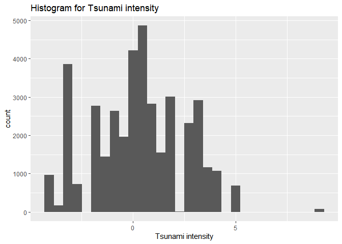<!-- -->

``` r
#Create scatterplot with summary statistic (bivariate)
ggplot(tsunami_temps2,aes(x=Country,y=annual_temp,color=mean(Ts_Intensity))) +geom_point()+theme(axis.text.x=element_text(angle=60, hjust=1))+ ggtitle("Tsunami intensity due to annual temperatures in different countries") #The scatterplot's x axis variables are at an angle due to extreme overlap without it. The relationship between annual temperatures and the mean tsunami intensity with different countries is observed.
```

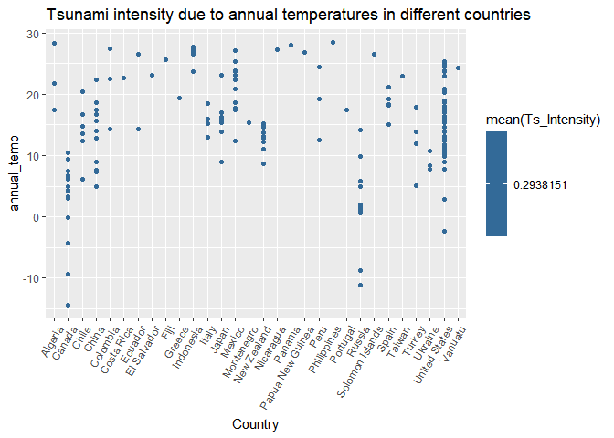<!-- -->

``` r
#Barplot of Tsunami intensity according to annual temperatures (univariate graph)
tsunami_temps2 %>% ggplot(aes(x=annual_temp, y= Ts_Intensity))+
  geom_bar(stat = "identity", fun.y = mean, na.rm = TRUE,
  position = position_dodge(width = 0.6), xlim = c(0,100)) +    
  labs(title = "Barplot of Tsunami Intensity according to Annual temperatures",x ="annual temperatures (degrees Celsius)", y= "Tsunami intensity")
```

    ## Warning: Ignoring unknown parameters: fun.y, xlim

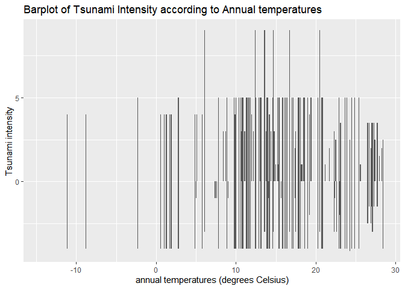<!-- -->

``` r
#returns bar plot displaying the tsunami intensity levels as temperature changes every year. The values were shown to be spread out as the error bars were used as well.

#Barplot of Tsunami intensity according to country (univariate graph)
tsunami_temps2 %>% ggplot(aes(x= Country, y= Ts_Intensity))+
  geom_bar(stat = "identity", fun.y = mean, na.rm = TRUE,
  position = position_dodge(width = 0.6), xlim = c(0,100)) + theme(axis.text.x = element_text(angle=90, vjust = 0.6, hjust = 1))   
```

    ## Warning: Ignoring unknown parameters: fun.y, xlim

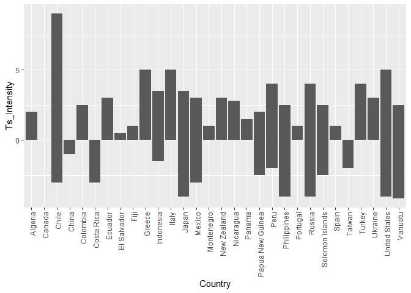<!-- -->

``` r
  labs(title = "Barplot of Tsunami Intensity according to countries",x ="annual temperatures (degrees Celsius)", y= "Tsunami intensity")
```

    ## $x
    ## [1] "annual temperatures (degrees Celsius)"
    ## 
    ## $y
    ## [1] "Tsunami intensity"
    ## 
    ## $title
    ## [1] "Barplot of Tsunami Intensity according to countries"
    ## 
    ## attr(,"class")
    ## [1] "labels"

``` r
#returns bar plot displaying the tsunami intensity levels as temperature changes every year. The values were shown to be spread out as the error bars were used as well.
```

The univariate graphs are trimodal (having three modes from the center
on each side) compared to the histogram of tsunami intensities. The
bivariate graph (scatterplot) shows the tsunami intensity is highest in
the United States according to the mean Tsunamity value of 0.2928
(categorized as “light”) with an average annual temperature of 25
degrees Celsius and Tsunami intensity is lowest in El Salvador, Fiji,
and Greece. According to the barplot, the Tsunami intensity is lowest in
China, El Salvador, Taiwan, and Fiji. There is some overlap for tsunami
intensities across countries between the univariate and bivariate
graphs. Spain and portugal have identical tsunami intensities according
to the univariate barplot.

``` r
#Correlation heat map for two numeric variables
plot <- tsunami_temps2%>% select_if(is.numeric) #for numeric variables
cor(plot,use="pairwise.complete.obs")
```

    ##              annual_temp monthly_temp        Year      Month.y Eq_Magnitude
    ## annual_temp   1.00000000   0.74676721 -0.17066968 -0.068989893   0.03751548
    ## monthly_temp  0.74676721   1.00000000 -0.12745424 -0.051515850   0.02806468
    ## Year         -0.17066968  -0.12745424  1.00000000 -0.035704879  -0.03024877
    ## Month.y      -0.06898989  -0.05151585 -0.03570488  1.000000000   0.01751903
    ## Eq_Magnitude  0.03751548   0.02806468 -0.03024877  0.017519035   1.00000000
    ## Eq_Depth      0.17851415   0.13336707 -0.23497480 -0.001205965   0.05117281
    ## Ts_Intensity  0.11579246   0.08660150 -0.22353647  0.134975198   0.42628925
    ##                  Eq_Depth Ts_Intensity
    ## annual_temp   0.178514153   0.11579246
    ## monthly_temp  0.133367067   0.08660150
    ## Year         -0.234974797  -0.22353647
    ## Month.y      -0.001205965   0.13497520
    ## Eq_Magnitude  0.051172806   0.42628925
    ## Eq_Depth      1.000000000   0.07942799
    ## Ts_Intensity  0.079427988   1.00000000

``` r
cor(plot,use="pairwise.complete.obs") %>%
  as.data.frame %>%
  rownames_to_column %>%
  pivot_longer(-1,names_to="other_var",values_to="correlation")%>%
  ggplot(aes(rowname,other_var,fill=correlation)) + 
  geom_tile() + 
  scale_fill_gradient2(low="blue",mid="white",high="orange") + #scale_fill_gradient2 is especially important with creating 3 different levels to the gradient colors on the scale. 
  geom_text(aes(label=round(correlation,2)),color="brown",size =
  4) +labs(title = "Correlation matrix for the dataset 'tsunami_temps2'", x = "variable1", y = "variable2")
```

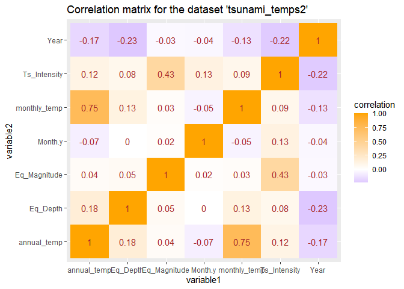<!-- --> It
can be seen from the correlation matrix that annual temperature has a
very weak positive correlation to tsunami intensity with its value of
0.12 while Year has the least positive correlation (negative correlation
of -0.22) with tsunami intensity. Magnitude of an earthquake has the
strongest positive correlation with a value of 0.43, a correlation also
greater than monthly temperature with tsunami intensity. I was surprised
that annual temperature and year has a negative correlation of -0.17
since I predicted annual temperatures would increase over the years due
to global warming.

Note that the `echo = FALSE` parameter was added to the code chunk to
prevent printing of the R code that generated the plot.

## MANOVA

``` r
#run a MANOVA test 
TsunamiManovaTest <- manova(cbind(annual_temp,monthly_temp,Ts_Intensity)~Event_validity,data=tsunami_temps2)
summary(TsunamiManovaTest)
```

    ##                   Df   Pillai approx F num Df den Df    Pr(>F)    
    ## Event_validity     4 0.026492   87.281     12 117561 < 2.2e-16 ***
    ## Residuals      39187                                              
    ## ---
    ## Signif. codes:  0 '***' 0.001 '**' 0.01 '*' 0.05 '.' 0.1 ' ' 1

``` r
#Conduct ANOVA test for each numeric variable 
summary.aov(TsunamiManovaTest)
```

    ##  Response annual_temp :
    ##                   Df  Sum Sq Mean Sq F value    Pr(>F)    
    ## Event_validity     4   51985 12996.3  181.41 < 2.2e-16 ***
    ## Residuals      39187 2807456    71.6                      
    ## ---
    ## Signif. codes:  0 '***' 0.001 '**' 0.01 '*' 0.05 '.' 0.1 ' ' 1
    ## 
    ##  Response monthly_temp :
    ##                   Df  Sum Sq Mean Sq F value    Pr(>F)    
    ## Event_validity     4   52095 13023.8  100.67 < 2.2e-16 ***
    ## Residuals      39187 5069670   129.4                      
    ## ---
    ## Signif. codes:  0 '***' 0.001 '**' 0.01 '*' 0.05 '.' 0.1 ' ' 1
    ## 
    ##  Response Ts_Intensity :
    ##                   Df Sum Sq Mean Sq F value    Pr(>F)    
    ## Event_validity     4   1116 279.112  59.306 < 2.2e-16 ***
    ## Residuals      39187 184426   4.706                      
    ## ---
    ## Signif. codes:  0 '***' 0.001 '**' 0.01 '*' 0.05 '.' 0.1 ' ' 1

``` r
#Conduct post-hoc tests for all significant ANOVAs 
pairwise.t.test(tsunami_temps2$annual_temp,tsunami_temps2$Event_validity,p.adj="none")
```

    ## 
    ##  Pairwise comparisons using t tests with pooled SD 
    ## 
    ## data:  tsunami_temps2$annual_temp and tsunami_temps2$Event_validity 
    ## 
    ##                                                                   Definite Tsunami
    ## Event that only caused a seiche or disturbance in an inland river 2.8e-08         
    ## Probable Tsunami                                                  < 2e-16         
    ## Questionable Tsunami                                              < 2e-16         
    ## Very Doubtful Tsunami                                             < 2e-16         
    ##                                                                   Event that only caused a seiche or disturbance in an inland river
    ## Event that only caused a seiche or disturbance in an inland river -                                                                
    ## Probable Tsunami                                                  7.4e-05                                                          
    ## Questionable Tsunami                                              0.00011                                                          
    ## Very Doubtful Tsunami                                             4.2e-05                                                          
    ##                                                                   Probable Tsunami
    ## Event that only caused a seiche or disturbance in an inland river -               
    ## Probable Tsunami                                                  -               
    ## Questionable Tsunami                                              0.55082         
    ## Very Doubtful Tsunami                                             0.26546         
    ##                                                                   Questionable Tsunami
    ## Event that only caused a seiche or disturbance in an inland river -                   
    ## Probable Tsunami                                                  -                   
    ## Questionable Tsunami                                              -                   
    ## Very Doubtful Tsunami                                             0.13381             
    ## 
    ## P value adjustment method: none

``` r
pairwise.t.test(tsunami_temps2$monthly_temp,tsunami_temps2$Event_validity,p.adj="none")
```

    ## 
    ##  Pairwise comparisons using t tests with pooled SD 
    ## 
    ## data:  tsunami_temps2$monthly_temp and tsunami_temps2$Event_validity 
    ## 
    ##                                                                   Definite Tsunami
    ## Event that only caused a seiche or disturbance in an inland river 3.7e-05         
    ## Probable Tsunami                                                  < 2e-16         
    ## Questionable Tsunami                                              < 2e-16         
    ## Very Doubtful Tsunami                                             < 2e-16         
    ##                                                                   Event that only caused a seiche or disturbance in an inland river
    ## Event that only caused a seiche or disturbance in an inland river -                                                                
    ## Probable Tsunami                                                  0.0033                                                           
    ## Questionable Tsunami                                              0.0040                                                           
    ## Very Doubtful Tsunami                                             0.0024                                                           
    ##                                                                   Probable Tsunami
    ## Event that only caused a seiche or disturbance in an inland river -               
    ## Probable Tsunami                                                  -               
    ## Questionable Tsunami                                              0.6602          
    ## Very Doubtful Tsunami                                             0.4059          
    ##                                                                   Questionable Tsunami
    ## Event that only caused a seiche or disturbance in an inland river -                   
    ## Probable Tsunami                                                  -                   
    ## Questionable Tsunami                                              -                   
    ## Very Doubtful Tsunami                                             0.2652              
    ## 
    ## P value adjustment method: none

``` r
pairwise.t.test(tsunami_temps2$Ts_Intensity,tsunami_temps2$Event_validity,p.adj="none")
```

    ## 
    ##  Pairwise comparisons using t tests with pooled SD 
    ## 
    ## data:  tsunami_temps2$Ts_Intensity and tsunami_temps2$Event_validity 
    ## 
    ##                                                                   Definite Tsunami
    ## Event that only caused a seiche or disturbance in an inland river 2.5e-05         
    ## Probable Tsunami                                                  < 2e-16         
    ## Questionable Tsunami                                              0.7318          
    ## Very Doubtful Tsunami                                             < 2e-16         
    ##                                                                   Event that only caused a seiche or disturbance in an inland river
    ## Event that only caused a seiche or disturbance in an inland river -                                                                
    ## Probable Tsunami                                                  0.0014                                                           
    ## Questionable Tsunami                                              2.4e-05                                                          
    ## Very Doubtful Tsunami                                             0.0012                                                           
    ##                                                                   Probable Tsunami
    ## Event that only caused a seiche or disturbance in an inland river -               
    ## Probable Tsunami                                                  -               
    ## Questionable Tsunami                                              < 2e-16         
    ## Very Doubtful Tsunami                                             0.6347          
    ##                                                                   Questionable Tsunami
    ## Event that only caused a seiche or disturbance in an inland river -                   
    ## Probable Tsunami                                                  -                   
    ## Questionable Tsunami                                              -                   
    ## Very Doubtful Tsunami                                             1.5e-11             
    ## 
    ## P value adjustment method: none

According to the MANOVA test, the numerical variable annual
temperatures, tsunami intensity, and monthly temperatures all showed a
mean difference across levels of the categorical variable event validity
for the tsunamis. Therefore, we rejected the null hypothesis that the
global temperatures and tsunami intensity would be equal across the
different event validities of tsunami (pillai = 0.026492, df= 4, F =
87.281, p&lt; 0.05). The ANOVA showed that each of the 3 numerica
variables had a p value of 2.2e-16 which is less than 0.05, so the null
hypothesis was once again rejected and all 3 explanatory/ numeric
variables significantly differed by Event validity of the Tsunamis.
There was 1 manova, 3 anovas, and 30 t-tests conducted in total.

``` r
#find overall Type-I error
1- 0.95^34
```

    ## [1] 0.8251754

``` r
#Adjusted bonferroni
0.05/34
```

    ## [1] 0.001470588

``` r
#post hoc tests adjusted 
pairwise.t.test(tsunami_temps2$annual_temp,tsunami_temps2$Event_validity,p.adj="bonferroni")
```

    ## 
    ##  Pairwise comparisons using t tests with pooled SD 
    ## 
    ## data:  tsunami_temps2$annual_temp and tsunami_temps2$Event_validity 
    ## 
    ##                                                                   Definite Tsunami
    ## Event that only caused a seiche or disturbance in an inland river 2.8e-07         
    ## Probable Tsunami                                                  < 2e-16         
    ## Questionable Tsunami                                              < 2e-16         
    ## Very Doubtful Tsunami                                             < 2e-16         
    ##                                                                   Event that only caused a seiche or disturbance in an inland river
    ## Event that only caused a seiche or disturbance in an inland river -                                                                
    ## Probable Tsunami                                                  0.00074                                                          
    ## Questionable Tsunami                                              0.00106                                                          
    ## Very Doubtful Tsunami                                             0.00042                                                          
    ##                                                                   Probable Tsunami
    ## Event that only caused a seiche or disturbance in an inland river -               
    ## Probable Tsunami                                                  -               
    ## Questionable Tsunami                                              1.00000         
    ## Very Doubtful Tsunami                                             1.00000         
    ##                                                                   Questionable Tsunami
    ## Event that only caused a seiche or disturbance in an inland river -                   
    ## Probable Tsunami                                                  -                   
    ## Questionable Tsunami                                              -                   
    ## Very Doubtful Tsunami                                             1.00000             
    ## 
    ## P value adjustment method: bonferroni

``` r
pairwise.t.test(tsunami_temps2$monthly_temp,tsunami_temps2$Event_validity,p.adj="bonferroni")
```

    ## 
    ##  Pairwise comparisons using t tests with pooled SD 
    ## 
    ## data:  tsunami_temps2$monthly_temp and tsunami_temps2$Event_validity 
    ## 
    ##                                                                   Definite Tsunami
    ## Event that only caused a seiche or disturbance in an inland river 0.00037         
    ## Probable Tsunami                                                  < 2e-16         
    ## Questionable Tsunami                                              < 2e-16         
    ## Very Doubtful Tsunami                                             < 2e-16         
    ##                                                                   Event that only caused a seiche or disturbance in an inland river
    ## Event that only caused a seiche or disturbance in an inland river -                                                                
    ## Probable Tsunami                                                  0.03305                                                          
    ## Questionable Tsunami                                              0.04036                                                          
    ## Very Doubtful Tsunami                                             0.02394                                                          
    ##                                                                   Probable Tsunami
    ## Event that only caused a seiche or disturbance in an inland river -               
    ## Probable Tsunami                                                  -               
    ## Questionable Tsunami                                              1.00000         
    ## Very Doubtful Tsunami                                             1.00000         
    ##                                                                   Questionable Tsunami
    ## Event that only caused a seiche or disturbance in an inland river -                   
    ## Probable Tsunami                                                  -                   
    ## Questionable Tsunami                                              -                   
    ## Very Doubtful Tsunami                                             1.00000             
    ## 
    ## P value adjustment method: bonferroni

``` r
pairwise.t.test(tsunami_temps2$Ts_Intensity,tsunami_temps2$Event_validity,p.adj="bonferroni")
```

    ## 
    ##  Pairwise comparisons using t tests with pooled SD 
    ## 
    ## data:  tsunami_temps2$Ts_Intensity and tsunami_temps2$Event_validity 
    ## 
    ##                                                                   Definite Tsunami
    ## Event that only caused a seiche or disturbance in an inland river 0.00025         
    ## Probable Tsunami                                                  < 2e-16         
    ## Questionable Tsunami                                              1.00000         
    ## Very Doubtful Tsunami                                             < 2e-16         
    ##                                                                   Event that only caused a seiche or disturbance in an inland river
    ## Event that only caused a seiche or disturbance in an inland river -                                                                
    ## Probable Tsunami                                                  0.01395                                                          
    ## Questionable Tsunami                                              0.00024                                                          
    ## Very Doubtful Tsunami                                             0.01161                                                          
    ##                                                                   Probable Tsunami
    ## Event that only caused a seiche or disturbance in an inland river -               
    ## Probable Tsunami                                                  -               
    ## Questionable Tsunami                                              1.9e-15         
    ## Very Doubtful Tsunami                                             1.00000         
    ##                                                                   Questionable Tsunami
    ## Event that only caused a seiche or disturbance in an inland river -                   
    ## Probable Tsunami                                                  -                   
    ## Questionable Tsunami                                              -                   
    ## Very Doubtful Tsunami                                             1.5e-10             
    ## 
    ## P value adjustment method: bonferroni

The overall Type-I erorr rate is 0.8251754 and 0.001470588 is the
Bonferroni adjusted significance level that I would use to keep the
overall type I error rate at 0.05. All the pairwise tests that were
significant before stayed significant after the bonferroni correction
was used on the post hoc tests.

``` r
#Check sample size assumption 
tsunami_temps2%>%
  group_by(Event_validity) %>%
  summarise(N=n())
```

    ## # A tibble: 5 x 2
    ##   Event_validity                                                        N
    ## * <chr>                                                             <int>
    ## 1 Definite Tsunami                                                  30420
    ## 2 Event that only caused a seiche or disturbance in an inland river    24
    ## 3 Probable Tsunami                                                   4236
    ## 4 Questionable Tsunami                                               2292
    ## 5 Very Doubtful Tsunami                                              2220

``` r
#find univariate outliers 
library(rstatix)
```

    ## Warning: package 'rstatix' was built under R version 3.6.3

    ## 
    ## Attaching package: 'rstatix'

    ## The following object is masked from 'package:stats':
    ## 
    ##     filter

``` r
tsunami_temps2%>%
  group_by(Event_validity) %>%
  identify_outliers(annual_temp)
```

    ## # A tibble: 1,032 x 13
    ##    Event_validity Country annual_temp Month.x monthly_temp  Year Month.y Cause
    ##    <chr>          <chr>         <dbl> <chr>          <dbl> <dbl>   <dbl> <chr>
    ##  1 Definite Tsun~ Russia        -11.1 Jan            -24.8  1841       5 Eart~
    ##  2 Definite Tsun~ Russia        -11.1 Jan            -24.8  1918      11 Eart~
    ##  3 Definite Tsun~ Russia        -11.1 Jan            -24.8  1904       6 Eart~
    ##  4 Definite Tsun~ Russia        -11.1 Jan            -24.8  1918       9 Eart~
    ##  5 Definite Tsun~ Russia        -11.1 Jan            -24.8  1933       1 Volc~
    ##  6 Definite Tsun~ Russia        -11.1 Jan            -24.8  1964       7 Eart~
    ##  7 Definite Tsun~ Russia        -11.1 Jan            -24.8  1968       1 Eart~
    ##  8 Definite Tsun~ Russia        -11.1 Jan            -24.8  1963      10 Eart~
    ##  9 Definite Tsun~ Russia        -11.1 Jan            -24.8  1961       2 Eart~
    ## 10 Definite Tsun~ Russia        -11.1 Jan            -24.8  1963      10 Eart~
    ## # ... with 1,022 more rows, and 5 more variables: Eq_Magnitude <dbl>,
    ## #   Eq_Depth <dbl>, Ts_Intensity <dbl>, is.outlier <lgl>, is.extreme <lgl>

MANOVA assumptions are very restrictive and often violated. The
independent observations assumption was met as well as the sample size
assumption since the larger the sample size for each case in
event\_validity, the better. In this case, the sample sizes are very
large, barring ‘Event that caused a seiche or disturbance in an inland
river’. Each group has more sample sizes than the number of dependent
variables I am analyzing, so the sample size assumption is met for this
data. There were also no univariate extreme outliers. The Levene’s test
is mostly likely not significant (p&gt;0.05), so there was most likely a
homogeneity of variances, as per most MANOVA tests. We most likely
cannot assume multivariate normality or univariate normality for this
dataset.

## Randomization test

``` r
# Observed F-statistic, running anova
summary(aov(Ts_Intensity ~ Event_validity, data=tsunami_temps2))
```

    ##                   Df Sum Sq Mean Sq F value Pr(>F)    
    ## Event_validity     4   1116  279.11   59.31 <2e-16 ***
    ## Residuals      39187 184426    4.71                   
    ## ---
    ## Signif. codes:  0 '***' 0.001 '**' 0.01 '*' 0.05 '.' 0.1 ' ' 1

``` r
obs_F <- 59.31

set.seed(348)
# Randomization test (using replicate)
Fs <- replicate(5000,{
  # Randomly permute the response variable across temperatures
  new <- tsunami_temps2 %>%
    mutate(Ts_Intensity = sample(Ts_Intensity))
  # Compute variation within groups
  SSW <- new %>%
    group_by(Event_validity) %>%
    summarize(SSW = sum((Ts_Intensity - mean(Ts_Intensity))^2)) %>%
    summarize(sum(SSW)) %>% 
    pull
  # Compute variation between groups
  SSB <- new %>% 
    mutate(mean = mean(Ts_Intensity)) %>%
    group_by(Event_validity) %>% 
    mutate(groupmean = mean(Ts_Intensity)) %>%
    summarize(SSB = sum((mean - groupmean)^2)) %>%
    summarize(sum(SSB)) %>%
    pull
  # Compute the F-statistic (ratio of MSB and MSW)
  # df for SSB is 13 groups - 1 = 12
  # df for SSW is 39192 observations - 13 groups = 39179
  (SSB/12)/(SSW/39179)
})

# Represent the distribution of the F-statistics for each randomized sample
hist(Fs, prob=T, main = 'Distribution of Sampled F values');
abline(v = obs_F, col="red",add=T)
```

    ## Warning in int_abline(a = a, b = b, h = h, v = v, untf = untf, ...): "add" is
    ## not a graphical parameter

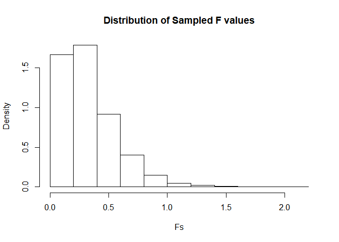<!-- -->

``` r
# Calculate the proportion of F statistic that are greater than the observed F-statistic
mean(Fs > obs_F)
```

    ## [1] 0

The null hypothesis is that there is no significant effect of type of
tsunami on tsunami intensity. The alternate hypothesis is that there is
a significant effect of type of tsunami on tsunami intensity. Since the
proportion of F-statistic that is greater than the observed F-statistic
is 0, the null hypothesis is rejected so there is a significant effect
of type of tsunami on tsunami intensity.

## Linear regression model

``` r
# Mean center annual_temp 
tsunami_temps2$annual_temp_c <- tsunami_temps2$annual_temp - mean(tsunami_temps2$annual_temp)
tsunami_temps2$Ts_Intensity_c <- tsunami_temps2$Ts_Intensity - mean(tsunami_temps2$Ts_Intensity)
#Include an interaction term in regression model with centered predictors 
fit_c <- lm(Ts_Intensity_c ~ annual_temp_c* Cause, data= tsunami_temps2)
summary(fit_c)
```

    ## 
    ## Call:
    ## lm(formula = Ts_Intensity_c ~ annual_temp_c * Cause, data = tsunami_temps2)
    ## 
    ## Residuals:
    ##     Min      1Q  Median      3Q     Max 
    ## -5.2646 -1.5144  0.0685  1.5940  9.1360 
    ## 
    ## Coefficients:
    ##                                              Estimate Std. Error t value
    ## (Intercept)                                 -0.149025   0.011778 -12.653
    ## annual_temp_c                                0.031882   0.001298  24.562
    ## CauseEarthquake and Landslide                1.074147   0.027316  39.323
    ## CauseMeteorological                         -3.144790   0.084147 -37.372
    ## CauseVolcano                                 1.855210   0.369143   5.026
    ## CauseVolcano and Earthquake                 -1.144790   0.232172  -4.931
    ## annual_temp_c:CauseEarthquake and Landslide -0.034534   0.004375  -7.894
    ## annual_temp_c:CauseMeteorological           -0.031882   0.015250  -2.091
    ## annual_temp_c:CauseVolcano                  -0.031882   0.025818  -1.235
    ## annual_temp_c:CauseVolcano and Earthquake   -0.031882   0.058090  -0.549
    ##                                             Pr(>|t|)    
    ## (Intercept)                                  < 2e-16 ***
    ## annual_temp_c                                < 2e-16 ***
    ## CauseEarthquake and Landslide                < 2e-16 ***
    ## CauseMeteorological                          < 2e-16 ***
    ## CauseVolcano                                5.04e-07 ***
    ## CauseVolcano and Earthquake                 8.22e-07 ***
    ## annual_temp_c:CauseEarthquake and Landslide 3.01e-15 ***
    ## annual_temp_c:CauseMeteorological             0.0366 *  
    ## annual_temp_c:CauseVolcano                    0.2169    
    ## annual_temp_c:CauseVolcano and Earthquake     0.5831    
    ## ---
    ## Signif. codes:  0 '***' 0.001 '**' 0.01 '*' 0.05 '.' 0.1 ' ' 1
    ## 
    ## Residual standard error: 2.075 on 39182 degrees of freedom
    ## Multiple R-squared:  0.09099,    Adjusted R-squared:  0.09078 
    ## F-statistic: 435.8 on 9 and 39182 DF,  p-value: < 2.2e-16

The variables ‘annual\_temp’ and ‘Ts\_Intensity’ were mean-centered,
meaning the annual temperature and tsunami intensity are constant at its
mean instead of beinf constant at 0. The intercept is when annual
temperature is the mean and the cause of the tsunami is an Earthquake
since this is the reference variable, meaning that the tsunami intensity
would be -0.149025. This would be a significant effect and when the
cause of the tsunami changes from an Earthquake to caused by an
Earthquake and a Landslide, the tsunami intensity would change by
1.074147 and this would be significant. When the cause of the tusnami
changes from an Earthquake to a meteorological cause, the tsunami
intensity changes by -3.144790 and this is significant. When the cause
of the tusnami changes from an Earthquake to a volcanic cause, the
tsunami intensity changes by 1.855210 and this is significant. When the
cause of the tusnami changes from an Earthquake to a volcanic and
earthquake cause, the tsunami intensity changes by -1.144790 and this is
significant. When the global annual temperature increases, the tsunami
intensity would increase by 0.031882 and this is a significant effect.
There is a negative interaction when the causes of the tsunami shifts
away from an Earthquake to either earthquake and landslide,
meteorological, volcanic, and volcanic and earthquake as observed with
the coefficients -0.034534, -0.031882, -0.0318812 and -0.031882,
respectively as the annual temperature increases. The tsunami intensity
would decrease when the annual temperature increases and the cause of
the tsunami shifts away from an Earthquake.

``` r
#Create a visualization for the interaction between annual_temp and Cause
ggplot(fit_c,aes(x= annual_temp_c,y = Ts_Intensity_c,color=Cause))+ 
  geom_smooth(method=lm,se=FALSE,fullrange=TRUE)+
  labs(title ="Regression line between annual temperature (degrees Celsius) and Tsunami Intensity by Cause",             
       x = "Annual temp (degrees Celsius)", y = "Tsunami Intensity")
```

    ## `geom_smooth()` using formula 'y ~ x'

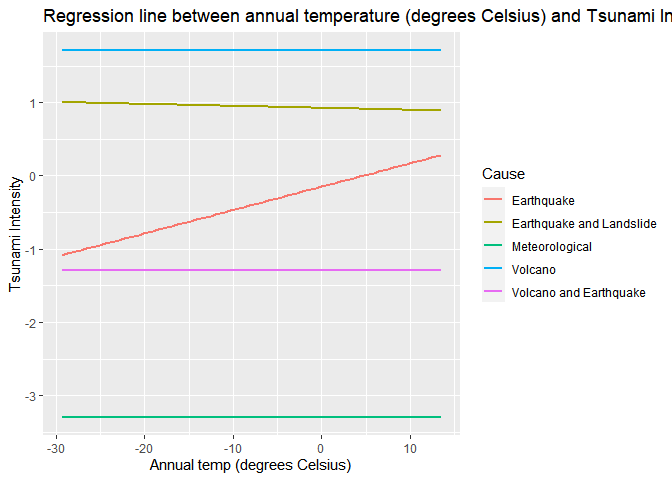<!-- -->

``` r
#proportion of variation
summary(fit_c)$r.squared
```

    ## [1] 0.09099171

According to the linear regression model, as the annual temperature
increases, the intensity of the tsunami is most likely not affected and
does not change. The interaction between the centered tsunami intensity
and the tsunami cause being an earthquake seems to be the most important
since it shows a positive interaction with the tsunami intensity being
strongest when the cause is an earthquake and temperature is increasing.
This model explains 9% of variation in the response.

``` r
#Checking assumptions visually
plot(fit_c, which = 1) # residuals vs fitted plot 
```

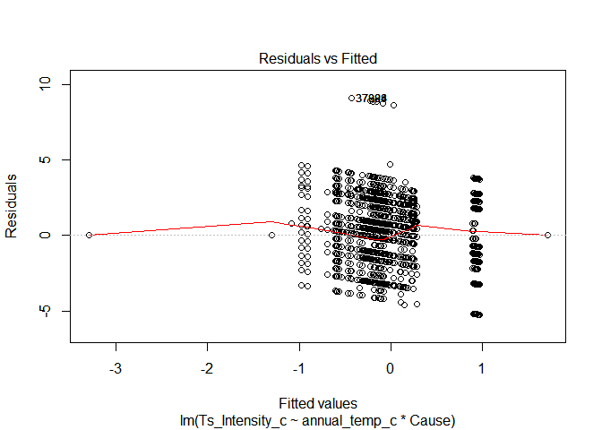<!-- -->

``` r
library(lmtest)
```

    ## Warning: package 'lmtest' was built under R version 3.6.3

    ## Loading required package: zoo

    ## Warning: package 'zoo' was built under R version 3.6.3

    ## 
    ## Attaching package: 'zoo'

    ## The following objects are masked from 'package:base':
    ## 
    ##     as.Date, as.Date.numeric

``` r
bptest(fit_c) #Checks assumptions for linearity and homoscedasticity
```

    ## 
    ##  studentized Breusch-Pagan test
    ## 
    ## data:  fit_c
    ## BP = 2355.7, df = 9, p-value < 2.2e-16

``` r
plot(fit_c, which = 2) #Q-Q plot for the residuals 
```

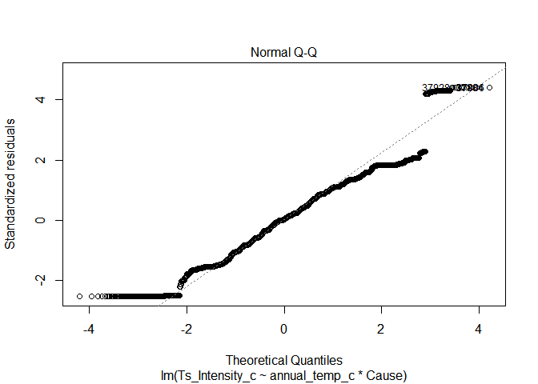<!-- -->

``` r
shapiro.test(fit_c$residuals[0:5000]) #Checks assumptions for normality
```

    ## 
    ##  Shapiro-Wilk normality test
    ## 
    ## data:  fit_c$residuals[0:5000]
    ## W = 0.94597, p-value < 2.2e-16

``` r
hist(fit_c$residuals) #histogram of residuals 
```

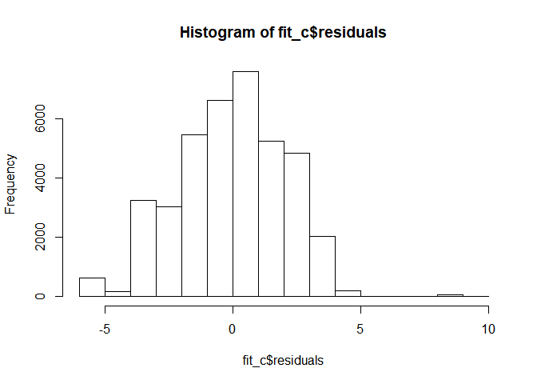<!-- --> For
the residuals vs fitted graph, the red line should be approximately
horizontal at 0 and is mostly clustered around the center. Since there
is a pretty clear pattern, we cannot assume a linear relationship
bbetween the predictors and the outcome variables. For the normality Q-Q
plot, the points fall approximately along the reference line but since
there are heavy tails, we can assume the distrubution is not normal.
Since the p value is less than 0.05 for the Shapiro-Wilk normality test,
it is significant and the normality assumption is violated. The p value
for the Breusch-Pagan test for homoscedasicity is less than 0.05,
meaning this is significant and the equal variance assumption is not
met.

## Bootstrapped standard errors

``` r
#Robust Standard eror 
library(sandwich)
```

    ## Warning: package 'sandwich' was built under R version 3.6.3

``` r
coeftest(fit_c,vcov=vcovHC(fit_c,type="HC1"))
```

    ## 
    ## t test of coefficients:
    ## 
    ##                                               Estimate Std. Error   t value
    ## (Intercept)                                 -0.1490255  0.0110692  -13.4630
    ## annual_temp_c                                0.0318822  0.0012302   25.9172
    ## CauseEarthquake and Landslide                1.0741465  0.0333753   32.1839
    ## CauseMeteorological                         -3.1447896  0.0110692 -284.1019
    ## CauseVolcano                                 1.8552104  0.0110692  167.6007
    ## CauseVolcano and Earthquake                 -1.1447896  0.0110692 -103.4209
    ## annual_temp_c:CauseEarthquake and Landslide -0.0345344  0.0051180   -6.7476
    ## annual_temp_c:CauseMeteorological           -0.0318822  0.0012302  -25.9172
    ## annual_temp_c:CauseVolcano                  -0.0318822  0.0012302  -25.9172
    ## annual_temp_c:CauseVolcano and Earthquake   -0.0318822  0.0012302  -25.9172
    ##                                              Pr(>|t|)    
    ## (Intercept)                                 < 2.2e-16 ***
    ## annual_temp_c                               < 2.2e-16 ***
    ## CauseEarthquake and Landslide               < 2.2e-16 ***
    ## CauseMeteorological                         < 2.2e-16 ***
    ## CauseVolcano                                < 2.2e-16 ***
    ## CauseVolcano and Earthquake                 < 2.2e-16 ***
    ## annual_temp_c:CauseEarthquake and Landslide 1.524e-11 ***
    ## annual_temp_c:CauseMeteorological           < 2.2e-16 ***
    ## annual_temp_c:CauseVolcano                  < 2.2e-16 ***
    ## annual_temp_c:CauseVolcano and Earthquake   < 2.2e-16 ***
    ## ---
    ## Signif. codes:  0 '***' 0.001 '**' 0.01 '*' 0.05 '.' 0.1 ' ' 1

``` r
set.seed(348)
# When assumptions are violated (homoscedasticity, normality, small sample size)
# use bootstrap samples to estimate coefficients, SEs, fitted values, ...

# Example of estimating coefficients SEs
# Use the function replicate to repeat the process (similar to a for loop)
samp_SEs <- replicate(5000, {
  # Bootstrap your data (resample observations)
  boot_data <- sample_frac(tsunami_temps2, replace = TRUE)
  # Fit regression model
  fitboot <- lm(Ts_Intensity ~ Cause*annual_temp_c, data = boot_data)
  # Save the coefficients
  coef(fitboot)
})

# Estimated SEs
samp_SEs %>%
  # Transpose the obtained matrices
  t %>%
  # Consider the matrix as a data frame
  as.data.frame %>%
  # Compute the standard error (standard deviation of the sampling distribution)
  summarize_all(sd)
```

    ##   (Intercept) CauseEarthquake and Landslide CauseMeteorological CauseVolcano
    ## 1  0.01111831                    0.03298683          0.01111831   0.01111831
    ##   CauseVolcano and Earthquake annual_temp_c
    ## 1                  0.01111831   0.001232086
    ##   CauseEarthquake and Landslide:annual_temp_c CauseMeteorological:annual_temp_c
    ## 1                                 0.005036807                       0.001232086
    ##   CauseVolcano:annual_temp_c CauseVolcano and Earthquake:annual_temp_c
    ## 1                0.001232086                               0.001232086

Everything that was significant before was significant after recomputing
regressaion results with robust standard erorrs. With the robust
standard errors, the effect of volcano as well as the effect of volcano
and earthquake are now significant as temperature increases on tsunami
intensity when they were not significant before. Additionally, the
effect of meteorological cause of tsunamis increases as temperature
incrteases on tsunami intensity becomes more significant. The
bootstrapped standard errors were a bit smaller than the original SEs
and the robust SEs except for when the cause of the tsunami is an
earthquake and landslide as it is larger than that.

## Logistic regression

``` r
#Create a binary variable coded as 0 and 1 
tsunami_temp2 <- tsunami_temps2%>%
  mutate(tsunami_code=ifelse(Event_validity=="Definite Tsunami",1,0))

# Fit a new regression model
fit1 <- glm(tsunami_code ~ annual_temp + Eq_Magnitude, data = tsunami_temp2, family = binomial(link="logit"))
summary(fit1)
```

    ## 
    ## Call:
    ## glm(formula = tsunami_code ~ annual_temp + Eq_Magnitude, family = binomial(link = "logit"), 
    ##     data = tsunami_temp2)
    ## 
    ## Deviance Residuals: 
    ##     Min       1Q   Median       3Q      Max  
    ## -2.6835   0.2060   0.4654   0.6568   2.2590  
    ## 
    ## Coefficients:
    ##               Estimate Std. Error z value Pr(>|z|)    
    ## (Intercept)  -6.628960   0.118054  -56.15   <2e-16 ***
    ## annual_temp  -0.058866   0.001769  -33.27   <2e-16 ***
    ## Eq_Magnitude  1.256373   0.017443   72.03   <2e-16 ***
    ## ---
    ## Signif. codes:  0 '***' 0.001 '**' 0.01 '*' 0.05 '.' 0.1 ' ' 1
    ## 
    ## (Dispersion parameter for binomial family taken to be 1)
    ## 
    ##     Null deviance: 41677  on 39191  degrees of freedom
    ## Residual deviance: 34005  on 39189  degrees of freedom
    ## AIC: 34011
    ## 
    ## Number of Fisher Scoring iterations: 5

``` r
# Interpret the coefficients by considering the odds (inverse of log(odds))
exp(coef(fit1))
```

    ##  (Intercept)  annual_temp Eq_Magnitude 
    ##  0.001321537  0.942833070  3.512656404

There is a significant effect as temperature increases and earthquake
magnitude increases by 1.256373. There is also a significant effect as
event validity changes and annual temperature changes by -0.058866. The
intercept is when tsunami intensity is at 0 and intercept is at the
event validity for the tsunamis. The odds ratio for the annual
temperature is 0.943 and 3.513 for the earthquake magnitude affecting
event validity for tsunamis. The odds ratio of 0.943 implies that a 1
unit increase in annual temperature increases the odds of event validity
for a tsunami by a product factor of 0.943. Likewise, the odds ratio of
3.513 implies that a 1 unit increase in earthquake magnitude increases
the odds of event validity for a tsunami by a product factor of 3.513.

``` r
#Represent model 
# Add predicted probabilities to the dataset
tsunami_temp2$prob <- predict(fit1, type = "response")
# Predicted outcome is based on the probability of definite tsunami 
# if the probability is greater than 0.6, tsunami is definitely a tsunami
tsunami_temp2$predicted <- ifelse(tsunami_temp2$prob > .6, "Definite Tsunami", "No Tsunami") 

# Confusion matrix
table(truth = tsunami_temp2$tsunami_code, prediction = tsunami_temp2$predicted)
```

    ##      prediction
    ## truth Definite Tsunami No Tsunami
    ##     0             5220       3552
    ##     1            28680       1740

``` r
# Accuracy (correctly classified cases)
(28680+3552)/ 39192
```

    ## [1] 0.8224127

``` r
#Sensitivity (TPR)
28680/ 30420
```

    ## [1] 0.9428008

``` r
#Specificity (TNR)
3552/ 8772
```

    ## [1] 0.4049248

``` r
#Precision (PPV)
28680/33900
```

    ## [1] 0.8460177

The accuracy is 0.8224127, the sensitivity is 0.9428, the specificity is
0.4049248, and the precision is 0.8460177. This was with the probablity
set to greater than 0.6 rather than 0.5 since it yielded a higher
specificity. Higher specificity and sensitivity values are desired
because that is tellinf me the model’s prediction rate. There was a very
high sensitivity and a fairly high specificity rate for the model from
the confusion matrix.

``` r
#Density plot of log-odds for each outcome 
tsunami_temp2$logit <- predict(fit1)

# Compare to the outcome in the dataset with a density plot
ggplot(tsunami_temp2, aes(logit, fill = as.factor(tsunami_code))) +
  geom_density(alpha = .3) +
  geom_vline(xintercept = 0, lty = 2) +
  labs(fill = "Definite Tsunami") + ggtitle("Density plot of Event validity for tsunamis")
```

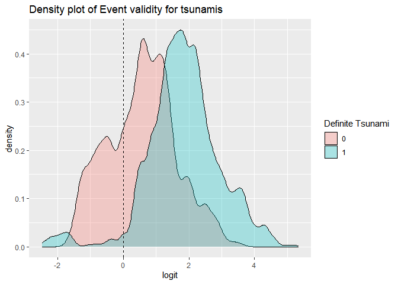<!-- -->

The definite tsunami event validity has the highest density with “1”
while the not tsunamis have the lowest density with “0”.

``` r
#Ganerate ROC plot 
library(plotROC)
```

    ## Warning: package 'plotROC' was built under R version 3.6.3

``` r
tsunami_temp2$prob1 <- predict(fit1,type="response")
ROCplot <- ggplot(tsunami_temp2) + geom_roc(aes(d=tsunami_code ,m=prob1),cutoffs.at= list(0.6))+ggtitle("ROC curve")
ROCplot
```

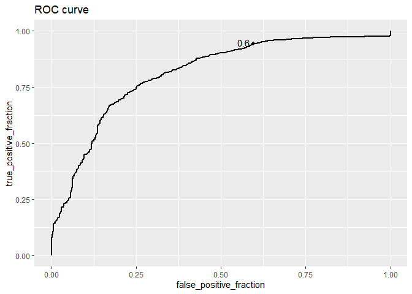<!-- -->

``` r
#AUC 
calc_auc(ROCplot)
```

    ##   PANEL group       AUC
    ## 1     1    -1 0.8104361

The AUC is 0.8104361. The AUC indicates the prediction power of the
model. According to the rule of thumb, this model is good at predicting
Event validity for tsunamis from annual temperature and earthquake
magnitude.
