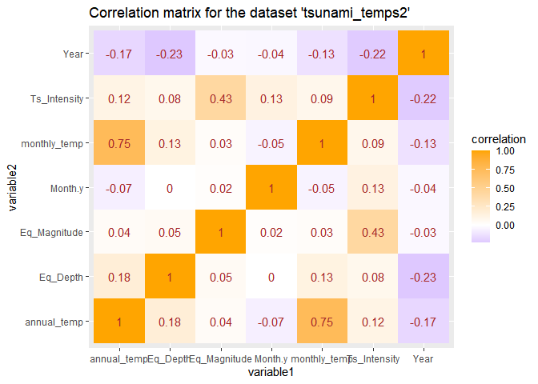
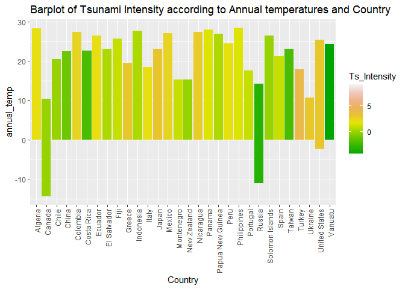
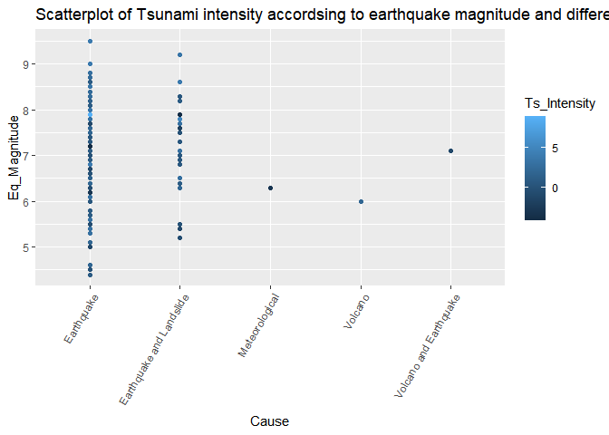
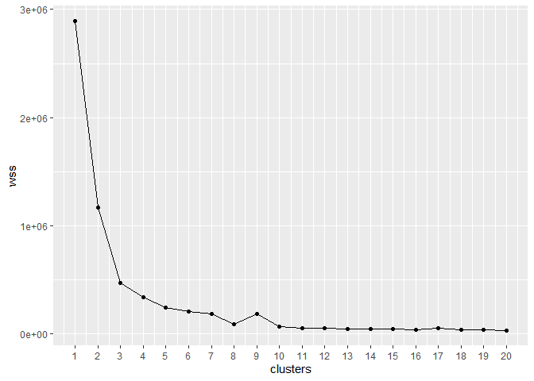
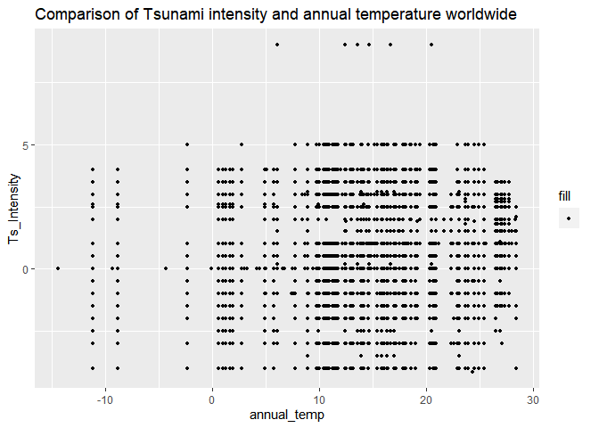
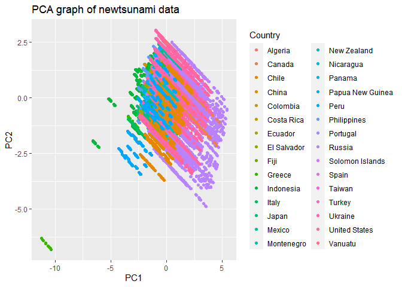

Research project 1\_How the globally increasing temperatures affect
tsunami occurances and intensities over the years.
================
SDS 348 Spring 2021

Bhoomika Venkatesh, bv5732

## R Markdown

When you click the **Knit** button a document will be generated that
includes both content as well as the output of any embedded R code
chunks within the document. You can embed an R code chunk like this:

Part 1: Introduction

Climate change has been on the rise for the past decade or so due to
rising temperatures all over the world. The dataset
“Average\_temperature\_of\_cities” contains statistics of the average
temperature changing over the year in cities within certain countries.
This could portray that steady increase in temperature annually that is
a sign of global warming. This dataset contains the variables ‘country’,
‘city’, and ‘jan, feb, mar, apr, may, jun,jul,aug,sep,oct,nov,dec’ so
the 12 months of the year with average temperatures per month and the
average temperatures per ‘year’ as well as ‘continent’.The temperatures
listed are averages of the daily highs and lows. The actual daytime
temperature in a given month will be 2 to 10 degrees celsius higher than
the temperature in the data, depending on how large the difference
between daily highs and lows is. This is from the years 1961-1990. These
temperatures were most likely acquired using thermocouples,
thermometers, infrared sensors, and resistive temperature measuring
devices. Satellites are also used to measure temperature globally. The
second dataset is the ‘Tsunami\_dataset’ that contains the ‘ID’ for each
tsunami, ‘country’, ‘region’, ‘year’ from 2100BC to current day with
2259 tsunami records, ‘month’ with 1 representing january and 12
representing December of each year, ‘day’, ‘hour’, ‘minutes’ of each
tsunami, ‘lattitude’, ‘longitude’, ‘location name’, ‘cause’, ‘event
validity’, ‘EQ\_depth’ for earthquake depth if that was the cause ,
‘EQ\_magnitude’for magnitude of the earthquake if that was the cause ,
’TS\_intensity’ for the intensity of the tsunami,
‘damage\_total\_description’for how much in total the damage of the
tsunami costed, ’House\_total\_description’,
‘deaths\_total\_description’ for how many total deaths from the tsunami,
and ‘comments’ on details of the Tsunamis. They were acquired through
the Homeland Infastructure Foundation-Level data (HIFLD) with no methods
stated for it. TSunami intensities are usually detected by open-ocean
tsunami buoys and coastal tide gages. This topic is very interesting to
me as climate change is one of the most important issues that face the
world in this era and many more to come. For example, this snowstorm in
texas (which rarely happens) is most likely a consequence of global
warming and its creeping effects. I have always grown up learning about
it in school throughout the years and how it can exaggerate natural
disasters by increasing its frequency and magnitude over the years. A
potential association I expect between these two datasets is as
temperatures slowly increased over the years over the world, the
intensity and frequency of Tsunami (a devastating natural disaster) also
increased.

###### Part 2: Tidy datasets

``` r
library("dplyr")
library(tidyverse)
library(readxl)
tsunami_dataset <- read_excel("C:/Users/Bhoomika Venkatesh/Downloads/R code SDS328 comp bio/tsunami_dataset.xlsx")
View(tsunami_dataset)
Average_Temperature_of_Cities<-read_excel("C:/Users/Bhoomika Venkatesh/Downloads/R code SDS328 comp bio/Average Temperature of Cities.xlsx")
View(Average_Temperature_of_Cities)
avg_temps <- Average_Temperature_of_Cities%>%pivot_longer(Jan:Dec,names_to = "Month",values_to="temp",values_drop_na=TRUE) #A new variable called avg_temps was created for an update, tidier version of the average-temperature_of_cities dataset and was piped with the pivot_longer() function in order to make datasets longer by increasing the number of rows and decreasing the number of columns. There is now a new column called "Month" with Jan-Dec as well as another new column called "Temp (in degrees Celsius)" containing all the values. 
avg_temps #This pulls up the newly created tidy dataset called avg_temps. 
```

    ## # A tibble: 5,412 x 6
    ##    Country City    Year             Continent Month temp            
    ##    <chr>   <chr>   <chr>            <chr>     <chr> <chr>           
    ##  1 Algeria Algiers "17.4\r\n(63.3)" AFRICA    Jan   "11.2\r\n(52.2)"
    ##  2 Algeria Algiers "17.4\r\n(63.3)" AFRICA    Feb   "11.9\r\n(53.4)"
    ##  3 Algeria Algiers "17.4\r\n(63.3)" AFRICA    Mar   "12.8\r\n(55.0)"
    ##  4 Algeria Algiers "17.4\r\n(63.3)" AFRICA    Apr   "14.7\r\n(58.5)"
    ##  5 Algeria Algiers "17.4\r\n(63.3)" AFRICA    May   "17.7\r\n(63.9)"
    ##  6 Algeria Algiers "17.4\r\n(63.3)" AFRICA    Jun   "21.3\r\n(70.3)"
    ##  7 Algeria Algiers "17.4\r\n(63.3)" AFRICA    Jul   "24.6\r\n(76.3)"
    ##  8 Algeria Algiers "17.4\r\n(63.3)" AFRICA    Aug   "25.2\r\n(77.4)"
    ##  9 Algeria Algiers "17.4\r\n(63.3)" AFRICA    Sep   "23.2\r\n(73.8)"
    ## 10 Algeria Algiers "17.4\r\n(63.3)" AFRICA    Oct   "19.4\r\n(66.9)"
    ## # ... with 5,402 more rows

``` r
avg_temps1 <- avg_temps%>% separate(col=Year,sep='\\s', into=c("annual_temp","rest"))%>%
  separate(col= temp , into=c('monthly_temp','leftovers'),
            sep = '\\s', extra='merge') %>%
  select(-c(rest,leftovers)) #this removes the fahrenheit values and the parantheses they are in from the annual and monthly temperatures. The new columns with just the temperatures in Celsius would be the 'monthly_temp' and 'annual_temp' so it is tidier. 
avg_temps1
```

    ## # A tibble: 5,412 x 6
    ##    Country City    annual_temp Continent Month monthly_temp
    ##    <chr>   <chr>   <chr>       <chr>     <chr> <chr>       
    ##  1 Algeria Algiers 17.4        AFRICA    Jan   11.2        
    ##  2 Algeria Algiers 17.4        AFRICA    Feb   11.9        
    ##  3 Algeria Algiers 17.4        AFRICA    Mar   12.8        
    ##  4 Algeria Algiers 17.4        AFRICA    Apr   14.7        
    ##  5 Algeria Algiers 17.4        AFRICA    May   17.7        
    ##  6 Algeria Algiers 17.4        AFRICA    Jun   21.3        
    ##  7 Algeria Algiers 17.4        AFRICA    Jul   24.6        
    ##  8 Algeria Algiers 17.4        AFRICA    Aug   25.2        
    ##  9 Algeria Algiers 17.4        AFRICA    Sep   23.2        
    ## 10 Algeria Algiers 17.4        AFRICA    Oct   19.4        
    ## # ... with 5,402 more rows

My tsunami dataset is already tidy as each variable is saved in its own
column and each observation is saved in its own row. For the Average
temperature dataset, there were 2 new columns created called ‘Month’ and
‘temp’ for the values from the temperatures for each individual month
from the initial datatset from January to December. The pivot\_longer()
function was used to make the dataset longer by increasing the number of
rows and decreasing the number of columns. Some other functions that
could be used to create this new tidy dataset could be pivot\_wider(),
unite(), separate() with the functions values\_drop\_na=TRUE to drop any
missing values.

###### Part3: Join/merge datasets

``` r
tsunami <- tsunami_dataset%>%select(-Comments,-Url,-Day,-Hour,-Minute,-Latitude,-Longitude,-COUNTRY,-Houses_Total_Description,-Deaths_Total_Description,-`Damage_ Total_Description`,-Location_name,-Region) #Select() dplyr function selects listed variables and the ("-") deletes them from the dataset altogether. Renamed to new dataset called tsunami that will be used moving forward. 
average_temp <- avg_temps1%>%select(-City,-Continent) #The new variable average_temp was created to be used moving forward. The new tidy dataset avg_temps from part 2 was used with the select() function to remove the columns that would not be used in the final dataset. 
tsunami_temps<-average_temp%>%inner_join(tsunami,by=c("Country"="Country")) #The inner_join() function was used with the newly created average_temp variable and tsunami variable to match the common variable 'Country' since that merges the two datasets into one. 
tsunami_temps#This is the new variable that pulls up the merged dataset with the variables.
```

    ## # A tibble: 231,900 x 11
    ##    Country annual_temp Month.x monthly_temp  Year Month.y Cause Event_validity
    ##    <chr>   <chr>       <chr>   <chr>        <dbl>   <dbl> <chr> <chr>         
    ##  1 Algeria 17.4        Jan     11.2          2003       5 Eart~ Definite Tsun~
    ##  2 Algeria 17.4        Jan     11.2          1989      10 Eart~ Questionable ~
    ##  3 Algeria 17.4        Jan     11.2          1980      10 Eart~ Definite Tsun~
    ##  4 Algeria 17.4        Jan     11.2          1802      11 Eart~ Probable Tsun~
    ##  5 Algeria 17.4        Jan     11.2          1790      10 Eart~ Probable Tsun~
    ##  6 Algeria 17.4        Jan     11.2          1365       1 Eart~ Probable Tsun~
    ##  7 Algeria 17.4        Jan     11.2          1856       8 Eart~ Probable Tsun~
    ##  8 Algeria 17.4        Jan     11.2          1857       5 Eart~ Questionable ~
    ##  9 Algeria 17.4        Jan     11.2          1856       8 Eart~ Probable Tsun~
    ## 10 Algeria 17.4        Jan     11.2          1954       9 Eart~ Definite Tsun~
    ## # ... with 231,890 more rows, and 3 more variables: Eq_Magnitude <dbl>,
    ## #   Eq_Depth <dbl>, Ts_Intensity <dbl>

Note that the `echo = FALSE` parameter was added to the code chunk to
prevent printing of the R code that generated the plot.

The inner\_join() function was used to merge the ‘average\_temp’ and
‘tsunami’ datasets into one final dataset called ‘tsunami\_temps’. The
inner\_join() function matches pairs of observations with a key
variable, in this case ‘Country’,which was common between the two
datasets, to create one final variable called ‘Country’ in the final
dataset so duplication of the same variable does not occur. I dropped
the columns ‘Comments’,
‘Url’,‘Day’,‘Hour’,‘Minute’,‘Latitude’,‘Longitude’,‘COUNTRY’,‘-Houses\_Total\_Description’,‘-Deaths\_Total\_Description’,-‘Damage\_Total\_Description’,-‘Location\_name’,-‘Region’
from my Tsunami dataset because they were not going to contribute to a
correlation in any way when I would run the dplyr functions later. I
used the select() and “-” functions to get rid of each variable or
column with commas in between to separate each variable. I also dropped
the columns ‘-City’ and ‘-Continent’ in the average\_temp dataset since
those would not be contributing to my overall dataset using select() as
well.The columns I removed would not contribute to the dataset since I
am trying to find a relationship between Tsunami intensity and
temperature over time and these extra variables do not contribte to the
goal. I did have an issue at first with the countries not matching since
it was all capitalized for the tsunami dataset but I found a way to
de-capitalize it in excel and import that into R studio with renamed
variables that could match with the ‘Country’ from the average
temperature dataset. It finally worked and I was able to merge them
together since they were the same format.

###### Part 4:Summary statistics

``` r
#Filter
library(tidyverse)
install.packages("kableExtra",repos= "http://cran.us.r-project.org")
```

    ## package 'kableExtra' successfully unpacked and MD5 sums checked
    ## 
    ## The downloaded binary packages are in
    ##  C:\Users\Bhoomika Venkatesh\AppData\Local\Temp\Rtmpo5Sf0d\downloaded_packages

``` r
install.packages("psych,",repos="http://cran.us.r-project.org")
library("psych")
library("kableExtra")

tsunami_yeartemp<- filter(tsunami_temps,Year>0) #the filter function was used to clean up the Year column since there were negative values from the B.C. times. values for year greater than 0 or positive were filtered out and saved into a new variable 'tsunami_yeartemp'. 
tsunami_temp<- tsunami_yeartemp%>%filter(!is.na(Ts_Intensity)) #use filter function again to drop NA values from the Ts_Intensity column so summary stats can be run on it later. It is saved into a new variable called tsunami_temp from tsunami_yeartemp previously.  
tsunami_temps1 <- tsunami_temp%>%filter(!is.na(Eq_Magnitude))
tsunami_temps2 <- tsunami_temps1%>%filter(!is.na(Eq_Depth)) #The final datatset to be used for the rest of the parts is tsunami_temps2 and has all the dbl functions from the tsunami dataset with its NA values filtered out and the year values are positive. 
filter(tsunami_temps2,Country=='China')
```

    ## # A tibble: 132 x 11
    ##    Country annual_temp Month.x monthly_temp  Year Month.y Cause Event_validity
    ##    <chr>   <chr>       <chr>   <chr>        <dbl>   <dbl> <chr> <chr>         
    ##  1 China   12.9        Jan     -3.1          1918       2 Eart~ Definite Tsun~
    ##  2 China   12.9        Feb     0.3           1918       2 Eart~ Definite Tsun~
    ##  3 China   12.9        Mar     6.7           1918       2 Eart~ Definite Tsun~
    ##  4 China   12.9        Apr     14.8          1918       2 Eart~ Definite Tsun~
    ##  5 China   12.9        May     20.8          1918       2 Eart~ Definite Tsun~
    ##  6 China   12.9        Jun     24.9          1918       2 Eart~ Definite Tsun~
    ##  7 China   12.9        Jul     26.7          1918       2 Eart~ Definite Tsun~
    ##  8 China   12.9        Aug     25.5          1918       2 Eart~ Definite Tsun~
    ##  9 China   12.9        Sep     20.8          1918       2 Eart~ Definite Tsun~
    ## 10 China   12.9        Oct     13.7          1918       2 Eart~ Definite Tsun~
    ## # ... with 122 more rows, and 3 more variables: Eq_Magnitude <dbl>,
    ## #   Eq_Depth <dbl>, Ts_Intensity <dbl>

``` r
filter(tsunami_temps2,Ts_Intensity<=5.0 & Month.y==10) #filters out values when tsunami intensity is less than or equal to 5.0 scale and the month is october (or 10). 
```

    ## # A tibble: 2,112 x 11
    ##    Country annual_temp Month.x monthly_temp  Year Month.y Cause Event_validity
    ##    <chr>   <chr>       <chr>   <chr>        <dbl>   <dbl> <chr> <chr>         
    ##  1 Algeria 17.4        Jan     11.2          1980      10 Eart~ Definite Tsun~
    ##  2 Algeria 17.4        Feb     11.9          1980      10 Eart~ Definite Tsun~
    ##  3 Algeria 17.4        Mar     12.8          1980      10 Eart~ Definite Tsun~
    ##  4 Algeria 17.4        Apr     14.7          1980      10 Eart~ Definite Tsun~
    ##  5 Algeria 17.4        May     17.7          1980      10 Eart~ Definite Tsun~
    ##  6 Algeria 17.4        Jun     21.3          1980      10 Eart~ Definite Tsun~
    ##  7 Algeria 17.4        Jul     24.6          1980      10 Eart~ Definite Tsun~
    ##  8 Algeria 17.4        Aug     25.2          1980      10 Eart~ Definite Tsun~
    ##  9 Algeria 17.4        Sep     23.2          1980      10 Eart~ Definite Tsun~
    ## 10 Algeria 17.4        Oct     19.4          1980      10 Eart~ Definite Tsun~
    ## # ... with 2,102 more rows, and 3 more variables: Eq_Magnitude <dbl>,
    ## #   Eq_Depth <dbl>, Ts_Intensity <dbl>

``` r
#Character to numeric variable conversion
tsunami_temps2$monthly_temp <- as.numeric(as.character(tsunami_temps2$monthly_temp))
sapply(tsunami_temps2,class) 
```

    ##        Country    annual_temp        Month.x   monthly_temp           Year 
    ##    "character"    "character"    "character"      "numeric"      "numeric" 
    ##        Month.y          Cause Event_validity   Eq_Magnitude       Eq_Depth 
    ##      "numeric"    "character"    "character"      "numeric"      "numeric" 
    ##   Ts_Intensity 
    ##      "numeric"

``` r
tsunami_temps2$annual_temp <- as.numeric(as.character(tsunami_temps2$annual_temp))
sapply(tsunami_temps2,class)
```

    ##        Country    annual_temp        Month.x   monthly_temp           Year 
    ##    "character"      "numeric"    "character"      "numeric"      "numeric" 
    ##        Month.y          Cause Event_validity   Eq_Magnitude       Eq_Depth 
    ##      "numeric"    "character"    "character"      "numeric"      "numeric" 
    ##   Ts_Intensity 
    ##      "numeric"

``` r
tsunami_temps2 #This new dataset now has columns 'monthly_temp' and 'annual_temp' both as numeric variables and not characters anymore. These can be used in summary statistics. 
```

    ## # A tibble: 39,192 x 11
    ##    Country annual_temp Month.x monthly_temp  Year Month.y Cause Event_validity
    ##    <chr>         <dbl> <chr>          <dbl> <dbl>   <dbl> <chr> <chr>         
    ##  1 Algeria        17.4 Jan             11.2  2003       5 Eart~ Definite Tsun~
    ##  2 Algeria        17.4 Jan             11.2  1980      10 Eart~ Definite Tsun~
    ##  3 Algeria        17.4 Feb             11.9  2003       5 Eart~ Definite Tsun~
    ##  4 Algeria        17.4 Feb             11.9  1980      10 Eart~ Definite Tsun~
    ##  5 Algeria        17.4 Mar             12.8  2003       5 Eart~ Definite Tsun~
    ##  6 Algeria        17.4 Mar             12.8  1980      10 Eart~ Definite Tsun~
    ##  7 Algeria        17.4 Apr             14.7  2003       5 Eart~ Definite Tsun~
    ##  8 Algeria        17.4 Apr             14.7  1980      10 Eart~ Definite Tsun~
    ##  9 Algeria        17.4 May             17.7  2003       5 Eart~ Definite Tsun~
    ## 10 Algeria        17.4 May             17.7  1980      10 Eart~ Definite Tsun~
    ## # ... with 39,182 more rows, and 3 more variables: Eq_Magnitude <dbl>,
    ## #   Eq_Depth <dbl>, Ts_Intensity <dbl>

``` r
#Select
select(tsunami_temps2,Ts_Intensity,monthly_temp,everything()) #selects variables Tsunami intensity and monhtly_temp to be moved to the front of the dataset when viewed. 
```

    ## # A tibble: 39,192 x 11
    ##    Ts_Intensity monthly_temp Country annual_temp Month.x  Year Month.y Cause
    ##           <dbl>        <dbl> <chr>         <dbl> <chr>   <dbl>   <dbl> <chr>
    ##  1          1.5         11.2 Algeria        17.4 Jan      2003       5 Eart~
    ##  2          2           11.2 Algeria        17.4 Jan      1980      10 Eart~
    ##  3          1.5         11.9 Algeria        17.4 Feb      2003       5 Eart~
    ##  4          2           11.9 Algeria        17.4 Feb      1980      10 Eart~
    ##  5          1.5         12.8 Algeria        17.4 Mar      2003       5 Eart~
    ##  6          2           12.8 Algeria        17.4 Mar      1980      10 Eart~
    ##  7          1.5         14.7 Algeria        17.4 Apr      2003       5 Eart~
    ##  8          2           14.7 Algeria        17.4 Apr      1980      10 Eart~
    ##  9          1.5         17.7 Algeria        17.4 May      2003       5 Eart~
    ## 10          2           17.7 Algeria        17.4 May      1980      10 Eart~
    ## # ... with 39,182 more rows, and 3 more variables: Event_validity <chr>,
    ## #   Eq_Magnitude <dbl>, Eq_Depth <dbl>

``` r
select(tsunami_temps2,1,4,6,11) #selects variable indexes instead of writing out all the variable names individually. 
```

    ## # A tibble: 39,192 x 4
    ##    Country monthly_temp Month.y Ts_Intensity
    ##    <chr>          <dbl>   <dbl>        <dbl>
    ##  1 Algeria         11.2       5          1.5
    ##  2 Algeria         11.2      10          2  
    ##  3 Algeria         11.9       5          1.5
    ##  4 Algeria         11.9      10          2  
    ##  5 Algeria         12.8       5          1.5
    ##  6 Algeria         12.8      10          2  
    ##  7 Algeria         14.7       5          1.5
    ##  8 Algeria         14.7      10          2  
    ##  9 Algeria         17.7       5          1.5
    ## 10 Algeria         17.7      10          2  
    ## # ... with 39,182 more rows

``` r
#Arrange
arrange(tsunami_temps2,Month.y) #The Month.y variable from 1-12 is arranged chronologically from 1 to 12 in ascending order. 
```

    ## # A tibble: 39,192 x 11
    ##    Country annual_temp Month.x monthly_temp  Year Month.y Cause Event_validity
    ##    <chr>         <dbl> <chr>          <dbl> <dbl>   <dbl> <chr> <chr>         
    ##  1 Indone~        26.7 Jan             26.1  1843       1 Eart~ Definite Tsun~
    ##  2 Indone~        26.7 Jan             26.1  1840       1 Eart~ Questionable ~
    ##  3 Indone~        26.7 Jan             26.1  1907       1 Eart~ Definite Tsun~
    ##  4 Indone~        26.7 Jan             26.1  1965       1 Eart~ Definite Tsun~
    ##  5 Indone~        26.7 Jan             26.1  1994       1 Eart~ Definite Tsun~
    ##  6 Indone~        26.7 Jan             26.1  1996       1 Eart~ Definite Tsun~
    ##  7 Indone~        26.7 Jan             26.1  1852       1 Eart~ Probable Tsun~
    ##  8 Indone~        26.7 Feb             26.1  1843       1 Eart~ Definite Tsun~
    ##  9 Indone~        26.7 Feb             26.1  1840       1 Eart~ Questionable ~
    ## 10 Indone~        26.7 Feb             26.1  1907       1 Eart~ Definite Tsun~
    ## # ... with 39,182 more rows, and 3 more variables: Eq_Magnitude <dbl>,
    ## #   Eq_Depth <dbl>, Ts_Intensity <dbl>

``` r
arrange(tsunami_temps2,desc(Year)) #the variable 'Year' is selected to descend from highest year value to lowest year value from dataset 'tsunami_temps2' using arrange(). 
```

    ## # A tibble: 39,192 x 11
    ##    Country annual_temp Month.x monthly_temp  Year Month.y Cause Event_validity
    ##    <chr>         <dbl> <chr>          <dbl> <dbl>   <dbl> <chr> <chr>         
    ##  1 Algeria        17.4 Jan             11.2  2003       5 Eart~ Definite Tsun~
    ##  2 Algeria        17.4 Feb             11.9  2003       5 Eart~ Definite Tsun~
    ##  3 Algeria        17.4 Mar             12.8  2003       5 Eart~ Definite Tsun~
    ##  4 Algeria        17.4 Apr             14.7  2003       5 Eart~ Definite Tsun~
    ##  5 Algeria        17.4 May             17.7  2003       5 Eart~ Definite Tsun~
    ##  6 Algeria        17.4 Jun             21.3  2003       5 Eart~ Definite Tsun~
    ##  7 Algeria        17.4 Jul             24.6  2003       5 Eart~ Definite Tsun~
    ##  8 Algeria        17.4 Aug             25.2  2003       5 Eart~ Definite Tsun~
    ##  9 Algeria        17.4 Sep             23.2  2003       5 Eart~ Definite Tsun~
    ## 10 Algeria        17.4 Oct             19.4  2003       5 Eart~ Definite Tsun~
    ## # ... with 39,182 more rows, and 3 more variables: Eq_Magnitude <dbl>,
    ## #   Eq_Depth <dbl>, Ts_Intensity <dbl>

``` r
#Group_by
tsunami_temps2%>%group_by(Country,annual_temp,Ts_Intensity) #group_by() function used to put together country, annual_temp, and tsunami intensity values together. 
```

    ## # A tibble: 39,192 x 11
    ## # Groups:   Country, annual_temp, Ts_Intensity [1,404]
    ##    Country annual_temp Month.x monthly_temp  Year Month.y Cause Event_validity
    ##    <chr>         <dbl> <chr>          <dbl> <dbl>   <dbl> <chr> <chr>         
    ##  1 Algeria        17.4 Jan             11.2  2003       5 Eart~ Definite Tsun~
    ##  2 Algeria        17.4 Jan             11.2  1980      10 Eart~ Definite Tsun~
    ##  3 Algeria        17.4 Feb             11.9  2003       5 Eart~ Definite Tsun~
    ##  4 Algeria        17.4 Feb             11.9  1980      10 Eart~ Definite Tsun~
    ##  5 Algeria        17.4 Mar             12.8  2003       5 Eart~ Definite Tsun~
    ##  6 Algeria        17.4 Mar             12.8  1980      10 Eart~ Definite Tsun~
    ##  7 Algeria        17.4 Apr             14.7  2003       5 Eart~ Definite Tsun~
    ##  8 Algeria        17.4 Apr             14.7  1980      10 Eart~ Definite Tsun~
    ##  9 Algeria        17.4 May             17.7  2003       5 Eart~ Definite Tsun~
    ## 10 Algeria        17.4 May             17.7  1980      10 Eart~ Definite Tsun~
    ## # ... with 39,182 more rows, and 3 more variables: Eq_Magnitude <dbl>,
    ## #   Eq_Depth <dbl>, Ts_Intensity <dbl>

``` r
#Mutate
tsunami_temps2%>%mutate(Month.z=recode(Month.y, '1' ="Jan",'2'="Feb",'3'="Mar",'4'="April",'5'="May",'6'="June",'7'="July",'8'="August",'9'="September",'10'="October",'11'="November",'12'="December")) #A new variable called "Month.z" is created using the mutate() function from Month.y since 1-12 numbers represent the actual months of January to December. 
```

    ## # A tibble: 39,192 x 12
    ##    Country annual_temp Month.x monthly_temp  Year Month.y Cause Event_validity
    ##    <chr>         <dbl> <chr>          <dbl> <dbl>   <dbl> <chr> <chr>         
    ##  1 Algeria        17.4 Jan             11.2  2003       5 Eart~ Definite Tsun~
    ##  2 Algeria        17.4 Jan             11.2  1980      10 Eart~ Definite Tsun~
    ##  3 Algeria        17.4 Feb             11.9  2003       5 Eart~ Definite Tsun~
    ##  4 Algeria        17.4 Feb             11.9  1980      10 Eart~ Definite Tsun~
    ##  5 Algeria        17.4 Mar             12.8  2003       5 Eart~ Definite Tsun~
    ##  6 Algeria        17.4 Mar             12.8  1980      10 Eart~ Definite Tsun~
    ##  7 Algeria        17.4 Apr             14.7  2003       5 Eart~ Definite Tsun~
    ##  8 Algeria        17.4 Apr             14.7  1980      10 Eart~ Definite Tsun~
    ##  9 Algeria        17.4 May             17.7  2003       5 Eart~ Definite Tsun~
    ## 10 Algeria        17.4 May             17.7  1980      10 Eart~ Definite Tsun~
    ## # ... with 39,182 more rows, and 4 more variables: Eq_Magnitude <dbl>,
    ## #   Eq_Depth <dbl>, Ts_Intensity <dbl>, Month.z <chr>

``` r
tsunami_temps2%>%mutate(Intensity_cat = case_when(Ts_Intensity<=4 ~ "light",
                                               Ts_Intensity=5 & Ts_Intensity <= 6 ~ "Moderate", Ts_Intensity>6 ~ "Very Strong")) #The new variable 'Intensity_cat' was created as a new categorical variable that has conditions such as renaming tsunami intensities less than or equal to 4 as light, etc. 
```

    ## # A tibble: 39,192 x 12
    ##    Country annual_temp Month.x monthly_temp  Year Month.y Cause Event_validity
    ##    <chr>         <dbl> <chr>          <dbl> <dbl>   <dbl> <chr> <chr>         
    ##  1 Algeria        17.4 Jan             11.2  2003       5 Eart~ Definite Tsun~
    ##  2 Algeria        17.4 Jan             11.2  1980      10 Eart~ Definite Tsun~
    ##  3 Algeria        17.4 Feb             11.9  2003       5 Eart~ Definite Tsun~
    ##  4 Algeria        17.4 Feb             11.9  1980      10 Eart~ Definite Tsun~
    ##  5 Algeria        17.4 Mar             12.8  2003       5 Eart~ Definite Tsun~
    ##  6 Algeria        17.4 Mar             12.8  1980      10 Eart~ Definite Tsun~
    ##  7 Algeria        17.4 Apr             14.7  2003       5 Eart~ Definite Tsun~
    ##  8 Algeria        17.4 Apr             14.7  1980      10 Eart~ Definite Tsun~
    ##  9 Algeria        17.4 May             17.7  2003       5 Eart~ Definite Tsun~
    ## 10 Algeria        17.4 May             17.7  1980      10 Eart~ Definite Tsun~
    ## # ... with 39,182 more rows, and 4 more variables: Eq_Magnitude <dbl>,
    ## #   Eq_Depth <dbl>, Ts_Intensity <dbl>, Intensity_cat <chr>

``` r
#Summarize
tsunami_temps2%>%summarize(n_distinct(monthly_temp)) #The number of distinct values for monthly_temp is summarized and collected with this function. 
```

    ## # A tibble: 1 x 1
    ##   `n_distinct(monthly_temp)`
    ##                        <int>
    ## 1                        446

``` r
#mean of numerical variables 
tsunami_temps2%>%summarize(across(where(is.numeric),~mean(.x,na.rm=TRUE)))
```

    ## # A tibble: 1 x 7
    ##   annual_temp monthly_temp  Year Month.y Eq_Magnitude Eq_Depth Ts_Intensity
    ##         <dbl>        <dbl> <dbl>   <dbl>        <dbl>    <dbl>        <dbl>
    ## 1        14.9         14.9 1946.    6.45         7.21     36.2        0.294

``` r
#mean of numerical variables grouped by Country
tsunami_temps2%>%group_by(Country)%>%summarize(across(where(is.numeric),~mean(.x,na.rm=TRUE)))
```

    ## # A tibble: 30 x 8
    ##    Country annual_temp monthly_temp  Year Month.y Eq_Magnitude Eq_Depth
    ##  * <chr>         <dbl>        <dbl> <dbl>   <dbl>        <dbl>    <dbl>
    ##  1 Algeria       22.5         22.4  1992.    7.5          7.25     11  
    ##  2 Canada         2.57         2.57 1928.    3.5          6.4      33  
    ##  3 Chile         14           14.0  1948.    9.14         7.59     35.7
    ##  4 China         13.3         13.3  1918     2            7.5      33  
    ##  5 Colomb~       21.4         21.5  1960.    8.5          6.75     77  
    ##  6 Costa ~       22.6         22.6  1951     7.5          7.3      48.5
    ##  7 Ecuador       20.4         20.4  1932.    4            7.77     39.3
    ##  8 El Sal~       23.1         23.1  1915     9            7.9      80  
    ##  9 Fiji          25.6         25.6  1953     9            6.4      33  
    ## 10 Greece        19.4         19.4  1856     5.79         6.67     27  
    ## # ... with 20 more rows, and 1 more variable: Ts_Intensity <dbl>

``` r
#standard deviation of numerical variables
tsunami_temps2%>%summarize(across(where(is.numeric),~sd(.x,na.rm=TRUE)))
```

    ## # A tibble: 1 x 7
    ##   annual_temp monthly_temp  Year Month.y Eq_Magnitude Eq_Depth Ts_Intensity
    ##         <dbl>        <dbl> <dbl>   <dbl>        <dbl>    <dbl>        <dbl>
    ## 1        8.54         11.4  55.2    3.36        0.895     44.3         2.18

``` r
#standard deviation of numerical variables grouped by Country
tsunami_temps2%>%group_by(Country)%>%summarize(across(where(is.numeric),~sd(.x,na.rm=TRUE)))
```

    ## # A tibble: 30 x 8
    ##    Country annual_temp monthly_temp    Year Month.y Eq_Magnitude Eq_Depth
    ##  * <chr>         <dbl>        <dbl>   <dbl>   <dbl>        <dbl>    <dbl>
    ##  1 Algeria        4.51        7.84   11.6      2.52        0.453     1.01
    ##  2 Canada         6.72       12.7     0.501    1.50        0.601     0   
    ##  3 Chile          4.38        5.30   31.7      2.53        0.761    19.9 
    ##  4 China          5.25       10.7     0        0           0         0   
    ##  5 Colomb~        5.40        5.36   18.6      3.52        0.957    53.4 
    ##  6 Costa ~        0           0.582   1.02     2.55        0.409    15.8 
    ##  7 Ecuador        6.09        6.09   21.4      4.27        0.790    15.1 
    ##  8 El Sal~        0           0.770   0        0           0         0   
    ##  9 Fiji           0           1.39    0        0           0         0   
    ## 10 Greece         0           6.51  360.       2.75        0.629    18.0 
    ## # ... with 20 more rows, and 1 more variable: Ts_Intensity <dbl>

``` r
#minimum of numerical variables
tsunami_temps2%>%summarize(across(where(is.numeric),~min(.x,na.rm=TRUE)))
```

    ## # A tibble: 1 x 7
    ##   annual_temp monthly_temp  Year Month.y Eq_Magnitude Eq_Depth Ts_Intensity
    ##         <dbl>        <dbl> <dbl>   <dbl>        <dbl>    <dbl>        <dbl>
    ## 1       -14.4        -38.6   365       1          4.4        0        -4.14

``` r
#minimum of numerical variables grouped by Country
tsunami_temps2%>%group_by(Country)%>%summarize(across(where(is.numeric),~min(.x,na.rm=TRUE)))
```

    ## # A tibble: 30 x 8
    ##    Country annual_temp monthly_temp  Year Month.y Eq_Magnitude Eq_Depth
    ##  * <chr>         <dbl>        <dbl> <dbl>   <dbl>        <dbl>    <dbl>
    ##  1 Algeria        17.4         11.2  1980       5          6.8       10
    ##  2 Canada        -14.4        -34    1928       2          5.8       33
    ##  3 Chile           6.1          1.4  1868       4          6         10
    ##  4 China           5          -17.6  1918       2          7.5       33
    ##  5 Colomb~        14.4         14.1  1942       5          5.8       24
    ##  6 Costa ~        22.6         21.8  1950       5          6.9       33
    ##  7 Ecuador        14.4         14    1906       1          6.9       25
    ##  8 El Sal~        23.1         22    1915       9          7.9       80
    ##  9 Fiji           25.6         23.7  1953       9          6.4       33
    ## 10 Greece         19.4         11.1   365       2          5.4        2
    ## # ... with 20 more rows, and 1 more variable: Ts_Intensity <dbl>

``` r
#maximum of numerical variables 
tsunami_temps2%>%summarize(across(where(is.numeric),~max(.x,na.rm=TRUE)))
```

    ## # A tibble: 1 x 7
    ##   annual_temp monthly_temp  Year Month.y Eq_Magnitude Eq_Depth Ts_Intensity
    ##         <dbl>        <dbl> <dbl>   <dbl>        <dbl>    <dbl>        <dbl>
    ## 1        28.4         39.8  2003      12          9.5      600            9

``` r
#maximum of numerical variables grouped by Country
tsunami_temps2%>%group_by(Country)%>%summarize(across(where(is.numeric),~max(.x,na.rm=TRUE)))
```

    ## # A tibble: 30 x 8
    ##    Country annual_temp monthly_temp  Year Month.y Eq_Magnitude Eq_Depth
    ##  * <chr>         <dbl>        <dbl> <dbl>   <dbl>        <dbl>    <dbl>
    ##  1 Algeria        28.3         39.8  2003      10          7.7       12
    ##  2 Canada         10.4         22.3  1929       5          7         33
    ##  3 Chile          20.5         23.7  1996      12          9.5      100
    ##  4 China          22.4         29.2  1918       2          7.5       33
    ##  5 Colomb~        27.4         28.1  1979      12          7.7      130
    ##  6 Costa ~        22.6         23.7  1952      10          7.7       64
    ##  7 Ecuador        26.5         28    1958      10          8.8       60
    ##  8 El Sal~        23.1         24.5  1915       9          7.9       80
    ##  9 Fiji           25.6         27.6  1953       9          6.4       33
    ## 10 Greece         19.4         29    1995      11          8         70
    ## # ... with 20 more rows, and 1 more variable: Ts_Intensity <dbl>

``` r
#median of numerical variables
tsunami_temps2%>%summarize(across(where(is.numeric),~median(.x,na.rm=TRUE)))
```

    ## # A tibble: 1 x 7
    ##   annual_temp monthly_temp  Year Month.y Eq_Magnitude Eq_Depth Ts_Intensity
    ##         <dbl>        <dbl> <dbl>   <dbl>        <dbl>    <dbl>        <dbl>
    ## 1        15.4         16.7  1959       6          7.2       33          0.5

``` r
#median of numerical variables grouped by Country
tsunami_temps2%>%group_by(Country)%>%summarize(across(where(is.numeric),~median(.x,na.rm=TRUE)))
```

    ## # A tibble: 30 x 8
    ##    Country annual_temp monthly_temp  Year Month.y Eq_Magnitude Eq_Depth
    ##  * <chr>         <dbl>        <dbl> <dbl>   <dbl>        <dbl>    <dbl>
    ##  1 Algeria        21.7        22.1  1992.     7.5         7.25     11  
    ##  2 Canada          4.4         4.70 1928.     3.5         6.4      33  
    ##  3 Chile          14.2        14.4  1952.     9.5         7.65     33  
    ##  4 China          14.1        15.2  1918      2           7.5      33  
    ##  5 Colomb~        22.5        22.5  1960.     8.5         6.75     77  
    ##  6 Costa ~        22.6        22.6  1951      7.5         7.3      48.5
    ##  7 Ecuador        20.4        20    1933      1           7.6      33  
    ##  8 El Sal~        23.1        23    1915      9           7.9      80  
    ##  9 Fiji           25.6        25.8  1953      9           6.4      33  
    ## 10 Greece         19.4        18.8  1949      6           6.7      28  
    ## # ... with 20 more rows, and 1 more variable: Ts_Intensity <dbl>

``` r
#range of numerical variables 
tsunami_temps2%>%summarize(across(where(is.numeric),~range(.x,na.rm=TRUE)))
```

    ## # A tibble: 2 x 7
    ##   annual_temp monthly_temp  Year Month.y Eq_Magnitude Eq_Depth Ts_Intensity
    ##         <dbl>        <dbl> <dbl>   <dbl>        <dbl>    <dbl>        <dbl>
    ## 1       -14.4        -38.6   365       1          4.4        0        -4.14
    ## 2        28.4         39.8  2003      12          9.5      600         9

``` r
#range of numerical variables grouped by Country
tsunami_temps2%>%group_by(Country)%>%summarize(across(where(is.numeric),~range(.x,na.rm=TRUE)))
```

    ## # A tibble: 60 x 8
    ## # Groups:   Country [30]
    ##    Country annual_temp monthly_temp  Year Month.y Eq_Magnitude Eq_Depth
    ##    <chr>         <dbl>        <dbl> <dbl>   <dbl>        <dbl>    <dbl>
    ##  1 Algeria        17.4         11.2  1980       5          6.8       10
    ##  2 Algeria        28.3         39.8  2003      10          7.7       12
    ##  3 Canada        -14.4        -34    1928       2          5.8       33
    ##  4 Canada         10.4         22.3  1929       5          7         33
    ##  5 Chile           6.1          1.4  1868       4          6         10
    ##  6 Chile          20.5         23.7  1996      12          9.5      100
    ##  7 China           5          -17.6  1918       2          7.5       33
    ##  8 China          22.4         29.2  1918       2          7.5       33
    ##  9 Colomb~        14.4         14.1  1942       5          5.8       24
    ## 10 Colomb~        27.4         28.1  1979      12          7.7      130
    ## # ... with 50 more rows, and 1 more variable: Ts_Intensity <dbl>

``` r
#Creating statistical summary table for all numeric variables 
tsunami_temps2%>%select_if(is.numeric)%>%describe()%>%kbl(caption="Summary statistics for each numeric variable")%>%kable_styling() #download psych package and use describe() function within it to create table with summary statistics usually found in studies. Also downloaded kableExtra package and used kbl() and kable_styling() to create neat tables. 
```

<table class="table" style="margin-left: auto; margin-right: auto;">
<caption>
Summary statistics for each numeric variable
</caption>
<thead>
<tr>
<th style="text-align:left;">
</th>
<th style="text-align:right;">
vars
</th>
<th style="text-align:right;">
n
</th>
<th style="text-align:right;">
mean
</th>
<th style="text-align:right;">
sd
</th>
<th style="text-align:right;">
median
</th>
<th style="text-align:right;">
trimmed
</th>
<th style="text-align:right;">
mad
</th>
<th style="text-align:right;">
min
</th>
<th style="text-align:right;">
max
</th>
<th style="text-align:right;">
range
</th>
<th style="text-align:right;">
skew
</th>
<th style="text-align:right;">
kurtosis
</th>
<th style="text-align:right;">
se
</th>
</tr>
</thead>
<tbody>
<tr>
<td style="text-align:left;">
annual\_temp
</td>
<td style="text-align:right;">
1
</td>
<td style="text-align:right;">
39192
</td>
<td style="text-align:right;">
14.9068585
</td>
<td style="text-align:right;">
8.5417606
</td>
<td style="text-align:right;">
15.4
</td>
<td style="text-align:right;">
15.5184474
</td>
<td style="text-align:right;">
7.85778
</td>
<td style="text-align:right;">
-14.40
</td>
<td style="text-align:right;">
28.4
</td>
<td style="text-align:right;">
42.80
</td>
<td style="text-align:right;">
-0.6824470
</td>
<td style="text-align:right;">
0.5033696
</td>
<td style="text-align:right;">
0.0431468
</td>
</tr>
<tr>
<td style="text-align:left;">
monthly\_temp
</td>
<td style="text-align:right;">
2
</td>
<td style="text-align:right;">
39192
</td>
<td style="text-align:right;">
14.9041820
</td>
<td style="text-align:right;">
11.4318536
</td>
<td style="text-align:right;">
16.7
</td>
<td style="text-align:right;">
16.1670855
</td>
<td style="text-align:right;">
11.71254
</td>
<td style="text-align:right;">
-38.60
</td>
<td style="text-align:right;">
39.8
</td>
<td style="text-align:right;">
78.40
</td>
<td style="text-align:right;">
-1.0722493
</td>
<td style="text-align:right;">
1.5420680
</td>
<td style="text-align:right;">
0.0577455
</td>
</tr>
<tr>
<td style="text-align:left;">
Year
</td>
<td style="text-align:right;">
3
</td>
<td style="text-align:right;">
39192
</td>
<td style="text-align:right;">
1946.3668096
</td>
<td style="text-align:right;">
55.2216008
</td>
<td style="text-align:right;">
1959.0
</td>
<td style="text-align:right;">
1952.9557951
</td>
<td style="text-align:right;">
38.54760
</td>
<td style="text-align:right;">
365.00
</td>
<td style="text-align:right;">
2003.0
</td>
<td style="text-align:right;">
1638.00
</td>
<td style="text-align:right;">
-9.1598927
</td>
<td style="text-align:right;">
214.5653726
</td>
<td style="text-align:right;">
0.2789397
</td>
</tr>
<tr>
<td style="text-align:left;">
Month.y
</td>
<td style="text-align:right;">
4
</td>
<td style="text-align:right;">
39192
</td>
<td style="text-align:right;">
6.4494795
</td>
<td style="text-align:right;">
3.3647022
</td>
<td style="text-align:right;">
6.0
</td>
<td style="text-align:right;">
6.4563692
</td>
<td style="text-align:right;">
4.44780
</td>
<td style="text-align:right;">
1.00
</td>
<td style="text-align:right;">
12.0
</td>
<td style="text-align:right;">
11.00
</td>
<td style="text-align:right;">
0.0079900
</td>
<td style="text-align:right;">
-1.2713618
</td>
<td style="text-align:right;">
0.0169960
</td>
</tr>
<tr>
<td style="text-align:left;">
Eq\_Magnitude
</td>
<td style="text-align:right;">
5
</td>
<td style="text-align:right;">
39192
</td>
<td style="text-align:right;">
7.2101960
</td>
<td style="text-align:right;">
0.8946492
</td>
<td style="text-align:right;">
7.2
</td>
<td style="text-align:right;">
7.2678032
</td>
<td style="text-align:right;">
0.74130
</td>
<td style="text-align:right;">
4.40
</td>
<td style="text-align:right;">
9.5
</td>
<td style="text-align:right;">
5.10
</td>
<td style="text-align:right;">
-0.6238193
</td>
<td style="text-align:right;">
0.9646075
</td>
<td style="text-align:right;">
0.0045191
</td>
</tr>
<tr>
<td style="text-align:left;">
Eq\_Depth
</td>
<td style="text-align:right;">
6
</td>
<td style="text-align:right;">
39192
</td>
<td style="text-align:right;">
36.2149418
</td>
<td style="text-align:right;">
44.3350439
</td>
<td style="text-align:right;">
33.0
</td>
<td style="text-align:right;">
29.7560439
</td>
<td style="text-align:right;">
17.79120
</td>
<td style="text-align:right;">
0.00
</td>
<td style="text-align:right;">
600.0
</td>
<td style="text-align:right;">
600.00
</td>
<td style="text-align:right;">
8.3030216
</td>
<td style="text-align:right;">
91.7437306
</td>
<td style="text-align:right;">
0.2239486
</td>
</tr>
<tr>
<td style="text-align:left;">
Ts\_Intensity
</td>
<td style="text-align:right;">
7
</td>
<td style="text-align:right;">
39192
</td>
<td style="text-align:right;">
0.2938151
</td>
<td style="text-align:right;">
2.1758461
</td>
<td style="text-align:right;">
0.5
</td>
<td style="text-align:right;">
0.2903132
</td>
<td style="text-align:right;">
2.22390
</td>
<td style="text-align:right;">
-4.14
</td>
<td style="text-align:right;">
9.0
</td>
<td style="text-align:right;">
13.14
</td>
<td style="text-align:right;">
0.0662954
</td>
<td style="text-align:right;">
-0.4080887
</td>
<td style="text-align:right;">
0.0109908
</td>
</tr>
</tbody>
</table>

``` r
#Creating statistical summary table for numeric variables grouped by country and mean() summary statistic used
tsunami_temps2%>%group_by(Country)%>%summarize(across(where(is.numeric),~mean(.x,na.rm=TRUE)))%>%kbl(caption="Mean of numerical variables grouped by country")%>%kable_styling()
```

<table class="table" style="margin-left: auto; margin-right: auto;">
<caption>
Mean of numerical variables grouped by country
</caption>
<thead>
<tr>
<th style="text-align:left;">
Country
</th>
<th style="text-align:right;">
annual\_temp
</th>
<th style="text-align:right;">
monthly\_temp
</th>
<th style="text-align:right;">
Year
</th>
<th style="text-align:right;">
Month.y
</th>
<th style="text-align:right;">
Eq\_Magnitude
</th>
<th style="text-align:right;">
Eq\_Depth
</th>
<th style="text-align:right;">
Ts\_Intensity
</th>
</tr>
</thead>
<tbody>
<tr>
<td style="text-align:left;">
Algeria
</td>
<td style="text-align:right;">
22.466667
</td>
<td style="text-align:right;">
22.386111
</td>
<td style="text-align:right;">
1991.500
</td>
<td style="text-align:right;">
7.500000
</td>
<td style="text-align:right;">
7.250000
</td>
<td style="text-align:right;">
11.00000
</td>
<td style="text-align:right;">
1.7500000
</td>
</tr>
<tr>
<td style="text-align:left;">
Canada
</td>
<td style="text-align:right;">
2.573333
</td>
<td style="text-align:right;">
2.565556
</td>
<td style="text-align:right;">
1928.500
</td>
<td style="text-align:right;">
3.500000
</td>
<td style="text-align:right;">
6.400000
</td>
<td style="text-align:right;">
33.00000
</td>
<td style="text-align:right;">
0.0000000
</td>
</tr>
<tr>
<td style="text-align:left;">
Chile
</td>
<td style="text-align:right;">
14.000000
</td>
<td style="text-align:right;">
14.022222
</td>
<td style="text-align:right;">
1948.455
</td>
<td style="text-align:right;">
9.136364
</td>
<td style="text-align:right;">
7.590909
</td>
<td style="text-align:right;">
35.68182
</td>
<td style="text-align:right;">
1.0772727
</td>
</tr>
<tr>
<td style="text-align:left;">
China
</td>
<td style="text-align:right;">
13.345455
</td>
<td style="text-align:right;">
13.338636
</td>
<td style="text-align:right;">
1918.000
</td>
<td style="text-align:right;">
2.000000
</td>
<td style="text-align:right;">
7.500000
</td>
<td style="text-align:right;">
33.00000
</td>
<td style="text-align:right;">
-1.0000000
</td>
</tr>
<tr>
<td style="text-align:left;">
Colombia
</td>
<td style="text-align:right;">
21.433333
</td>
<td style="text-align:right;">
21.472222
</td>
<td style="text-align:right;">
1960.500
</td>
<td style="text-align:right;">
8.500000
</td>
<td style="text-align:right;">
6.750000
</td>
<td style="text-align:right;">
77.00000
</td>
<td style="text-align:right;">
1.7500000
</td>
</tr>
<tr>
<td style="text-align:left;">
Costa Rica
</td>
<td style="text-align:right;">
22.600000
</td>
<td style="text-align:right;">
22.600000
</td>
<td style="text-align:right;">
1951.000
</td>
<td style="text-align:right;">
7.500000
</td>
<td style="text-align:right;">
7.300000
</td>
<td style="text-align:right;">
48.50000
</td>
<td style="text-align:right;">
-2.5000000
</td>
</tr>
<tr>
<td style="text-align:left;">
Ecuador
</td>
<td style="text-align:right;">
20.450000
</td>
<td style="text-align:right;">
20.441667
</td>
<td style="text-align:right;">
1932.333
</td>
<td style="text-align:right;">
4.000000
</td>
<td style="text-align:right;">
7.766667
</td>
<td style="text-align:right;">
39.33333
</td>
<td style="text-align:right;">
2.1666667
</td>
</tr>
<tr>
<td style="text-align:left;">
El Salvador
</td>
<td style="text-align:right;">
23.100000
</td>
<td style="text-align:right;">
23.108333
</td>
<td style="text-align:right;">
1915.000
</td>
<td style="text-align:right;">
9.000000
</td>
<td style="text-align:right;">
7.900000
</td>
<td style="text-align:right;">
80.00000
</td>
<td style="text-align:right;">
0.5000000
</td>
</tr>
<tr>
<td style="text-align:left;">
Fiji
</td>
<td style="text-align:right;">
25.600000
</td>
<td style="text-align:right;">
25.641667
</td>
<td style="text-align:right;">
1953.000
</td>
<td style="text-align:right;">
9.000000
</td>
<td style="text-align:right;">
6.400000
</td>
<td style="text-align:right;">
33.00000
</td>
<td style="text-align:right;">
1.0000000
</td>
</tr>
<tr>
<td style="text-align:left;">
Greece
</td>
<td style="text-align:right;">
19.400000
</td>
<td style="text-align:right;">
19.350000
</td>
<td style="text-align:right;">
1856.000
</td>
<td style="text-align:right;">
5.789474
</td>
<td style="text-align:right;">
6.673684
</td>
<td style="text-align:right;">
27.00000
</td>
<td style="text-align:right;">
2.9473684
</td>
</tr>
<tr>
<td style="text-align:left;">
Indonesia
</td>
<td style="text-align:right;">
26.587500
</td>
<td style="text-align:right;">
26.587500
</td>
<td style="text-align:right;">
1911.500
</td>
<td style="text-align:right;">
5.630435
</td>
<td style="text-align:right;">
7.241304
</td>
<td style="text-align:right;">
80.47826
</td>
<td style="text-align:right;">
1.4373913
</td>
</tr>
<tr>
<td style="text-align:left;">
Italy
</td>
<td style="text-align:right;">
15.650000
</td>
<td style="text-align:right;">
15.652083
</td>
<td style="text-align:right;">
1848.375
</td>
<td style="text-align:right;">
5.875000
</td>
<td style="text-align:right;">
6.075000
</td>
<td style="text-align:right;">
25.62500
</td>
<td style="text-align:right;">
3.3750000
</td>
</tr>
<tr>
<td style="text-align:left;">
Japan
</td>
<td style="text-align:right;">
15.771429
</td>
<td style="text-align:right;">
15.751190
</td>
<td style="text-align:right;">
1952.082
</td>
<td style="text-align:right;">
6.600000
</td>
<td style="text-align:right;">
7.134118
</td>
<td style="text-align:right;">
34.35294
</td>
<td style="text-align:right;">
-0.6400000
</td>
</tr>
<tr>
<td style="text-align:left;">
Mexico
</td>
<td style="text-align:right;">
21.154546
</td>
<td style="text-align:right;">
21.147727
</td>
<td style="text-align:right;">
1960.417
</td>
<td style="text-align:right;">
6.500000
</td>
<td style="text-align:right;">
7.516667
</td>
<td style="text-align:right;">
41.16667
</td>
<td style="text-align:right;">
0.7083333
</td>
</tr>
<tr>
<td style="text-align:left;">
Montenegro
</td>
<td style="text-align:right;">
15.300000
</td>
<td style="text-align:right;">
15.283333
</td>
<td style="text-align:right;">
1979.000
</td>
<td style="text-align:right;">
4.000000
</td>
<td style="text-align:right;">
6.900000
</td>
<td style="text-align:right;">
10.00000
</td>
<td style="text-align:right;">
1.0000000
</td>
</tr>
<tr>
<td style="text-align:left;">
New Zealand
</td>
<td style="text-align:right;">
12.944444
</td>
<td style="text-align:right;">
12.937037
</td>
<td style="text-align:right;">
1925.000
</td>
<td style="text-align:right;">
4.600000
</td>
<td style="text-align:right;">
7.420000
</td>
<td style="text-align:right;">
40.00000
</td>
<td style="text-align:right;">
1.5000000
</td>
</tr>
<tr>
<td style="text-align:left;">
Nicaragua
</td>
<td style="text-align:right;">
27.300000
</td>
<td style="text-align:right;">
27.300000
</td>
<td style="text-align:right;">
1992.000
</td>
<td style="text-align:right;">
9.000000
</td>
<td style="text-align:right;">
7.700000
</td>
<td style="text-align:right;">
40.00000
</td>
<td style="text-align:right;">
2.8000000
</td>
</tr>
<tr>
<td style="text-align:left;">
Panama
</td>
<td style="text-align:right;">
28.000000
</td>
<td style="text-align:right;">
27.416667
</td>
<td style="text-align:right;">
1908.000
</td>
<td style="text-align:right;">
8.000000
</td>
<td style="text-align:right;">
7.800000
</td>
<td style="text-align:right;">
50.00000
</td>
<td style="text-align:right;">
1.2500000
</td>
</tr>
<tr>
<td style="text-align:left;">
Papua New Guinea
</td>
<td style="text-align:right;">
26.900000
</td>
<td style="text-align:right;">
26.916667
</td>
<td style="text-align:right;">
1956.333
</td>
<td style="text-align:right;">
6.777778
</td>
<td style="text-align:right;">
7.300000
</td>
<td style="text-align:right;">
37.44444
</td>
<td style="text-align:right;">
0.3377778
</td>
</tr>
<tr>
<td style="text-align:left;">
Peru
</td>
<td style="text-align:right;">
18.733333
</td>
<td style="text-align:right;">
18.719444
</td>
<td style="text-align:right;">
1877.333
</td>
<td style="text-align:right;">
7.833333
</td>
<td style="text-align:right;">
7.777778
</td>
<td style="text-align:right;">
47.55556
</td>
<td style="text-align:right;">
1.5222222
</td>
</tr>
<tr>
<td style="text-align:left;">
Philippines
</td>
<td style="text-align:right;">
28.400000
</td>
<td style="text-align:right;">
28.400000
</td>
<td style="text-align:right;">
1937.630
</td>
<td style="text-align:right;">
7.148148
</td>
<td style="text-align:right;">
7.288889
</td>
<td style="text-align:right;">
42.11111
</td>
<td style="text-align:right;">
0.5222222
</td>
</tr>
<tr>
<td style="text-align:left;">
Portugal
</td>
<td style="text-align:right;">
17.500000
</td>
<td style="text-align:right;">
17.433333
</td>
<td style="text-align:right;">
1959.500
</td>
<td style="text-align:right;">
3.000000
</td>
<td style="text-align:right;">
6.700000
</td>
<td style="text-align:right;">
14.50000
</td>
<td style="text-align:right;">
1.0000000
</td>
</tr>
<tr>
<td style="text-align:left;">
Russia
</td>
<td style="text-align:right;">
2.266667
</td>
<td style="text-align:right;">
2.266667
</td>
<td style="text-align:right;">
1964.356
</td>
<td style="text-align:right;">
7.088889
</td>
<td style="text-align:right;">
7.177778
</td>
<td style="text-align:right;">
32.26667
</td>
<td style="text-align:right;">
0.0355556
</td>
</tr>
<tr>
<td style="text-align:left;">
Solomon Islands
</td>
<td style="text-align:right;">
26.500000
</td>
<td style="text-align:right;">
26.516667
</td>
<td style="text-align:right;">
1965.333
</td>
<td style="text-align:right;">
6.500000
</td>
<td style="text-align:right;">
7.383333
</td>
<td style="text-align:right;">
36.50000
</td>
<td style="text-align:right;">
0.2916667
</td>
</tr>
<tr>
<td style="text-align:left;">
Spain
</td>
<td style="text-align:right;">
18.380000
</td>
<td style="text-align:right;">
18.388333
</td>
<td style="text-align:right;">
1978.000
</td>
<td style="text-align:right;">
8.000000
</td>
<td style="text-align:right;">
4.400000
</td>
<td style="text-align:right;">
30.00000
</td>
<td style="text-align:right;">
1.0000000
</td>
</tr>
<tr>
<td style="text-align:left;">
Taiwan
</td>
<td style="text-align:right;">
23.000000
</td>
<td style="text-align:right;">
23.000000
</td>
<td style="text-align:right;">
1959.200
</td>
<td style="text-align:right;">
3.600000
</td>
<td style="text-align:right;">
7.120000
</td>
<td style="text-align:right;">
35.60000
</td>
<td style="text-align:right;">
-1.1000000
</td>
</tr>
<tr>
<td style="text-align:left;">
Turkey
</td>
<td style="text-align:right;">
12.225000
</td>
<td style="text-align:right;">
12.206250
</td>
<td style="text-align:right;">
1939.000
</td>
<td style="text-align:right;">
12.000000
</td>
<td style="text-align:right;">
7.700000
</td>
<td style="text-align:right;">
35.00000
</td>
<td style="text-align:right;">
4.0000000
</td>
</tr>
<tr>
<td style="text-align:left;">
Ukraine
</td>
<td style="text-align:right;">
8.966667
</td>
<td style="text-align:right;">
8.952778
</td>
<td style="text-align:right;">
1907.667
</td>
<td style="text-align:right;">
8.333333
</td>
<td style="text-align:right;">
6.133333
</td>
<td style="text-align:right;">
20.66667
</td>
<td style="text-align:right;">
2.3333333
</td>
</tr>
<tr>
<td style="text-align:left;">
United States
</td>
<td style="text-align:right;">
15.342308
</td>
<td style="text-align:right;">
15.346154
</td>
<td style="text-align:right;">
1952.696
</td>
<td style="text-align:right;">
6.130435
</td>
<td style="text-align:right;">
7.213044
</td>
<td style="text-align:right;">
24.60870
</td>
<td style="text-align:right;">
0.1304348
</td>
</tr>
<tr>
<td style="text-align:left;">
Vanuatu
</td>
<td style="text-align:right;">
24.300000
</td>
<td style="text-align:right;">
24.341667
</td>
<td style="text-align:right;">
1973.250
</td>
<td style="text-align:right;">
6.000000
</td>
<td style="text-align:right;">
7.200000
</td>
<td style="text-align:right;">
28.00000
</td>
<td style="text-align:right;">
-0.2850000
</td>
</tr>
</tbody>
</table>

``` r
#Creating statistical summary table for numeric variables grouped by country and median() summary statistic used
tsunami_temps2%>%group_by(Country)%>%summarize(across(where(is.numeric),~median(.x,na.rm=TRUE)))%>%kbl(caption="Median of numerical variables grouped by country")%>%kable_styling()
```

<table class="table" style="margin-left: auto; margin-right: auto;">
<caption>
Median of numerical variables grouped by country
</caption>
<thead>
<tr>
<th style="text-align:left;">
Country
</th>
<th style="text-align:right;">
annual\_temp
</th>
<th style="text-align:right;">
monthly\_temp
</th>
<th style="text-align:right;">
Year
</th>
<th style="text-align:right;">
Month.y
</th>
<th style="text-align:right;">
Eq\_Magnitude
</th>
<th style="text-align:right;">
Eq\_Depth
</th>
<th style="text-align:right;">
Ts\_Intensity
</th>
</tr>
</thead>
<tbody>
<tr>
<td style="text-align:left;">
Algeria
</td>
<td style="text-align:right;">
21.70
</td>
<td style="text-align:right;">
22.10
</td>
<td style="text-align:right;">
1991.5
</td>
<td style="text-align:right;">
7.5
</td>
<td style="text-align:right;">
7.25
</td>
<td style="text-align:right;">
11.0
</td>
<td style="text-align:right;">
1.75
</td>
</tr>
<tr>
<td style="text-align:left;">
Canada
</td>
<td style="text-align:right;">
4.40
</td>
<td style="text-align:right;">
4.70
</td>
<td style="text-align:right;">
1928.5
</td>
<td style="text-align:right;">
3.5
</td>
<td style="text-align:right;">
6.40
</td>
<td style="text-align:right;">
33.0
</td>
<td style="text-align:right;">
0.00
</td>
</tr>
<tr>
<td style="text-align:left;">
Chile
</td>
<td style="text-align:right;">
14.15
</td>
<td style="text-align:right;">
14.45
</td>
<td style="text-align:right;">
1951.5
</td>
<td style="text-align:right;">
9.5
</td>
<td style="text-align:right;">
7.65
</td>
<td style="text-align:right;">
33.0
</td>
<td style="text-align:right;">
0.50
</td>
</tr>
<tr>
<td style="text-align:left;">
China
</td>
<td style="text-align:right;">
14.10
</td>
<td style="text-align:right;">
15.15
</td>
<td style="text-align:right;">
1918.0
</td>
<td style="text-align:right;">
2.0
</td>
<td style="text-align:right;">
7.50
</td>
<td style="text-align:right;">
33.0
</td>
<td style="text-align:right;">
-1.00
</td>
</tr>
<tr>
<td style="text-align:left;">
Colombia
</td>
<td style="text-align:right;">
22.50
</td>
<td style="text-align:right;">
22.50
</td>
<td style="text-align:right;">
1960.5
</td>
<td style="text-align:right;">
8.5
</td>
<td style="text-align:right;">
6.75
</td>
<td style="text-align:right;">
77.0
</td>
<td style="text-align:right;">
1.75
</td>
</tr>
<tr>
<td style="text-align:left;">
Costa Rica
</td>
<td style="text-align:right;">
22.60
</td>
<td style="text-align:right;">
22.55
</td>
<td style="text-align:right;">
1951.0
</td>
<td style="text-align:right;">
7.5
</td>
<td style="text-align:right;">
7.30
</td>
<td style="text-align:right;">
48.5
</td>
<td style="text-align:right;">
-2.50
</td>
</tr>
<tr>
<td style="text-align:left;">
Ecuador
</td>
<td style="text-align:right;">
20.45
</td>
<td style="text-align:right;">
20.00
</td>
<td style="text-align:right;">
1933.0
</td>
<td style="text-align:right;">
1.0
</td>
<td style="text-align:right;">
7.60
</td>
<td style="text-align:right;">
33.0
</td>
<td style="text-align:right;">
2.00
</td>
</tr>
<tr>
<td style="text-align:left;">
El Salvador
</td>
<td style="text-align:right;">
23.10
</td>
<td style="text-align:right;">
23.00
</td>
<td style="text-align:right;">
1915.0
</td>
<td style="text-align:right;">
9.0
</td>
<td style="text-align:right;">
7.90
</td>
<td style="text-align:right;">
80.0
</td>
<td style="text-align:right;">
0.50
</td>
</tr>
<tr>
<td style="text-align:left;">
Fiji
</td>
<td style="text-align:right;">
25.60
</td>
<td style="text-align:right;">
25.75
</td>
<td style="text-align:right;">
1953.0
</td>
<td style="text-align:right;">
9.0
</td>
<td style="text-align:right;">
6.40
</td>
<td style="text-align:right;">
33.0
</td>
<td style="text-align:right;">
1.00
</td>
</tr>
<tr>
<td style="text-align:left;">
Greece
</td>
<td style="text-align:right;">
19.40
</td>
<td style="text-align:right;">
18.75
</td>
<td style="text-align:right;">
1949.0
</td>
<td style="text-align:right;">
6.0
</td>
<td style="text-align:right;">
6.70
</td>
<td style="text-align:right;">
28.0
</td>
<td style="text-align:right;">
3.00
</td>
</tr>
<tr>
<td style="text-align:left;">
Indonesia
</td>
<td style="text-align:right;">
26.85
</td>
<td style="text-align:right;">
27.00
</td>
<td style="text-align:right;">
1908.5
</td>
<td style="text-align:right;">
4.5
</td>
<td style="text-align:right;">
7.15
</td>
<td style="text-align:right;">
50.0
</td>
<td style="text-align:right;">
1.50
</td>
</tr>
<tr>
<td style="text-align:left;">
Italy
</td>
<td style="text-align:right;">
15.55
</td>
<td style="text-align:right;">
16.05
</td>
<td style="text-align:right;">
1906.5
</td>
<td style="text-align:right;">
6.0
</td>
<td style="text-align:right;">
6.30
</td>
<td style="text-align:right;">
14.0
</td>
<td style="text-align:right;">
3.00
</td>
</tr>
<tr>
<td style="text-align:left;">
Japan
</td>
<td style="text-align:right;">
15.80
</td>
<td style="text-align:right;">
17.05
</td>
<td style="text-align:right;">
1959.0
</td>
<td style="text-align:right;">
6.0
</td>
<td style="text-align:right;">
7.10
</td>
<td style="text-align:right;">
33.0
</td>
<td style="text-align:right;">
-0.50
</td>
</tr>
<tr>
<td style="text-align:left;">
Mexico
</td>
<td style="text-align:right;">
22.30
</td>
<td style="text-align:right;">
21.65
</td>
<td style="text-align:right;">
1959.5
</td>
<td style="text-align:right;">
6.0
</td>
<td style="text-align:right;">
7.60
</td>
<td style="text-align:right;">
29.0
</td>
<td style="text-align:right;">
0.75
</td>
</tr>
<tr>
<td style="text-align:left;">
Montenegro
</td>
<td style="text-align:right;">
15.30
</td>
<td style="text-align:right;">
14.90
</td>
<td style="text-align:right;">
1979.0
</td>
<td style="text-align:right;">
4.0
</td>
<td style="text-align:right;">
6.90
</td>
<td style="text-align:right;">
10.0
</td>
<td style="text-align:right;">
1.00
</td>
</tr>
<tr>
<td style="text-align:left;">
New Zealand
</td>
<td style="text-align:right;">
13.20
</td>
<td style="text-align:right;">
12.95
</td>
<td style="text-align:right;">
1917.0
</td>
<td style="text-align:right;">
3.0
</td>
<td style="text-align:right;">
7.50
</td>
<td style="text-align:right;">
35.0
</td>
<td style="text-align:right;">
1.00
</td>
</tr>
<tr>
<td style="text-align:left;">
Nicaragua
</td>
<td style="text-align:right;">
27.30
</td>
<td style="text-align:right;">
27.00
</td>
<td style="text-align:right;">
1992.0
</td>
<td style="text-align:right;">
9.0
</td>
<td style="text-align:right;">
7.70
</td>
<td style="text-align:right;">
40.0
</td>
<td style="text-align:right;">
2.80
</td>
</tr>
<tr>
<td style="text-align:left;">
Panama
</td>
<td style="text-align:right;">
28.00
</td>
<td style="text-align:right;">
27.00
</td>
<td style="text-align:right;">
1908.0
</td>
<td style="text-align:right;">
8.0
</td>
<td style="text-align:right;">
7.80
</td>
<td style="text-align:right;">
50.0
</td>
<td style="text-align:right;">
1.25
</td>
</tr>
<tr>
<td style="text-align:left;">
Papua New Guinea
</td>
<td style="text-align:right;">
26.90
</td>
<td style="text-align:right;">
27.05
</td>
<td style="text-align:right;">
1964.5
</td>
<td style="text-align:right;">
7.5
</td>
<td style="text-align:right;">
7.55
</td>
<td style="text-align:right;">
34.0
</td>
<td style="text-align:right;">
0.75
</td>
</tr>
<tr>
<td style="text-align:left;">
Peru
</td>
<td style="text-align:right;">
19.20
</td>
<td style="text-align:right;">
18.75
</td>
<td style="text-align:right;">
1951.5
</td>
<td style="text-align:right;">
9.5
</td>
<td style="text-align:right;">
7.90
</td>
<td style="text-align:right;">
35.5
</td>
<td style="text-align:right;">
1.50
</td>
</tr>
<tr>
<td style="text-align:left;">
Philippines
</td>
<td style="text-align:right;">
28.40
</td>
<td style="text-align:right;">
28.40
</td>
<td style="text-align:right;">
1928.0
</td>
<td style="text-align:right;">
8.0
</td>
<td style="text-align:right;">
7.30
</td>
<td style="text-align:right;">
33.0
</td>
<td style="text-align:right;">
0.50
</td>
</tr>
<tr>
<td style="text-align:left;">
Portugal
</td>
<td style="text-align:right;">
17.50
</td>
<td style="text-align:right;">
16.95
</td>
<td style="text-align:right;">
1959.5
</td>
<td style="text-align:right;">
3.0
</td>
<td style="text-align:right;">
6.70
</td>
<td style="text-align:right;">
14.5
</td>
<td style="text-align:right;">
1.00
</td>
</tr>
<tr>
<td style="text-align:left;">
Russia
</td>
<td style="text-align:right;">
1.80
</td>
<td style="text-align:right;">
3.70
</td>
<td style="text-align:right;">
1971.0
</td>
<td style="text-align:right;">
9.0
</td>
<td style="text-align:right;">
7.20
</td>
<td style="text-align:right;">
33.0
</td>
<td style="text-align:right;">
0.00
</td>
</tr>
<tr>
<td style="text-align:left;">
Solomon Islands
</td>
<td style="text-align:right;">
26.50
</td>
<td style="text-align:right;">
26.55
</td>
<td style="text-align:right;">
1970.0
</td>
<td style="text-align:right;">
5.0
</td>
<td style="text-align:right;">
7.20
</td>
<td style="text-align:right;">
33.5
</td>
<td style="text-align:right;">
1.00
</td>
</tr>
<tr>
<td style="text-align:left;">
Spain
</td>
<td style="text-align:right;">
18.30
</td>
<td style="text-align:right;">
19.30
</td>
<td style="text-align:right;">
1978.0
</td>
<td style="text-align:right;">
8.0
</td>
<td style="text-align:right;">
4.40
</td>
<td style="text-align:right;">
30.0
</td>
<td style="text-align:right;">
1.00
</td>
</tr>
<tr>
<td style="text-align:left;">
Taiwan
</td>
<td style="text-align:right;">
23.00
</td>
<td style="text-align:right;">
23.20
</td>
<td style="text-align:right;">
1966.0
</td>
<td style="text-align:right;">
3.0
</td>
<td style="text-align:right;">
7.40
</td>
<td style="text-align:right;">
33.0
</td>
<td style="text-align:right;">
-1.00
</td>
</tr>
<tr>
<td style="text-align:left;">
Turkey
</td>
<td style="text-align:right;">
12.95
</td>
<td style="text-align:right;">
12.35
</td>
<td style="text-align:right;">
1939.0
</td>
<td style="text-align:right;">
12.0
</td>
<td style="text-align:right;">
7.70
</td>
<td style="text-align:right;">
35.0
</td>
<td style="text-align:right;">
4.00
</td>
</tr>
<tr>
<td style="text-align:left;">
Ukraine
</td>
<td style="text-align:right;">
8.40
</td>
<td style="text-align:right;">
8.85
</td>
<td style="text-align:right;">
1927.0
</td>
<td style="text-align:right;">
9.0
</td>
<td style="text-align:right;">
6.00
</td>
<td style="text-align:right;">
18.0
</td>
<td style="text-align:right;">
2.00
</td>
</tr>
<tr>
<td style="text-align:left;">
United States
</td>
<td style="text-align:right;">
15.00
</td>
<td style="text-align:right;">
16.30
</td>
<td style="text-align:right;">
1958.0
</td>
<td style="text-align:right;">
6.0
</td>
<td style="text-align:right;">
7.30
</td>
<td style="text-align:right;">
25.0
</td>
<td style="text-align:right;">
0.00
</td>
</tr>
<tr>
<td style="text-align:left;">
Vanuatu
</td>
<td style="text-align:right;">
24.30
</td>
<td style="text-align:right;">
24.35
</td>
<td style="text-align:right;">
1965.0
</td>
<td style="text-align:right;">
7.5
</td>
<td style="text-align:right;">
7.25
</td>
<td style="text-align:right;">
27.0
</td>
<td style="text-align:right;">
0.25
</td>
</tr>
</tbody>
</table>

``` r
#Creating statistical summary table for numeric variables grouped by country and sd() summary statistic used
tsunami_temps2%>%group_by(Country)%>%summarize(across(where(is.numeric),~sd(.x,na.rm=TRUE)))%>%kbl(caption="Standard deviation of numerical variables grouped by country")%>%kable_styling()
```

<table class="table" style="margin-left: auto; margin-right: auto;">
<caption>
Standard deviation of numerical variables grouped by country
</caption>
<thead>
<tr>
<th style="text-align:left;">
Country
</th>
<th style="text-align:right;">
annual\_temp
</th>
<th style="text-align:right;">
monthly\_temp
</th>
<th style="text-align:right;">
Year
</th>
<th style="text-align:right;">
Month.y
</th>
<th style="text-align:right;">
Eq\_Magnitude
</th>
<th style="text-align:right;">
Eq\_Depth
</th>
<th style="text-align:right;">
Ts\_Intensity
</th>
</tr>
</thead>
<tbody>
<tr>
<td style="text-align:left;">
Algeria
</td>
<td style="text-align:right;">
4.514265
</td>
<td style="text-align:right;">
7.8359645
</td>
<td style="text-align:right;">
11.5807027
</td>
<td style="text-align:right;">
2.517544
</td>
<td style="text-align:right;">
0.4531579
</td>
<td style="text-align:right;">
1.007018
</td>
<td style="text-align:right;">
0.2517544
</td>
</tr>
<tr>
<td style="text-align:left;">
Canada
</td>
<td style="text-align:right;">
6.715994
</td>
<td style="text-align:right;">
12.7314027
</td>
<td style="text-align:right;">
0.5006959
</td>
<td style="text-align:right;">
1.502088
</td>
<td style="text-align:right;">
0.6008351
</td>
<td style="text-align:right;">
0.000000
</td>
<td style="text-align:right;">
0.0000000
</td>
</tr>
<tr>
<td style="text-align:left;">
Chile
</td>
<td style="text-align:right;">
4.382403
</td>
<td style="text-align:right;">
5.2994510
</td>
<td style="text-align:right;">
31.7156580
</td>
<td style="text-align:right;">
2.528741
</td>
<td style="text-align:right;">
0.7605684
</td>
<td style="text-align:right;">
19.886342
</td>
<td style="text-align:right;">
2.4011239
</td>
</tr>
<tr>
<td style="text-align:left;">
China
</td>
<td style="text-align:right;">
5.246480
</td>
<td style="text-align:right;">
10.7289837
</td>
<td style="text-align:right;">
0.0000000
</td>
<td style="text-align:right;">
0.000000
</td>
<td style="text-align:right;">
0.0000000
</td>
<td style="text-align:right;">
0.000000
</td>
<td style="text-align:right;">
0.0000000
</td>
</tr>
<tr>
<td style="text-align:left;">
Colombia
</td>
<td style="text-align:right;">
5.398174
</td>
<td style="text-align:right;">
5.3555085
</td>
<td style="text-align:right;">
18.6298262
</td>
<td style="text-align:right;">
3.524562
</td>
<td style="text-align:right;">
0.9566667
</td>
<td style="text-align:right;">
53.371934
</td>
<td style="text-align:right;">
0.7552632
</td>
</tr>
<tr>
<td style="text-align:left;">
Costa Rica
</td>
<td style="text-align:right;">
0.000000
</td>
<td style="text-align:right;">
0.5823491
</td>
<td style="text-align:right;">
1.0215078
</td>
<td style="text-align:right;">
2.553770
</td>
<td style="text-align:right;">
0.4086031
</td>
<td style="text-align:right;">
15.833372
</td>
<td style="text-align:right;">
0.5107539
</td>
</tr>
<tr>
<td style="text-align:left;">
Ecuador
</td>
<td style="text-align:right;">
6.092457
</td>
<td style="text-align:right;">
6.0947391
</td>
<td style="text-align:right;">
21.3831578
</td>
<td style="text-align:right;">
4.272414
</td>
<td style="text-align:right;">
0.7900793
</td>
<td style="text-align:right;">
15.079134
</td>
<td style="text-align:right;">
0.6279858
</td>
</tr>
<tr>
<td style="text-align:left;">
El Salvador
</td>
<td style="text-align:right;">
0.000000
</td>
<td style="text-align:right;">
0.7704288
</td>
<td style="text-align:right;">
0.0000000
</td>
<td style="text-align:right;">
0.000000
</td>
<td style="text-align:right;">
0.0000000
</td>
<td style="text-align:right;">
0.000000
</td>
<td style="text-align:right;">
0.0000000
</td>
</tr>
<tr>
<td style="text-align:left;">
Fiji
</td>
<td style="text-align:right;">
0.000000
</td>
<td style="text-align:right;">
1.3879077
</td>
<td style="text-align:right;">
0.0000000
</td>
<td style="text-align:right;">
0.000000
</td>
<td style="text-align:right;">
0.0000000
</td>
<td style="text-align:right;">
0.000000
</td>
<td style="text-align:right;">
0.0000000
</td>
</tr>
<tr>
<td style="text-align:left;">
Greece
</td>
<td style="text-align:right;">
0.000000
</td>
<td style="text-align:right;">
6.5076810
</td>
<td style="text-align:right;">
360.4820561
</td>
<td style="text-align:right;">
2.750967
</td>
<td style="text-align:right;">
0.6286904
</td>
<td style="text-align:right;">
17.989718
</td>
<td style="text-align:right;">
0.9465179
</td>
</tr>
<tr>
<td style="text-align:left;">
Indonesia
</td>
<td style="text-align:right;">
1.148430
</td>
<td style="text-align:right;">
1.2756550
</td>
<td style="text-align:right;">
70.0121976
</td>
<td style="text-align:right;">
3.715014
</td>
<td style="text-align:right;">
0.7024284
</td>
<td style="text-align:right;">
110.709486
</td>
<td style="text-align:right;">
1.1052721
</td>
</tr>
<tr>
<td style="text-align:left;">
Italy
</td>
<td style="text-align:right;">
1.965339
</td>
<td style="text-align:right;">
6.4005545
</td>
<td style="text-align:right;">
138.7420734
</td>
<td style="text-align:right;">
3.659816
</td>
<td style="text-align:right;">
0.9022166
</td>
<td style="text-align:right;">
29.913452
</td>
<td style="text-align:right;">
0.8580748
</td>
</tr>
<tr>
<td style="text-align:left;">
Japan
</td>
<td style="text-align:right;">
3.898153
</td>
<td style="text-align:right;">
8.5163171
</td>
<td style="text-align:right;">
31.0092720
</td>
<td style="text-align:right;">
3.522278
</td>
<td style="text-align:right;">
0.5701902
</td>
<td style="text-align:right;">
23.048730
</td>
<td style="text-align:right;">
1.7186834
</td>
</tr>
<tr>
<td style="text-align:left;">
Mexico
</td>
<td style="text-align:right;">
4.050154
</td>
<td style="text-align:right;">
5.7129499
</td>
<td style="text-align:right;">
29.2651740
</td>
<td style="text-align:right;">
2.873188
</td>
<td style="text-align:right;">
0.3934717
</td>
<td style="text-align:right;">
33.261650
</td>
<td style="text-align:right;">
1.5342479
</td>
</tr>
<tr>
<td style="text-align:left;">
Montenegro
</td>
<td style="text-align:right;">
0.000000
</td>
<td style="text-align:right;">
7.6095434
</td>
<td style="text-align:right;">
0.0000000
</td>
<td style="text-align:right;">
0.000000
</td>
<td style="text-align:right;">
0.0000000
</td>
<td style="text-align:right;">
0.000000
</td>
<td style="text-align:right;">
0.0000000
</td>
</tr>
<tr>
<td style="text-align:left;">
New Zealand
</td>
<td style="text-align:right;">
1.946660
</td>
<td style="text-align:right;">
3.9308634
</td>
<td style="text-align:right;">
12.5973758
</td>
<td style="text-align:right;">
3.385443
</td>
<td style="text-align:right;">
0.4265406
</td>
<td style="text-align:right;">
18.226772
</td>
<td style="text-align:right;">
1.2660839
</td>
</tr>
<tr>
<td style="text-align:left;">
Nicaragua
</td>
<td style="text-align:right;">
0.000000
</td>
<td style="text-align:right;">
1.1208763
</td>
<td style="text-align:right;">
0.0000000
</td>
<td style="text-align:right;">
0.000000
</td>
<td style="text-align:right;">
0.0000000
</td>
<td style="text-align:right;">
0.000000
</td>
<td style="text-align:right;">
0.0000000
</td>
</tr>
<tr>
<td style="text-align:left;">
Panama
</td>
<td style="text-align:right;">
0.000000
</td>
<td style="text-align:right;">
0.5036102
</td>
<td style="text-align:right;">
26.5592038
</td>
<td style="text-align:right;">
1.021508
</td>
<td style="text-align:right;">
0.1021508
</td>
<td style="text-align:right;">
10.215078
</td>
<td style="text-align:right;">
0.2553770
</td>
</tr>
<tr>
<td style="text-align:left;">
Papua New Guinea
</td>
<td style="text-align:right;">
0.000000
</td>
<td style="text-align:right;">
0.6467809
</td>
<td style="text-align:right;">
26.1053323
</td>
<td style="text-align:right;">
3.161787
</td>
<td style="text-align:right;">
0.7934617
</td>
<td style="text-align:right;">
22.910679
</td>
<td style="text-align:right;">
1.1839086
</td>
</tr>
<tr>
<td style="text-align:left;">
Peru
</td>
<td style="text-align:right;">
4.913873
</td>
<td style="text-align:right;">
5.2722561
</td>
<td style="text-align:right;">
139.1965464
</td>
<td style="text-align:right;">
3.550040
</td>
<td style="text-align:right;">
0.5715566
</td>
<td style="text-align:right;">
34.671343
</td>
<td style="text-align:right;">
1.7832468
</td>
</tr>
<tr>
<td style="text-align:left;">
Philippines
</td>
<td style="text-align:right;">
0.000000
</td>
<td style="text-align:right;">
1.0172810
</td>
<td style="text-align:right;">
31.2479129
</td>
<td style="text-align:right;">
3.187091
</td>
<td style="text-align:right;">
0.8206318
</td>
<td style="text-align:right;">
22.105293
</td>
<td style="text-align:right;">
1.4365421
</td>
</tr>
<tr>
<td style="text-align:left;">
Portugal
</td>
<td style="text-align:right;">
0.000000
</td>
<td style="text-align:right;">
4.2068957
</td>
<td style="text-align:right;">
20.9409107
</td>
<td style="text-align:right;">
2.043016
</td>
<td style="text-align:right;">
0.2043016
</td>
<td style="text-align:right;">
1.532262
</td>
<td style="text-align:right;">
0.0000000
</td>
</tr>
<tr>
<td style="text-align:left;">
Russia
</td>
<td style="text-align:right;">
6.705532
</td>
<td style="text-align:right;">
13.0628959
</td>
<td style="text-align:right;">
28.3814904
</td>
<td style="text-align:right;">
3.607815
</td>
<td style="text-align:right;">
0.9165589
</td>
<td style="text-align:right;">
15.247888
</td>
<td style="text-align:right;">
2.1895530
</td>
</tr>
<tr>
<td style="text-align:left;">
Solomon Islands
</td>
<td style="text-align:right;">
0.000000
</td>
<td style="text-align:right;">
0.1957592
</td>
<td style="text-align:right;">
21.4925585
</td>
<td style="text-align:right;">
3.743526
</td>
<td style="text-align:right;">
0.4273843
</td>
<td style="text-align:right;">
14.824852
</td>
<td style="text-align:right;">
1.5927063
</td>
</tr>
<tr>
<td style="text-align:left;">
Spain
</td>
<td style="text-align:right;">
2.021310
</td>
<td style="text-align:right;">
5.6362354
</td>
<td style="text-align:right;">
0.0000000
</td>
<td style="text-align:right;">
0.000000
</td>
<td style="text-align:right;">
0.0000000
</td>
<td style="text-align:right;">
0.000000
</td>
<td style="text-align:right;">
0.0000000
</td>
</tr>
<tr>
<td style="text-align:left;">
Taiwan
</td>
<td style="text-align:right;">
0.000000
</td>
<td style="text-align:right;">
4.7845089
</td>
<td style="text-align:right;">
21.9033315
</td>
<td style="text-align:right;">
2.172244
</td>
<td style="text-align:right;">
0.6731661
</td>
<td style="text-align:right;">
11.437672
</td>
<td style="text-align:right;">
0.8067512
</td>
</tr>
<tr>
<td style="text-align:left;">
Turkey
</td>
<td style="text-align:right;">
4.681176
</td>
<td style="text-align:right;">
9.3077960
</td>
<td style="text-align:right;">
0.0000000
</td>
<td style="text-align:right;">
0.000000
</td>
<td style="text-align:right;">
0.0000000
</td>
<td style="text-align:right;">
0.000000
</td>
<td style="text-align:right;">
0.0000000
</td>
</tr>
<tr>
<td style="text-align:left;">
Ukraine
</td>
<td style="text-align:right;">
1.255716
</td>
<td style="text-align:right;">
8.4604463
</td>
<td style="text-align:right;">
27.4689289
</td>
<td style="text-align:right;">
1.707597
</td>
<td style="text-align:right;">
0.5012135
</td>
<td style="text-align:right;">
4.517877
</td>
<td style="text-align:right;">
0.4736022
</td>
</tr>
<tr>
<td style="text-align:left;">
United States
</td>
<td style="text-align:right;">
5.466463
</td>
<td style="text-align:right;">
9.6021999
</td>
<td style="text-align:right;">
31.5349794
</td>
<td style="text-align:right;">
2.908924
</td>
<td style="text-align:right;">
1.0788067
</td>
<td style="text-align:right;">
12.257596
</td>
<td style="text-align:right;">
2.4549715
</td>
</tr>
<tr>
<td style="text-align:left;">
Vanuatu
</td>
<td style="text-align:right;">
0.000000
</td>
<td style="text-align:right;">
1.6375687
</td>
<td style="text-align:right;">
16.8554556
</td>
<td style="text-align:right;">
2.946328
</td>
<td style="text-align:right;">
0.1237705
</td>
<td style="text-align:right;">
12.252659
</td>
<td style="text-align:right;">
2.4915875
</td>
</tr>
</tbody>
</table>

``` r
#Creating statistical summary table for numeric variables grouped by country and min() summary statistic used
tsunami_temps2%>%group_by(Country)%>%summarize(across(where(is.numeric),~min(.x,na.rm=TRUE)))%>%kbl(caption="Minimum values of numerical variables grouped by country")%>%kable_styling()
```

<table class="table" style="margin-left: auto; margin-right: auto;">
<caption>
Minimum values of numerical variables grouped by country
</caption>
<thead>
<tr>
<th style="text-align:left;">
Country
</th>
<th style="text-align:right;">
annual\_temp
</th>
<th style="text-align:right;">
monthly\_temp
</th>
<th style="text-align:right;">
Year
</th>
<th style="text-align:right;">
Month.y
</th>
<th style="text-align:right;">
Eq\_Magnitude
</th>
<th style="text-align:right;">
Eq\_Depth
</th>
<th style="text-align:right;">
Ts\_Intensity
</th>
</tr>
</thead>
<tbody>
<tr>
<td style="text-align:left;">
Algeria
</td>
<td style="text-align:right;">
17.4
</td>
<td style="text-align:right;">
11.2
</td>
<td style="text-align:right;">
1980
</td>
<td style="text-align:right;">
5
</td>
<td style="text-align:right;">
6.8
</td>
<td style="text-align:right;">
10
</td>
<td style="text-align:right;">
1.50
</td>
</tr>
<tr>
<td style="text-align:left;">
Canada
</td>
<td style="text-align:right;">
-14.4
</td>
<td style="text-align:right;">
-34.0
</td>
<td style="text-align:right;">
1928
</td>
<td style="text-align:right;">
2
</td>
<td style="text-align:right;">
5.8
</td>
<td style="text-align:right;">
33
</td>
<td style="text-align:right;">
0.00
</td>
</tr>
<tr>
<td style="text-align:left;">
Chile
</td>
<td style="text-align:right;">
6.1
</td>
<td style="text-align:right;">
1.4
</td>
<td style="text-align:right;">
1868
</td>
<td style="text-align:right;">
4
</td>
<td style="text-align:right;">
6.0
</td>
<td style="text-align:right;">
10
</td>
<td style="text-align:right;">
-3.00
</td>
</tr>
<tr>
<td style="text-align:left;">
China
</td>
<td style="text-align:right;">
5.0
</td>
<td style="text-align:right;">
-17.6
</td>
<td style="text-align:right;">
1918
</td>
<td style="text-align:right;">
2
</td>
<td style="text-align:right;">
7.5
</td>
<td style="text-align:right;">
33
</td>
<td style="text-align:right;">
-1.00
</td>
</tr>
<tr>
<td style="text-align:left;">
Colombia
</td>
<td style="text-align:right;">
14.4
</td>
<td style="text-align:right;">
14.1
</td>
<td style="text-align:right;">
1942
</td>
<td style="text-align:right;">
5
</td>
<td style="text-align:right;">
5.8
</td>
<td style="text-align:right;">
24
</td>
<td style="text-align:right;">
1.00
</td>
</tr>
<tr>
<td style="text-align:left;">
Costa Rica
</td>
<td style="text-align:right;">
22.6
</td>
<td style="text-align:right;">
21.8
</td>
<td style="text-align:right;">
1950
</td>
<td style="text-align:right;">
5
</td>
<td style="text-align:right;">
6.9
</td>
<td style="text-align:right;">
33
</td>
<td style="text-align:right;">
-3.00
</td>
</tr>
<tr>
<td style="text-align:left;">
Ecuador
</td>
<td style="text-align:right;">
14.4
</td>
<td style="text-align:right;">
14.0
</td>
<td style="text-align:right;">
1906
</td>
<td style="text-align:right;">
1
</td>
<td style="text-align:right;">
6.9
</td>
<td style="text-align:right;">
25
</td>
<td style="text-align:right;">
1.50
</td>
</tr>
<tr>
<td style="text-align:left;">
El Salvador
</td>
<td style="text-align:right;">
23.1
</td>
<td style="text-align:right;">
22.0
</td>
<td style="text-align:right;">
1915
</td>
<td style="text-align:right;">
9
</td>
<td style="text-align:right;">
7.9
</td>
<td style="text-align:right;">
80
</td>
<td style="text-align:right;">
0.50
</td>
</tr>
<tr>
<td style="text-align:left;">
Fiji
</td>
<td style="text-align:right;">
25.6
</td>
<td style="text-align:right;">
23.7
</td>
<td style="text-align:right;">
1953
</td>
<td style="text-align:right;">
9
</td>
<td style="text-align:right;">
6.4
</td>
<td style="text-align:right;">
33
</td>
<td style="text-align:right;">
1.00
</td>
</tr>
<tr>
<td style="text-align:left;">
Greece
</td>
<td style="text-align:right;">
19.4
</td>
<td style="text-align:right;">
11.1
</td>
<td style="text-align:right;">
365
</td>
<td style="text-align:right;">
2
</td>
<td style="text-align:right;">
5.4
</td>
<td style="text-align:right;">
2
</td>
<td style="text-align:right;">
1.00
</td>
</tr>
<tr>
<td style="text-align:left;">
Indonesia
</td>
<td style="text-align:right;">
23.7
</td>
<td style="text-align:right;">
22.5
</td>
<td style="text-align:right;">
1674
</td>
<td style="text-align:right;">
1
</td>
<td style="text-align:right;">
5.5
</td>
<td style="text-align:right;">
6
</td>
<td style="text-align:right;">
-1.50
</td>
</tr>
<tr>
<td style="text-align:left;">
Italy
</td>
<td style="text-align:right;">
13.0
</td>
<td style="text-align:right;">
2.5
</td>
<td style="text-align:right;">
1511
</td>
<td style="text-align:right;">
1
</td>
<td style="text-align:right;">
4.6
</td>
<td style="text-align:right;">
5
</td>
<td style="text-align:right;">
2.00
</td>
</tr>
<tr>
<td style="text-align:left;">
Japan
</td>
<td style="text-align:right;">
8.9
</td>
<td style="text-align:right;">
-3.6
</td>
<td style="text-align:right;">
1793
</td>
<td style="text-align:right;">
1
</td>
<td style="text-align:right;">
5.7
</td>
<td style="text-align:right;">
0
</td>
<td style="text-align:right;">
-4.00
</td>
</tr>
<tr>
<td style="text-align:left;">
Mexico
</td>
<td style="text-align:right;">
12.4
</td>
<td style="text-align:right;">
8.9
</td>
<td style="text-align:right;">
1925
</td>
<td style="text-align:right;">
1
</td>
<td style="text-align:right;">
7.0
</td>
<td style="text-align:right;">
15
</td>
<td style="text-align:right;">
-3.00
</td>
</tr>
<tr>
<td style="text-align:left;">
Montenegro
</td>
<td style="text-align:right;">
15.3
</td>
<td style="text-align:right;">
5.0
</td>
<td style="text-align:right;">
1979
</td>
<td style="text-align:right;">
4
</td>
<td style="text-align:right;">
6.9
</td>
<td style="text-align:right;">
10
</td>
<td style="text-align:right;">
1.00
</td>
</tr>
<tr>
<td style="text-align:left;">
New Zealand
</td>
<td style="text-align:right;">
8.7
</td>
<td style="text-align:right;">
1.4
</td>
<td style="text-align:right;">
1913
</td>
<td style="text-align:right;">
2
</td>
<td style="text-align:right;">
6.8
</td>
<td style="text-align:right;">
12
</td>
<td style="text-align:right;">
0.00
</td>
</tr>
<tr>
<td style="text-align:left;">
Nicaragua
</td>
<td style="text-align:right;">
27.3
</td>
<td style="text-align:right;">
26.2
</td>
<td style="text-align:right;">
1992
</td>
<td style="text-align:right;">
9
</td>
<td style="text-align:right;">
7.7
</td>
<td style="text-align:right;">
40
</td>
<td style="text-align:right;">
2.80
</td>
</tr>
<tr>
<td style="text-align:left;">
Panama
</td>
<td style="text-align:right;">
28.0
</td>
<td style="text-align:right;">
27.0
</td>
<td style="text-align:right;">
1882
</td>
<td style="text-align:right;">
7
</td>
<td style="text-align:right;">
7.7
</td>
<td style="text-align:right;">
40
</td>
<td style="text-align:right;">
1.00
</td>
</tr>
<tr>
<td style="text-align:left;">
Papua New Guinea
</td>
<td style="text-align:right;">
26.9
</td>
<td style="text-align:right;">
25.7
</td>
<td style="text-align:right;">
1906
</td>
<td style="text-align:right;">
1
</td>
<td style="text-align:right;">
5.4
</td>
<td style="text-align:right;">
8
</td>
<td style="text-align:right;">
-2.50
</td>
</tr>
<tr>
<td style="text-align:left;">
Peru
</td>
<td style="text-align:right;">
12.5
</td>
<td style="text-align:right;">
10.8
</td>
<td style="text-align:right;">
1586
</td>
<td style="text-align:right;">
1
</td>
<td style="text-align:right;">
6.8
</td>
<td style="text-align:right;">
10
</td>
<td style="text-align:right;">
-2.00
</td>
</tr>
<tr>
<td style="text-align:left;">
Philippines
</td>
<td style="text-align:right;">
28.4
</td>
<td style="text-align:right;">
26.7
</td>
<td style="text-align:right;">
1880
</td>
<td style="text-align:right;">
1
</td>
<td style="text-align:right;">
5.3
</td>
<td style="text-align:right;">
21
</td>
<td style="text-align:right;">
-4.00
</td>
</tr>
<tr>
<td style="text-align:left;">
Portugal
</td>
<td style="text-align:right;">
17.5
</td>
<td style="text-align:right;">
11.6
</td>
<td style="text-align:right;">
1939
</td>
<td style="text-align:right;">
1
</td>
<td style="text-align:right;">
6.5
</td>
<td style="text-align:right;">
13
</td>
<td style="text-align:right;">
1.00
</td>
</tr>
<tr>
<td style="text-align:left;">
Russia
</td>
<td style="text-align:right;">
-11.1
</td>
<td style="text-align:right;">
-38.6
</td>
<td style="text-align:right;">
1841
</td>
<td style="text-align:right;">
1
</td>
<td style="text-align:right;">
5.0
</td>
<td style="text-align:right;">
6
</td>
<td style="text-align:right;">
-4.00
</td>
</tr>
<tr>
<td style="text-align:left;">
Solomon Islands
</td>
<td style="text-align:right;">
26.5
</td>
<td style="text-align:right;">
26.1
</td>
<td style="text-align:right;">
1926
</td>
<td style="text-align:right;">
1
</td>
<td style="text-align:right;">
6.8
</td>
<td style="text-align:right;">
23
</td>
<td style="text-align:right;">
-2.50
</td>
</tr>
<tr>
<td style="text-align:left;">
Spain
</td>
<td style="text-align:right;">
15.0
</td>
<td style="text-align:right;">
6.3
</td>
<td style="text-align:right;">
1978
</td>
<td style="text-align:right;">
8
</td>
<td style="text-align:right;">
4.4
</td>
<td style="text-align:right;">
30
</td>
<td style="text-align:right;">
1.00
</td>
</tr>
<tr>
<td style="text-align:left;">
Taiwan
</td>
<td style="text-align:right;">
23.0
</td>
<td style="text-align:right;">
16.1
</td>
<td style="text-align:right;">
1917
</td>
<td style="text-align:right;">
1
</td>
<td style="text-align:right;">
5.8
</td>
<td style="text-align:right;">
17
</td>
<td style="text-align:right;">
-2.00
</td>
</tr>
<tr>
<td style="text-align:left;">
Turkey
</td>
<td style="text-align:right;">
5.1
</td>
<td style="text-align:right;">
-10.2
</td>
<td style="text-align:right;">
1939
</td>
<td style="text-align:right;">
12
</td>
<td style="text-align:right;">
7.7
</td>
<td style="text-align:right;">
35
</td>
<td style="text-align:right;">
4.00
</td>
</tr>
<tr>
<td style="text-align:left;">
Ukraine
</td>
<td style="text-align:right;">
7.8
</td>
<td style="text-align:right;">
-3.5
</td>
<td style="text-align:right;">
1869
</td>
<td style="text-align:right;">
6
</td>
<td style="text-align:right;">
5.6
</td>
<td style="text-align:right;">
17
</td>
<td style="text-align:right;">
2.00
</td>
</tr>
<tr>
<td style="text-align:left;">
United States
</td>
<td style="text-align:right;">
-2.3
</td>
<td style="text-align:right;">
-21.9
</td>
<td style="text-align:right;">
1899
</td>
<td style="text-align:right;">
1
</td>
<td style="text-align:right;">
4.5
</td>
<td style="text-align:right;">
2
</td>
<td style="text-align:right;">
-4.00
</td>
</tr>
<tr>
<td style="text-align:left;">
Vanuatu
</td>
<td style="text-align:right;">
24.3
</td>
<td style="text-align:right;">
22.0
</td>
<td style="text-align:right;">
1961
</td>
<td style="text-align:right;">
1
</td>
<td style="text-align:right;">
7.0
</td>
<td style="text-align:right;">
13
</td>
<td style="text-align:right;">
-4.14
</td>
</tr>
</tbody>
</table>

``` r
#Creating statistical summary table for numeric variables grouped by country and max() summary statistic used
tsunami_temps2%>%group_by(Country)%>%summarize(across(where(is.numeric),~max(.x,na.rm=TRUE)))%>%kbl(caption="Maximum values of numerical variables grouped by country")%>%kable_styling()
```

<table class="table" style="margin-left: auto; margin-right: auto;">
<caption>
Maximum values of numerical variables grouped by country
</caption>
<thead>
<tr>
<th style="text-align:left;">
Country
</th>
<th style="text-align:right;">
annual\_temp
</th>
<th style="text-align:right;">
monthly\_temp
</th>
<th style="text-align:right;">
Year
</th>
<th style="text-align:right;">
Month.y
</th>
<th style="text-align:right;">
Eq\_Magnitude
</th>
<th style="text-align:right;">
Eq\_Depth
</th>
<th style="text-align:right;">
Ts\_Intensity
</th>
</tr>
</thead>
<tbody>
<tr>
<td style="text-align:left;">
Algeria
</td>
<td style="text-align:right;">
28.3
</td>
<td style="text-align:right;">
39.8
</td>
<td style="text-align:right;">
2003
</td>
<td style="text-align:right;">
10
</td>
<td style="text-align:right;">
7.7
</td>
<td style="text-align:right;">
12
</td>
<td style="text-align:right;">
2.0
</td>
</tr>
<tr>
<td style="text-align:left;">
Canada
</td>
<td style="text-align:right;">
10.4
</td>
<td style="text-align:right;">
22.3
</td>
<td style="text-align:right;">
1929
</td>
<td style="text-align:right;">
5
</td>
<td style="text-align:right;">
7.0
</td>
<td style="text-align:right;">
33
</td>
<td style="text-align:right;">
0.0
</td>
</tr>
<tr>
<td style="text-align:left;">
Chile
</td>
<td style="text-align:right;">
20.5
</td>
<td style="text-align:right;">
23.7
</td>
<td style="text-align:right;">
1996
</td>
<td style="text-align:right;">
12
</td>
<td style="text-align:right;">
9.5
</td>
<td style="text-align:right;">
100
</td>
<td style="text-align:right;">
9.0
</td>
</tr>
<tr>
<td style="text-align:left;">
China
</td>
<td style="text-align:right;">
22.4
</td>
<td style="text-align:right;">
29.2
</td>
<td style="text-align:right;">
1918
</td>
<td style="text-align:right;">
2
</td>
<td style="text-align:right;">
7.5
</td>
<td style="text-align:right;">
33
</td>
<td style="text-align:right;">
-1.0
</td>
</tr>
<tr>
<td style="text-align:left;">
Colombia
</td>
<td style="text-align:right;">
27.4
</td>
<td style="text-align:right;">
28.1
</td>
<td style="text-align:right;">
1979
</td>
<td style="text-align:right;">
12
</td>
<td style="text-align:right;">
7.7
</td>
<td style="text-align:right;">
130
</td>
<td style="text-align:right;">
2.5
</td>
</tr>
<tr>
<td style="text-align:left;">
Costa Rica
</td>
<td style="text-align:right;">
22.6
</td>
<td style="text-align:right;">
23.7
</td>
<td style="text-align:right;">
1952
</td>
<td style="text-align:right;">
10
</td>
<td style="text-align:right;">
7.7
</td>
<td style="text-align:right;">
64
</td>
<td style="text-align:right;">
-2.0
</td>
</tr>
<tr>
<td style="text-align:left;">
Ecuador
</td>
<td style="text-align:right;">
26.5
</td>
<td style="text-align:right;">
28.0
</td>
<td style="text-align:right;">
1958
</td>
<td style="text-align:right;">
10
</td>
<td style="text-align:right;">
8.8
</td>
<td style="text-align:right;">
60
</td>
<td style="text-align:right;">
3.0
</td>
</tr>
<tr>
<td style="text-align:left;">
El Salvador
</td>
<td style="text-align:right;">
23.1
</td>
<td style="text-align:right;">
24.5
</td>
<td style="text-align:right;">
1915
</td>
<td style="text-align:right;">
9
</td>
<td style="text-align:right;">
7.9
</td>
<td style="text-align:right;">
80
</td>
<td style="text-align:right;">
0.5
</td>
</tr>
<tr>
<td style="text-align:left;">
Fiji
</td>
<td style="text-align:right;">
25.6
</td>
<td style="text-align:right;">
27.6
</td>
<td style="text-align:right;">
1953
</td>
<td style="text-align:right;">
9
</td>
<td style="text-align:right;">
6.4
</td>
<td style="text-align:right;">
33
</td>
<td style="text-align:right;">
1.0
</td>
</tr>
<tr>
<td style="text-align:left;">
Greece
</td>
<td style="text-align:right;">
19.4
</td>
<td style="text-align:right;">
29.0
</td>
<td style="text-align:right;">
1995
</td>
<td style="text-align:right;">
11
</td>
<td style="text-align:right;">
8.0
</td>
<td style="text-align:right;">
70
</td>
<td style="text-align:right;">
5.0
</td>
</tr>
<tr>
<td style="text-align:left;">
Indonesia
</td>
<td style="text-align:right;">
27.7
</td>
<td style="text-align:right;">
28.3
</td>
<td style="text-align:right;">
2002
</td>
<td style="text-align:right;">
12
</td>
<td style="text-align:right;">
8.5
</td>
<td style="text-align:right;">
600
</td>
<td style="text-align:right;">
3.5
</td>
</tr>
<tr>
<td style="text-align:left;">
Italy
</td>
<td style="text-align:right;">
18.5
</td>
<td style="text-align:right;">
26.2
</td>
<td style="text-align:right;">
1968
</td>
<td style="text-align:right;">
12
</td>
<td style="text-align:right;">
7.1
</td>
<td style="text-align:right;">
100
</td>
<td style="text-align:right;">
5.0
</td>
</tr>
<tr>
<td style="text-align:left;">
Japan
</td>
<td style="text-align:right;">
23.1
</td>
<td style="text-align:right;">
28.9
</td>
<td style="text-align:right;">
1996
</td>
<td style="text-align:right;">
12
</td>
<td style="text-align:right;">
8.4
</td>
<td style="text-align:right;">
160
</td>
<td style="text-align:right;">
3.5
</td>
</tr>
<tr>
<td style="text-align:left;">
Mexico
</td>
<td style="text-align:right;">
27.1
</td>
<td style="text-align:right;">
33.9
</td>
<td style="text-align:right;">
2003
</td>
<td style="text-align:right;">
11
</td>
<td style="text-align:right;">
8.1
</td>
<td style="text-align:right;">
138
</td>
<td style="text-align:right;">
3.0
</td>
</tr>
<tr>
<td style="text-align:left;">
Montenegro
</td>
<td style="text-align:right;">
15.3
</td>
<td style="text-align:right;">
26.0
</td>
<td style="text-align:right;">
1979
</td>
<td style="text-align:right;">
4
</td>
<td style="text-align:right;">
6.9
</td>
<td style="text-align:right;">
10
</td>
<td style="text-align:right;">
1.0
</td>
</tr>
<tr>
<td style="text-align:left;">
New Zealand
</td>
<td style="text-align:right;">
15.2
</td>
<td style="text-align:right;">
19.7
</td>
<td style="text-align:right;">
1947
</td>
<td style="text-align:right;">
11
</td>
<td style="text-align:right;">
8.0
</td>
<td style="text-align:right;">
60
</td>
<td style="text-align:right;">
3.0
</td>
</tr>
<tr>
<td style="text-align:left;">
Nicaragua
</td>
<td style="text-align:right;">
27.3
</td>
<td style="text-align:right;">
29.3
</td>
<td style="text-align:right;">
1992
</td>
<td style="text-align:right;">
9
</td>
<td style="text-align:right;">
7.7
</td>
<td style="text-align:right;">
40
</td>
<td style="text-align:right;">
2.8
</td>
</tr>
<tr>
<td style="text-align:left;">
Panama
</td>
<td style="text-align:right;">
28.0
</td>
<td style="text-align:right;">
28.0
</td>
<td style="text-align:right;">
1934
</td>
<td style="text-align:right;">
9
</td>
<td style="text-align:right;">
7.9
</td>
<td style="text-align:right;">
60
</td>
<td style="text-align:right;">
1.5
</td>
</tr>
<tr>
<td style="text-align:left;">
Papua New Guinea
</td>
<td style="text-align:right;">
26.9
</td>
<td style="text-align:right;">
27.8
</td>
<td style="text-align:right;">
2002
</td>
<td style="text-align:right;">
12
</td>
<td style="text-align:right;">
8.2
</td>
<td style="text-align:right;">
115
</td>
<td style="text-align:right;">
2.0
</td>
</tr>
<tr>
<td style="text-align:left;">
Peru
</td>
<td style="text-align:right;">
24.5
</td>
<td style="text-align:right;">
27.8
</td>
<td style="text-align:right;">
1996
</td>
<td style="text-align:right;">
12
</td>
<td style="text-align:right;">
8.5
</td>
<td style="text-align:right;">
160
</td>
<td style="text-align:right;">
4.0
</td>
</tr>
<tr>
<td style="text-align:left;">
Philippines
</td>
<td style="text-align:right;">
28.4
</td>
<td style="text-align:right;">
30.1
</td>
<td style="text-align:right;">
1995
</td>
<td style="text-align:right;">
12
</td>
<td style="text-align:right;">
8.7
</td>
<td style="text-align:right;">
110
</td>
<td style="text-align:right;">
2.5
</td>
</tr>
<tr>
<td style="text-align:left;">
Portugal
</td>
<td style="text-align:right;">
17.5
</td>
<td style="text-align:right;">
23.5
</td>
<td style="text-align:right;">
1980
</td>
<td style="text-align:right;">
5
</td>
<td style="text-align:right;">
6.9
</td>
<td style="text-align:right;">
16
</td>
<td style="text-align:right;">
1.0
</td>
</tr>
<tr>
<td style="text-align:left;">
Russia
</td>
<td style="text-align:right;">
14.2
</td>
<td style="text-align:right;">
23.6
</td>
<td style="text-align:right;">
1997
</td>
<td style="text-align:right;">
12
</td>
<td style="text-align:right;">
9.0
</td>
<td style="text-align:right;">
80
</td>
<td style="text-align:right;">
4.0
</td>
</tr>
<tr>
<td style="text-align:left;">
Solomon Islands
</td>
<td style="text-align:right;">
26.5
</td>
<td style="text-align:right;">
26.8
</td>
<td style="text-align:right;">
1997
</td>
<td style="text-align:right;">
12
</td>
<td style="text-align:right;">
8.1
</td>
<td style="text-align:right;">
83
</td>
<td style="text-align:right;">
2.5
</td>
</tr>
<tr>
<td style="text-align:left;">
Spain
</td>
<td style="text-align:right;">
21.2
</td>
<td style="text-align:right;">
28.2
</td>
<td style="text-align:right;">
1978
</td>
<td style="text-align:right;">
8
</td>
<td style="text-align:right;">
4.4
</td>
<td style="text-align:right;">
30
</td>
<td style="text-align:right;">
1.0
</td>
</tr>
<tr>
<td style="text-align:left;">
Taiwan
</td>
<td style="text-align:right;">
23.0
</td>
<td style="text-align:right;">
29.6
</td>
<td style="text-align:right;">
1978
</td>
<td style="text-align:right;">
7
</td>
<td style="text-align:right;">
7.6
</td>
<td style="text-align:right;">
48
</td>
<td style="text-align:right;">
0.0
</td>
</tr>
<tr>
<td style="text-align:left;">
Turkey
</td>
<td style="text-align:right;">
17.9
</td>
<td style="text-align:right;">
28.0
</td>
<td style="text-align:right;">
1939
</td>
<td style="text-align:right;">
12
</td>
<td style="text-align:right;">
7.7
</td>
<td style="text-align:right;">
35
</td>
<td style="text-align:right;">
4.0
</td>
</tr>
<tr>
<td style="text-align:left;">
Ukraine
</td>
<td style="text-align:right;">
10.7
</td>
<td style="text-align:right;">
22.6
</td>
<td style="text-align:right;">
1927
</td>
<td style="text-align:right;">
10
</td>
<td style="text-align:right;">
6.8
</td>
<td style="text-align:right;">
27
</td>
<td style="text-align:right;">
3.0
</td>
</tr>
<tr>
<td style="text-align:left;">
United States
</td>
<td style="text-align:right;">
25.4
</td>
<td style="text-align:right;">
36.1
</td>
<td style="text-align:right;">
1996
</td>
<td style="text-align:right;">
11
</td>
<td style="text-align:right;">
9.2
</td>
<td style="text-align:right;">
60
</td>
<td style="text-align:right;">
5.0
</td>
</tr>
<tr>
<td style="text-align:left;">
Vanuatu
</td>
<td style="text-align:right;">
24.3
</td>
<td style="text-align:right;">
26.5
</td>
<td style="text-align:right;">
2002
</td>
<td style="text-align:right;">
8
</td>
<td style="text-align:right;">
7.3
</td>
<td style="text-align:right;">
45
</td>
<td style="text-align:right;">
2.5
</td>
</tr>
</tbody>
</table>

``` r
#Creating statistical summary table for numeric variables grouped by country and range() summary statistic used
tsunami_temps2%>%group_by(Country)%>%summarize(across(where(is.numeric),~range(.x,na.rm=TRUE)))%>%kbl(caption="Range of numerical variables grouped by country")%>%kable_styling()
```

<table class="table" style="margin-left: auto; margin-right: auto;">
<caption>
Range of numerical variables grouped by country
</caption>
<thead>
<tr>
<th style="text-align:left;">
Country
</th>
<th style="text-align:right;">
annual\_temp
</th>
<th style="text-align:right;">
monthly\_temp
</th>
<th style="text-align:right;">
Year
</th>
<th style="text-align:right;">
Month.y
</th>
<th style="text-align:right;">
Eq\_Magnitude
</th>
<th style="text-align:right;">
Eq\_Depth
</th>
<th style="text-align:right;">
Ts\_Intensity
</th>
</tr>
</thead>
<tbody>
<tr>
<td style="text-align:left;">
Algeria
</td>
<td style="text-align:right;">
17.4
</td>
<td style="text-align:right;">
11.2
</td>
<td style="text-align:right;">
1980
</td>
<td style="text-align:right;">
5
</td>
<td style="text-align:right;">
6.8
</td>
<td style="text-align:right;">
10
</td>
<td style="text-align:right;">
1.50
</td>
</tr>
<tr>
<td style="text-align:left;">
Algeria
</td>
<td style="text-align:right;">
28.3
</td>
<td style="text-align:right;">
39.8
</td>
<td style="text-align:right;">
2003
</td>
<td style="text-align:right;">
10
</td>
<td style="text-align:right;">
7.7
</td>
<td style="text-align:right;">
12
</td>
<td style="text-align:right;">
2.00
</td>
</tr>
<tr>
<td style="text-align:left;">
Canada
</td>
<td style="text-align:right;">
-14.4
</td>
<td style="text-align:right;">
-34.0
</td>
<td style="text-align:right;">
1928
</td>
<td style="text-align:right;">
2
</td>
<td style="text-align:right;">
5.8
</td>
<td style="text-align:right;">
33
</td>
<td style="text-align:right;">
0.00
</td>
</tr>
<tr>
<td style="text-align:left;">
Canada
</td>
<td style="text-align:right;">
10.4
</td>
<td style="text-align:right;">
22.3
</td>
<td style="text-align:right;">
1929
</td>
<td style="text-align:right;">
5
</td>
<td style="text-align:right;">
7.0
</td>
<td style="text-align:right;">
33
</td>
<td style="text-align:right;">
0.00
</td>
</tr>
<tr>
<td style="text-align:left;">
Chile
</td>
<td style="text-align:right;">
6.1
</td>
<td style="text-align:right;">
1.4
</td>
<td style="text-align:right;">
1868
</td>
<td style="text-align:right;">
4
</td>
<td style="text-align:right;">
6.0
</td>
<td style="text-align:right;">
10
</td>
<td style="text-align:right;">
-3.00
</td>
</tr>
<tr>
<td style="text-align:left;">
Chile
</td>
<td style="text-align:right;">
20.5
</td>
<td style="text-align:right;">
23.7
</td>
<td style="text-align:right;">
1996
</td>
<td style="text-align:right;">
12
</td>
<td style="text-align:right;">
9.5
</td>
<td style="text-align:right;">
100
</td>
<td style="text-align:right;">
9.00
</td>
</tr>
<tr>
<td style="text-align:left;">
China
</td>
<td style="text-align:right;">
5.0
</td>
<td style="text-align:right;">
-17.6
</td>
<td style="text-align:right;">
1918
</td>
<td style="text-align:right;">
2
</td>
<td style="text-align:right;">
7.5
</td>
<td style="text-align:right;">
33
</td>
<td style="text-align:right;">
-1.00
</td>
</tr>
<tr>
<td style="text-align:left;">
China
</td>
<td style="text-align:right;">
22.4
</td>
<td style="text-align:right;">
29.2
</td>
<td style="text-align:right;">
1918
</td>
<td style="text-align:right;">
2
</td>
<td style="text-align:right;">
7.5
</td>
<td style="text-align:right;">
33
</td>
<td style="text-align:right;">
-1.00
</td>
</tr>
<tr>
<td style="text-align:left;">
Colombia
</td>
<td style="text-align:right;">
14.4
</td>
<td style="text-align:right;">
14.1
</td>
<td style="text-align:right;">
1942
</td>
<td style="text-align:right;">
5
</td>
<td style="text-align:right;">
5.8
</td>
<td style="text-align:right;">
24
</td>
<td style="text-align:right;">
1.00
</td>
</tr>
<tr>
<td style="text-align:left;">
Colombia
</td>
<td style="text-align:right;">
27.4
</td>
<td style="text-align:right;">
28.1
</td>
<td style="text-align:right;">
1979
</td>
<td style="text-align:right;">
12
</td>
<td style="text-align:right;">
7.7
</td>
<td style="text-align:right;">
130
</td>
<td style="text-align:right;">
2.50
</td>
</tr>
<tr>
<td style="text-align:left;">
Costa Rica
</td>
<td style="text-align:right;">
22.6
</td>
<td style="text-align:right;">
21.8
</td>
<td style="text-align:right;">
1950
</td>
<td style="text-align:right;">
5
</td>
<td style="text-align:right;">
6.9
</td>
<td style="text-align:right;">
33
</td>
<td style="text-align:right;">
-3.00
</td>
</tr>
<tr>
<td style="text-align:left;">
Costa Rica
</td>
<td style="text-align:right;">
22.6
</td>
<td style="text-align:right;">
23.7
</td>
<td style="text-align:right;">
1952
</td>
<td style="text-align:right;">
10
</td>
<td style="text-align:right;">
7.7
</td>
<td style="text-align:right;">
64
</td>
<td style="text-align:right;">
-2.00
</td>
</tr>
<tr>
<td style="text-align:left;">
Ecuador
</td>
<td style="text-align:right;">
14.4
</td>
<td style="text-align:right;">
14.0
</td>
<td style="text-align:right;">
1906
</td>
<td style="text-align:right;">
1
</td>
<td style="text-align:right;">
6.9
</td>
<td style="text-align:right;">
25
</td>
<td style="text-align:right;">
1.50
</td>
</tr>
<tr>
<td style="text-align:left;">
Ecuador
</td>
<td style="text-align:right;">
26.5
</td>
<td style="text-align:right;">
28.0
</td>
<td style="text-align:right;">
1958
</td>
<td style="text-align:right;">
10
</td>
<td style="text-align:right;">
8.8
</td>
<td style="text-align:right;">
60
</td>
<td style="text-align:right;">
3.00
</td>
</tr>
<tr>
<td style="text-align:left;">
El Salvador
</td>
<td style="text-align:right;">
23.1
</td>
<td style="text-align:right;">
22.0
</td>
<td style="text-align:right;">
1915
</td>
<td style="text-align:right;">
9
</td>
<td style="text-align:right;">
7.9
</td>
<td style="text-align:right;">
80
</td>
<td style="text-align:right;">
0.50
</td>
</tr>
<tr>
<td style="text-align:left;">
El Salvador
</td>
<td style="text-align:right;">
23.1
</td>
<td style="text-align:right;">
24.5
</td>
<td style="text-align:right;">
1915
</td>
<td style="text-align:right;">
9
</td>
<td style="text-align:right;">
7.9
</td>
<td style="text-align:right;">
80
</td>
<td style="text-align:right;">
0.50
</td>
</tr>
<tr>
<td style="text-align:left;">
Fiji
</td>
<td style="text-align:right;">
25.6
</td>
<td style="text-align:right;">
23.7
</td>
<td style="text-align:right;">
1953
</td>
<td style="text-align:right;">
9
</td>
<td style="text-align:right;">
6.4
</td>
<td style="text-align:right;">
33
</td>
<td style="text-align:right;">
1.00
</td>
</tr>
<tr>
<td style="text-align:left;">
Fiji
</td>
<td style="text-align:right;">
25.6
</td>
<td style="text-align:right;">
27.6
</td>
<td style="text-align:right;">
1953
</td>
<td style="text-align:right;">
9
</td>
<td style="text-align:right;">
6.4
</td>
<td style="text-align:right;">
33
</td>
<td style="text-align:right;">
1.00
</td>
</tr>
<tr>
<td style="text-align:left;">
Greece
</td>
<td style="text-align:right;">
19.4
</td>
<td style="text-align:right;">
11.1
</td>
<td style="text-align:right;">
365
</td>
<td style="text-align:right;">
2
</td>
<td style="text-align:right;">
5.4
</td>
<td style="text-align:right;">
2
</td>
<td style="text-align:right;">
1.00
</td>
</tr>
<tr>
<td style="text-align:left;">
Greece
</td>
<td style="text-align:right;">
19.4
</td>
<td style="text-align:right;">
29.0
</td>
<td style="text-align:right;">
1995
</td>
<td style="text-align:right;">
11
</td>
<td style="text-align:right;">
8.0
</td>
<td style="text-align:right;">
70
</td>
<td style="text-align:right;">
5.00
</td>
</tr>
<tr>
<td style="text-align:left;">
Indonesia
</td>
<td style="text-align:right;">
23.7
</td>
<td style="text-align:right;">
22.5
</td>
<td style="text-align:right;">
1674
</td>
<td style="text-align:right;">
1
</td>
<td style="text-align:right;">
5.5
</td>
<td style="text-align:right;">
6
</td>
<td style="text-align:right;">
-1.50
</td>
</tr>
<tr>
<td style="text-align:left;">
Indonesia
</td>
<td style="text-align:right;">
27.7
</td>
<td style="text-align:right;">
28.3
</td>
<td style="text-align:right;">
2002
</td>
<td style="text-align:right;">
12
</td>
<td style="text-align:right;">
8.5
</td>
<td style="text-align:right;">
600
</td>
<td style="text-align:right;">
3.50
</td>
</tr>
<tr>
<td style="text-align:left;">
Italy
</td>
<td style="text-align:right;">
13.0
</td>
<td style="text-align:right;">
2.5
</td>
<td style="text-align:right;">
1511
</td>
<td style="text-align:right;">
1
</td>
<td style="text-align:right;">
4.6
</td>
<td style="text-align:right;">
5
</td>
<td style="text-align:right;">
2.00
</td>
</tr>
<tr>
<td style="text-align:left;">
Italy
</td>
<td style="text-align:right;">
18.5
</td>
<td style="text-align:right;">
26.2
</td>
<td style="text-align:right;">
1968
</td>
<td style="text-align:right;">
12
</td>
<td style="text-align:right;">
7.1
</td>
<td style="text-align:right;">
100
</td>
<td style="text-align:right;">
5.00
</td>
</tr>
<tr>
<td style="text-align:left;">
Japan
</td>
<td style="text-align:right;">
8.9
</td>
<td style="text-align:right;">
-3.6
</td>
<td style="text-align:right;">
1793
</td>
<td style="text-align:right;">
1
</td>
<td style="text-align:right;">
5.7
</td>
<td style="text-align:right;">
0
</td>
<td style="text-align:right;">
-4.00
</td>
</tr>
<tr>
<td style="text-align:left;">
Japan
</td>
<td style="text-align:right;">
23.1
</td>
<td style="text-align:right;">
28.9
</td>
<td style="text-align:right;">
1996
</td>
<td style="text-align:right;">
12
</td>
<td style="text-align:right;">
8.4
</td>
<td style="text-align:right;">
160
</td>
<td style="text-align:right;">
3.50
</td>
</tr>
<tr>
<td style="text-align:left;">
Mexico
</td>
<td style="text-align:right;">
12.4
</td>
<td style="text-align:right;">
8.9
</td>
<td style="text-align:right;">
1925
</td>
<td style="text-align:right;">
1
</td>
<td style="text-align:right;">
7.0
</td>
<td style="text-align:right;">
15
</td>
<td style="text-align:right;">
-3.00
</td>
</tr>
<tr>
<td style="text-align:left;">
Mexico
</td>
<td style="text-align:right;">
27.1
</td>
<td style="text-align:right;">
33.9
</td>
<td style="text-align:right;">
2003
</td>
<td style="text-align:right;">
11
</td>
<td style="text-align:right;">
8.1
</td>
<td style="text-align:right;">
138
</td>
<td style="text-align:right;">
3.00
</td>
</tr>
<tr>
<td style="text-align:left;">
Montenegro
</td>
<td style="text-align:right;">
15.3
</td>
<td style="text-align:right;">
5.0
</td>
<td style="text-align:right;">
1979
</td>
<td style="text-align:right;">
4
</td>
<td style="text-align:right;">
6.9
</td>
<td style="text-align:right;">
10
</td>
<td style="text-align:right;">
1.00
</td>
</tr>
<tr>
<td style="text-align:left;">
Montenegro
</td>
<td style="text-align:right;">
15.3
</td>
<td style="text-align:right;">
26.0
</td>
<td style="text-align:right;">
1979
</td>
<td style="text-align:right;">
4
</td>
<td style="text-align:right;">
6.9
</td>
<td style="text-align:right;">
10
</td>
<td style="text-align:right;">
1.00
</td>
</tr>
<tr>
<td style="text-align:left;">
New Zealand
</td>
<td style="text-align:right;">
8.7
</td>
<td style="text-align:right;">
1.4
</td>
<td style="text-align:right;">
1913
</td>
<td style="text-align:right;">
2
</td>
<td style="text-align:right;">
6.8
</td>
<td style="text-align:right;">
12
</td>
<td style="text-align:right;">
0.00
</td>
</tr>
<tr>
<td style="text-align:left;">
New Zealand
</td>
<td style="text-align:right;">
15.2
</td>
<td style="text-align:right;">
19.7
</td>
<td style="text-align:right;">
1947
</td>
<td style="text-align:right;">
11
</td>
<td style="text-align:right;">
8.0
</td>
<td style="text-align:right;">
60
</td>
<td style="text-align:right;">
3.00
</td>
</tr>
<tr>
<td style="text-align:left;">
Nicaragua
</td>
<td style="text-align:right;">
27.3
</td>
<td style="text-align:right;">
26.2
</td>
<td style="text-align:right;">
1992
</td>
<td style="text-align:right;">
9
</td>
<td style="text-align:right;">
7.7
</td>
<td style="text-align:right;">
40
</td>
<td style="text-align:right;">
2.80
</td>
</tr>
<tr>
<td style="text-align:left;">
Nicaragua
</td>
<td style="text-align:right;">
27.3
</td>
<td style="text-align:right;">
29.3
</td>
<td style="text-align:right;">
1992
</td>
<td style="text-align:right;">
9
</td>
<td style="text-align:right;">
7.7
</td>
<td style="text-align:right;">
40
</td>
<td style="text-align:right;">
2.80
</td>
</tr>
<tr>
<td style="text-align:left;">
Panama
</td>
<td style="text-align:right;">
28.0
</td>
<td style="text-align:right;">
27.0
</td>
<td style="text-align:right;">
1882
</td>
<td style="text-align:right;">
7
</td>
<td style="text-align:right;">
7.7
</td>
<td style="text-align:right;">
40
</td>
<td style="text-align:right;">
1.00
</td>
</tr>
<tr>
<td style="text-align:left;">
Panama
</td>
<td style="text-align:right;">
28.0
</td>
<td style="text-align:right;">
28.0
</td>
<td style="text-align:right;">
1934
</td>
<td style="text-align:right;">
9
</td>
<td style="text-align:right;">
7.9
</td>
<td style="text-align:right;">
60
</td>
<td style="text-align:right;">
1.50
</td>
</tr>
<tr>
<td style="text-align:left;">
Papua New Guinea
</td>
<td style="text-align:right;">
26.9
</td>
<td style="text-align:right;">
25.7
</td>
<td style="text-align:right;">
1906
</td>
<td style="text-align:right;">
1
</td>
<td style="text-align:right;">
5.4
</td>
<td style="text-align:right;">
8
</td>
<td style="text-align:right;">
-2.50
</td>
</tr>
<tr>
<td style="text-align:left;">
Papua New Guinea
</td>
<td style="text-align:right;">
26.9
</td>
<td style="text-align:right;">
27.8
</td>
<td style="text-align:right;">
2002
</td>
<td style="text-align:right;">
12
</td>
<td style="text-align:right;">
8.2
</td>
<td style="text-align:right;">
115
</td>
<td style="text-align:right;">
2.00
</td>
</tr>
<tr>
<td style="text-align:left;">
Peru
</td>
<td style="text-align:right;">
12.5
</td>
<td style="text-align:right;">
10.8
</td>
<td style="text-align:right;">
1586
</td>
<td style="text-align:right;">
1
</td>
<td style="text-align:right;">
6.8
</td>
<td style="text-align:right;">
10
</td>
<td style="text-align:right;">
-2.00
</td>
</tr>
<tr>
<td style="text-align:left;">
Peru
</td>
<td style="text-align:right;">
24.5
</td>
<td style="text-align:right;">
27.8
</td>
<td style="text-align:right;">
1996
</td>
<td style="text-align:right;">
12
</td>
<td style="text-align:right;">
8.5
</td>
<td style="text-align:right;">
160
</td>
<td style="text-align:right;">
4.00
</td>
</tr>
<tr>
<td style="text-align:left;">
Philippines
</td>
<td style="text-align:right;">
28.4
</td>
<td style="text-align:right;">
26.7
</td>
<td style="text-align:right;">
1880
</td>
<td style="text-align:right;">
1
</td>
<td style="text-align:right;">
5.3
</td>
<td style="text-align:right;">
21
</td>
<td style="text-align:right;">
-4.00
</td>
</tr>
<tr>
<td style="text-align:left;">
Philippines
</td>
<td style="text-align:right;">
28.4
</td>
<td style="text-align:right;">
30.1
</td>
<td style="text-align:right;">
1995
</td>
<td style="text-align:right;">
12
</td>
<td style="text-align:right;">
8.7
</td>
<td style="text-align:right;">
110
</td>
<td style="text-align:right;">
2.50
</td>
</tr>
<tr>
<td style="text-align:left;">
Portugal
</td>
<td style="text-align:right;">
17.5
</td>
<td style="text-align:right;">
11.6
</td>
<td style="text-align:right;">
1939
</td>
<td style="text-align:right;">
1
</td>
<td style="text-align:right;">
6.5
</td>
<td style="text-align:right;">
13
</td>
<td style="text-align:right;">
1.00
</td>
</tr>
<tr>
<td style="text-align:left;">
Portugal
</td>
<td style="text-align:right;">
17.5
</td>
<td style="text-align:right;">
23.5
</td>
<td style="text-align:right;">
1980
</td>
<td style="text-align:right;">
5
</td>
<td style="text-align:right;">
6.9
</td>
<td style="text-align:right;">
16
</td>
<td style="text-align:right;">
1.00
</td>
</tr>
<tr>
<td style="text-align:left;">
Russia
</td>
<td style="text-align:right;">
-11.1
</td>
<td style="text-align:right;">
-38.6
</td>
<td style="text-align:right;">
1841
</td>
<td style="text-align:right;">
1
</td>
<td style="text-align:right;">
5.0
</td>
<td style="text-align:right;">
6
</td>
<td style="text-align:right;">
-4.00
</td>
</tr>
<tr>
<td style="text-align:left;">
Russia
</td>
<td style="text-align:right;">
14.2
</td>
<td style="text-align:right;">
23.6
</td>
<td style="text-align:right;">
1997
</td>
<td style="text-align:right;">
12
</td>
<td style="text-align:right;">
9.0
</td>
<td style="text-align:right;">
80
</td>
<td style="text-align:right;">
4.00
</td>
</tr>
<tr>
<td style="text-align:left;">
Solomon Islands
</td>
<td style="text-align:right;">
26.5
</td>
<td style="text-align:right;">
26.1
</td>
<td style="text-align:right;">
1926
</td>
<td style="text-align:right;">
1
</td>
<td style="text-align:right;">
6.8
</td>
<td style="text-align:right;">
23
</td>
<td style="text-align:right;">
-2.50
</td>
</tr>
<tr>
<td style="text-align:left;">
Solomon Islands
</td>
<td style="text-align:right;">
26.5
</td>
<td style="text-align:right;">
26.8
</td>
<td style="text-align:right;">
1997
</td>
<td style="text-align:right;">
12
</td>
<td style="text-align:right;">
8.1
</td>
<td style="text-align:right;">
83
</td>
<td style="text-align:right;">
2.50
</td>
</tr>
<tr>
<td style="text-align:left;">
Spain
</td>
<td style="text-align:right;">
15.0
</td>
<td style="text-align:right;">
6.3
</td>
<td style="text-align:right;">
1978
</td>
<td style="text-align:right;">
8
</td>
<td style="text-align:right;">
4.4
</td>
<td style="text-align:right;">
30
</td>
<td style="text-align:right;">
1.00
</td>
</tr>
<tr>
<td style="text-align:left;">
Spain
</td>
<td style="text-align:right;">
21.2
</td>
<td style="text-align:right;">
28.2
</td>
<td style="text-align:right;">
1978
</td>
<td style="text-align:right;">
8
</td>
<td style="text-align:right;">
4.4
</td>
<td style="text-align:right;">
30
</td>
<td style="text-align:right;">
1.00
</td>
</tr>
<tr>
<td style="text-align:left;">
Taiwan
</td>
<td style="text-align:right;">
23.0
</td>
<td style="text-align:right;">
16.1
</td>
<td style="text-align:right;">
1917
</td>
<td style="text-align:right;">
1
</td>
<td style="text-align:right;">
5.8
</td>
<td style="text-align:right;">
17
</td>
<td style="text-align:right;">
-2.00
</td>
</tr>
<tr>
<td style="text-align:left;">
Taiwan
</td>
<td style="text-align:right;">
23.0
</td>
<td style="text-align:right;">
29.6
</td>
<td style="text-align:right;">
1978
</td>
<td style="text-align:right;">
7
</td>
<td style="text-align:right;">
7.6
</td>
<td style="text-align:right;">
48
</td>
<td style="text-align:right;">
0.00
</td>
</tr>
<tr>
<td style="text-align:left;">
Turkey
</td>
<td style="text-align:right;">
5.1
</td>
<td style="text-align:right;">
-10.2
</td>
<td style="text-align:right;">
1939
</td>
<td style="text-align:right;">
12
</td>
<td style="text-align:right;">
7.7
</td>
<td style="text-align:right;">
35
</td>
<td style="text-align:right;">
4.00
</td>
</tr>
<tr>
<td style="text-align:left;">
Turkey
</td>
<td style="text-align:right;">
17.9
</td>
<td style="text-align:right;">
28.0
</td>
<td style="text-align:right;">
1939
</td>
<td style="text-align:right;">
12
</td>
<td style="text-align:right;">
7.7
</td>
<td style="text-align:right;">
35
</td>
<td style="text-align:right;">
4.00
</td>
</tr>
<tr>
<td style="text-align:left;">
Ukraine
</td>
<td style="text-align:right;">
7.8
</td>
<td style="text-align:right;">
-3.5
</td>
<td style="text-align:right;">
1869
</td>
<td style="text-align:right;">
6
</td>
<td style="text-align:right;">
5.6
</td>
<td style="text-align:right;">
17
</td>
<td style="text-align:right;">
2.00
</td>
</tr>
<tr>
<td style="text-align:left;">
Ukraine
</td>
<td style="text-align:right;">
10.7
</td>
<td style="text-align:right;">
22.6
</td>
<td style="text-align:right;">
1927
</td>
<td style="text-align:right;">
10
</td>
<td style="text-align:right;">
6.8
</td>
<td style="text-align:right;">
27
</td>
<td style="text-align:right;">
3.00
</td>
</tr>
<tr>
<td style="text-align:left;">
United States
</td>
<td style="text-align:right;">
-2.3
</td>
<td style="text-align:right;">
-21.9
</td>
<td style="text-align:right;">
1899
</td>
<td style="text-align:right;">
1
</td>
<td style="text-align:right;">
4.5
</td>
<td style="text-align:right;">
2
</td>
<td style="text-align:right;">
-4.00
</td>
</tr>
<tr>
<td style="text-align:left;">
United States
</td>
<td style="text-align:right;">
25.4
</td>
<td style="text-align:right;">
36.1
</td>
<td style="text-align:right;">
1996
</td>
<td style="text-align:right;">
11
</td>
<td style="text-align:right;">
9.2
</td>
<td style="text-align:right;">
60
</td>
<td style="text-align:right;">
5.00
</td>
</tr>
<tr>
<td style="text-align:left;">
Vanuatu
</td>
<td style="text-align:right;">
24.3
</td>
<td style="text-align:right;">
22.0
</td>
<td style="text-align:right;">
1961
</td>
<td style="text-align:right;">
1
</td>
<td style="text-align:right;">
7.0
</td>
<td style="text-align:right;">
13
</td>
<td style="text-align:right;">
-4.14
</td>
</tr>
<tr>
<td style="text-align:left;">
Vanuatu
</td>
<td style="text-align:right;">
24.3
</td>
<td style="text-align:right;">
26.5
</td>
<td style="text-align:right;">
2002
</td>
<td style="text-align:right;">
8
</td>
<td style="text-align:right;">
7.3
</td>
<td style="text-align:right;">
45
</td>
<td style="text-align:right;">
2.50
</td>
</tr>
</tbody>
</table>

``` r
#Creating statistical summary table for numeric variables grouped by country and mad() summary statistic used
tsunami_temps2%>%group_by(Country)%>%summarize(across(where(is.numeric),~mad(.x,na.rm=TRUE)))%>%kbl(caption="Median absolute deviation of numerical variables grouped by country")%>%kable_styling()
```

<table class="table" style="margin-left: auto; margin-right: auto;">
<caption>
Median absolute deviation of numerical variables grouped by country
</caption>
<thead>
<tr>
<th style="text-align:left;">
Country
</th>
<th style="text-align:right;">
annual\_temp
</th>
<th style="text-align:right;">
monthly\_temp
</th>
<th style="text-align:right;">
Year
</th>
<th style="text-align:right;">
Month.y
</th>
<th style="text-align:right;">
Eq\_Magnitude
</th>
<th style="text-align:right;">
Eq\_Depth
</th>
<th style="text-align:right;">
Ts\_Intensity
</th>
</tr>
</thead>
<tbody>
<tr>
<td style="text-align:left;">
Algeria
</td>
<td style="text-align:right;">
6.37518
</td>
<td style="text-align:right;">
9.04386
</td>
<td style="text-align:right;">
17.0499
</td>
<td style="text-align:right;">
3.7065
</td>
<td style="text-align:right;">
0.66717
</td>
<td style="text-align:right;">
1.4826
</td>
<td style="text-align:right;">
0.37065
</td>
</tr>
<tr>
<td style="text-align:left;">
Canada
</td>
<td style="text-align:right;">
3.55824
</td>
<td style="text-align:right;">
14.01057
</td>
<td style="text-align:right;">
0.7413
</td>
<td style="text-align:right;">
2.2239
</td>
<td style="text-align:right;">
0.88956
</td>
<td style="text-align:right;">
0.0000
</td>
<td style="text-align:right;">
0.00000
</td>
</tr>
<tr>
<td style="text-align:left;">
Chile
</td>
<td style="text-align:right;">
3.18759
</td>
<td style="text-align:right;">
5.55975
</td>
<td style="text-align:right;">
35.5824
</td>
<td style="text-align:right;">
3.7065
</td>
<td style="text-align:right;">
0.81543
</td>
<td style="text-align:right;">
15.5673
</td>
<td style="text-align:right;">
1.85325
</td>
</tr>
<tr>
<td style="text-align:left;">
China
</td>
<td style="text-align:right;">
6.67170
</td>
<td style="text-align:right;">
10.89711
</td>
<td style="text-align:right;">
0.0000
</td>
<td style="text-align:right;">
0.0000
</td>
<td style="text-align:right;">
0.00000
</td>
<td style="text-align:right;">
0.0000
</td>
<td style="text-align:right;">
0.00000
</td>
</tr>
<tr>
<td style="text-align:left;">
Colombia
</td>
<td style="text-align:right;">
7.26474
</td>
<td style="text-align:right;">
7.33887
</td>
<td style="text-align:right;">
27.4281
</td>
<td style="text-align:right;">
5.1891
</td>
<td style="text-align:right;">
1.40847
</td>
<td style="text-align:right;">
78.5778
</td>
<td style="text-align:right;">
1.11195
</td>
</tr>
<tr>
<td style="text-align:left;">
Costa Rica
</td>
<td style="text-align:right;">
0.00000
</td>
<td style="text-align:right;">
0.59304
</td>
<td style="text-align:right;">
1.4826
</td>
<td style="text-align:right;">
3.7065
</td>
<td style="text-align:right;">
0.59304
</td>
<td style="text-align:right;">
22.9803
</td>
<td style="text-align:right;">
0.74130
</td>
</tr>
<tr>
<td style="text-align:left;">
Ecuador
</td>
<td style="text-align:right;">
8.96973
</td>
<td style="text-align:right;">
8.45082
</td>
<td style="text-align:right;">
37.0650
</td>
<td style="text-align:right;">
0.0000
</td>
<td style="text-align:right;">
1.03782
</td>
<td style="text-align:right;">
11.8608
</td>
<td style="text-align:right;">
0.74130
</td>
</tr>
<tr>
<td style="text-align:left;">
El Salvador
</td>
<td style="text-align:right;">
0.00000
</td>
<td style="text-align:right;">
0.66717
</td>
<td style="text-align:right;">
0.0000
</td>
<td style="text-align:right;">
0.0000
</td>
<td style="text-align:right;">
0.00000
</td>
<td style="text-align:right;">
0.0000
</td>
<td style="text-align:right;">
0.00000
</td>
</tr>
<tr>
<td style="text-align:left;">
Fiji
</td>
<td style="text-align:right;">
0.00000
</td>
<td style="text-align:right;">
1.70499
</td>
<td style="text-align:right;">
0.0000
</td>
<td style="text-align:right;">
0.0000
</td>
<td style="text-align:right;">
0.00000
</td>
<td style="text-align:right;">
0.0000
</td>
<td style="text-align:right;">
0.00000
</td>
</tr>
<tr>
<td style="text-align:left;">
Greece
</td>
<td style="text-align:right;">
0.00000
</td>
<td style="text-align:right;">
9.34038
</td>
<td style="text-align:right;">
42.9954
</td>
<td style="text-align:right;">
2.9652
</td>
<td style="text-align:right;">
0.44478
</td>
<td style="text-align:right;">
17.7912
</td>
<td style="text-align:right;">
1.48260
</td>
</tr>
<tr>
<td style="text-align:left;">
Indonesia
</td>
<td style="text-align:right;">
0.44478
</td>
<td style="text-align:right;">
0.74130
</td>
<td style="text-align:right;">
86.7321
</td>
<td style="text-align:right;">
5.1891
</td>
<td style="text-align:right;">
0.66717
</td>
<td style="text-align:right;">
44.4780
</td>
<td style="text-align:right;">
0.74130
</td>
</tr>
<tr>
<td style="text-align:left;">
Italy
</td>
<td style="text-align:right;">
2.14977
</td>
<td style="text-align:right;">
7.70952
</td>
<td style="text-align:right;">
69.6822
</td>
<td style="text-align:right;">
4.4478
</td>
<td style="text-align:right;">
1.11195
</td>
<td style="text-align:right;">
8.1543
</td>
<td style="text-align:right;">
0.74130
</td>
</tr>
<tr>
<td style="text-align:left;">
Japan
</td>
<td style="text-align:right;">
1.77912
</td>
<td style="text-align:right;">
10.67472
</td>
<td style="text-align:right;">
28.1694
</td>
<td style="text-align:right;">
4.4478
</td>
<td style="text-align:right;">
0.59304
</td>
<td style="text-align:right;">
19.2738
</td>
<td style="text-align:right;">
2.22390
</td>
</tr>
<tr>
<td style="text-align:left;">
Mexico
</td>
<td style="text-align:right;">
4.59606
</td>
<td style="text-align:right;">
6.74583
</td>
<td style="text-align:right;">
43.7367
</td>
<td style="text-align:right;">
2.9652
</td>
<td style="text-align:right;">
0.51891
</td>
<td style="text-align:right;">
8.8956
</td>
<td style="text-align:right;">
1.11195
</td>
</tr>
<tr>
<td style="text-align:left;">
Montenegro
</td>
<td style="text-align:right;">
0.00000
</td>
<td style="text-align:right;">
10.67472
</td>
<td style="text-align:right;">
0.0000
</td>
<td style="text-align:right;">
0.0000
</td>
<td style="text-align:right;">
0.00000
</td>
<td style="text-align:right;">
0.0000
</td>
<td style="text-align:right;">
0.00000
</td>
</tr>
<tr>
<td style="text-align:left;">
New Zealand
</td>
<td style="text-align:right;">
2.07564
</td>
<td style="text-align:right;">
4.29954
</td>
<td style="text-align:right;">
5.9304
</td>
<td style="text-align:right;">
1.4826
</td>
<td style="text-align:right;">
0.59304
</td>
<td style="text-align:right;">
34.0998
</td>
<td style="text-align:right;">
1.48260
</td>
</tr>
<tr>
<td style="text-align:left;">
Nicaragua
</td>
<td style="text-align:right;">
0.00000
</td>
<td style="text-align:right;">
0.88956
</td>
<td style="text-align:right;">
0.0000
</td>
<td style="text-align:right;">
0.0000
</td>
<td style="text-align:right;">
0.00000
</td>
<td style="text-align:right;">
0.0000
</td>
<td style="text-align:right;">
0.00000
</td>
</tr>
<tr>
<td style="text-align:left;">
Panama
</td>
<td style="text-align:right;">
0.00000
</td>
<td style="text-align:right;">
0.00000
</td>
<td style="text-align:right;">
38.5476
</td>
<td style="text-align:right;">
1.4826
</td>
<td style="text-align:right;">
0.14826
</td>
<td style="text-align:right;">
14.8260
</td>
<td style="text-align:right;">
0.37065
</td>
</tr>
<tr>
<td style="text-align:left;">
Papua New Guinea
</td>
<td style="text-align:right;">
0.00000
</td>
<td style="text-align:right;">
0.74130
</td>
<td style="text-align:right;">
20.7564
</td>
<td style="text-align:right;">
2.2239
</td>
<td style="text-align:right;">
0.51891
</td>
<td style="text-align:right;">
12.6021
</td>
<td style="text-align:right;">
1.11195
</td>
</tr>
<tr>
<td style="text-align:left;">
Peru
</td>
<td style="text-align:right;">
7.85778
</td>
<td style="text-align:right;">
7.41300
</td>
<td style="text-align:right;">
28.1694
</td>
<td style="text-align:right;">
2.9652
</td>
<td style="text-align:right;">
0.74130
</td>
<td style="text-align:right;">
16.3086
</td>
<td style="text-align:right;">
2.22390
</td>
</tr>
<tr>
<td style="text-align:left;">
Philippines
</td>
<td style="text-align:right;">
0.00000
</td>
<td style="text-align:right;">
0.96369
</td>
<td style="text-align:right;">
29.6520
</td>
<td style="text-align:right;">
4.4478
</td>
<td style="text-align:right;">
0.88956
</td>
<td style="text-align:right;">
0.0000
</td>
<td style="text-align:right;">
0.74130
</td>
</tr>
<tr>
<td style="text-align:left;">
Portugal
</td>
<td style="text-align:right;">
0.00000
</td>
<td style="text-align:right;">
6.30105
</td>
<td style="text-align:right;">
30.3933
</td>
<td style="text-align:right;">
2.9652
</td>
<td style="text-align:right;">
0.29652
</td>
<td style="text-align:right;">
2.2239
</td>
<td style="text-align:right;">
0.00000
</td>
</tr>
<tr>
<td style="text-align:left;">
Russia
</td>
<td style="text-align:right;">
5.26323
</td>
<td style="text-align:right;">
13.86231
</td>
<td style="text-align:right;">
14.8260
</td>
<td style="text-align:right;">
4.4478
</td>
<td style="text-align:right;">
0.88956
</td>
<td style="text-align:right;">
11.8608
</td>
<td style="text-align:right;">
2.96520
</td>
</tr>
<tr>
<td style="text-align:left;">
Solomon Islands
</td>
<td style="text-align:right;">
0.00000
</td>
<td style="text-align:right;">
0.14826
</td>
<td style="text-align:right;">
10.3782
</td>
<td style="text-align:right;">
5.1891
</td>
<td style="text-align:right;">
0.51891
</td>
<td style="text-align:right;">
2.2239
</td>
<td style="text-align:right;">
1.48260
</td>
</tr>
<tr>
<td style="text-align:left;">
Spain
</td>
<td style="text-align:right;">
1.33434
</td>
<td style="text-align:right;">
6.59757
</td>
<td style="text-align:right;">
0.0000
</td>
<td style="text-align:right;">
0.0000
</td>
<td style="text-align:right;">
0.00000
</td>
<td style="text-align:right;">
0.0000
</td>
<td style="text-align:right;">
0.00000
</td>
</tr>
<tr>
<td style="text-align:left;">
Taiwan
</td>
<td style="text-align:right;">
0.00000
</td>
<td style="text-align:right;">
6.81996
</td>
<td style="text-align:right;">
8.8956
</td>
<td style="text-align:right;">
2.9652
</td>
<td style="text-align:right;">
0.14826
</td>
<td style="text-align:right;">
20.7564
</td>
<td style="text-align:right;">
1.48260
</td>
</tr>
<tr>
<td style="text-align:left;">
Turkey
</td>
<td style="text-align:right;">
4.37367
</td>
<td style="text-align:right;">
9.56277
</td>
<td style="text-align:right;">
0.0000
</td>
<td style="text-align:right;">
0.0000
</td>
<td style="text-align:right;">
0.00000
</td>
<td style="text-align:right;">
0.0000
</td>
<td style="text-align:right;">
0.00000
</td>
</tr>
<tr>
<td style="text-align:left;">
Ukraine
</td>
<td style="text-align:right;">
0.88956
</td>
<td style="text-align:right;">
11.34189
</td>
<td style="text-align:right;">
0.0000
</td>
<td style="text-align:right;">
1.4826
</td>
<td style="text-align:right;">
0.59304
</td>
<td style="text-align:right;">
1.4826
</td>
<td style="text-align:right;">
0.00000
</td>
</tr>
<tr>
<td style="text-align:left;">
United States
</td>
<td style="text-align:right;">
5.33736
</td>
<td style="text-align:right;">
10.22994
</td>
<td style="text-align:right;">
41.5128
</td>
<td style="text-align:right;">
4.4478
</td>
<td style="text-align:right;">
0.74130
</td>
<td style="text-align:right;">
11.8608
</td>
<td style="text-align:right;">
2.96520
</td>
</tr>
<tr>
<td style="text-align:left;">
Vanuatu
</td>
<td style="text-align:right;">
0.00000
</td>
<td style="text-align:right;">
2.22390
</td>
<td style="text-align:right;">
2.9652
</td>
<td style="text-align:right;">
0.7413
</td>
<td style="text-align:right;">
0.07413
</td>
<td style="text-align:right;">
14.8260
</td>
<td style="text-align:right;">
2.22390
</td>
</tr>
</tbody>
</table>

``` r
#Creating statistical summary table for numeric variables grouped by country and skew() summary statistic used
tsunami_temps2%>%group_by(Country)%>%summarize(across(where(is.numeric),~skew(.x,na.rm=TRUE)))%>%kbl(caption="Skew values of numerical variables grouped by country")%>%kable_styling()
```

<table class="table" style="margin-left: auto; margin-right: auto;">
<caption>
Skew values of numerical variables grouped by country
</caption>
<thead>
<tr>
<th style="text-align:left;">
Country
</th>
<th style="text-align:right;">
annual\_temp
</th>
<th style="text-align:right;">
monthly\_temp
</th>
<th style="text-align:right;">
Year
</th>
<th style="text-align:right;">
Month.y
</th>
<th style="text-align:right;">
Eq\_Magnitude
</th>
<th style="text-align:right;">
Eq\_Depth
</th>
<th style="text-align:right;">
Ts\_Intensity
</th>
</tr>
</thead>
<tbody>
<tr>
<td style="text-align:left;">
Algeria
</td>
<td style="text-align:right;">
0.2463114
</td>
<td style="text-align:right;">
0.5016904
</td>
<td style="text-align:right;">
0.0000000
</td>
<td style="text-align:right;">
0.0000000
</td>
<td style="text-align:right;">
0.0000000
</td>
<td style="text-align:right;">
0.0000000
</td>
<td style="text-align:right;">
0.0000000
</td>
</tr>
<tr>
<td style="text-align:left;">
Canada
</td>
<td style="text-align:right;">
-1.2721908
</td>
<td style="text-align:right;">
-0.6637296
</td>
<td style="text-align:right;">
0.0000000
</td>
<td style="text-align:right;">
0.0000000
</td>
<td style="text-align:right;">
0.0000000
</td>
<td style="text-align:right;">
NaN
</td>
<td style="text-align:right;">
NaN
</td>
</tr>
<tr>
<td style="text-align:left;">
Chile
</td>
<td style="text-align:right;">
-0.4010880
</td>
<td style="text-align:right;">
-0.3636260
</td>
<td style="text-align:right;">
-0.4374522
</td>
<td style="text-align:right;">
-0.4232561
</td>
<td style="text-align:right;">
0.3313177
</td>
<td style="text-align:right;">
1.4789534
</td>
<td style="text-align:right;">
1.3370894
</td>
</tr>
<tr>
<td style="text-align:left;">
China
</td>
<td style="text-align:right;">
-0.0364472
</td>
<td style="text-align:right;">
-0.6463535
</td>
<td style="text-align:right;">
NaN
</td>
<td style="text-align:right;">
NaN
</td>
<td style="text-align:right;">
NaN
</td>
<td style="text-align:right;">
NaN
</td>
<td style="text-align:right;">
NaN
</td>
</tr>
<tr>
<td style="text-align:left;">
Colombia
</td>
<td style="text-align:right;">
-0.2845647
</td>
<td style="text-align:right;">
-0.2622829
</td>
<td style="text-align:right;">
0.0000000
</td>
<td style="text-align:right;">
0.0000000
</td>
<td style="text-align:right;">
0.0000000
</td>
<td style="text-align:right;">
0.0000000
</td>
<td style="text-align:right;">
0.0000000
</td>
</tr>
<tr>
<td style="text-align:left;">
Costa Rica
</td>
<td style="text-align:right;">
NaN
</td>
<td style="text-align:right;">
0.4405235
</td>
<td style="text-align:right;">
0.0000000
</td>
<td style="text-align:right;">
0.0000000
</td>
<td style="text-align:right;">
0.0000000
</td>
<td style="text-align:right;">
0.0000000
</td>
<td style="text-align:right;">
0.0000000
</td>
</tr>
<tr>
<td style="text-align:left;">
Ecuador
</td>
<td style="text-align:right;">
0.0000000
</td>
<td style="text-align:right;">
0.0369559
</td>
<td style="text-align:right;">
-0.0460859
</td>
<td style="text-align:right;">
0.6924267
</td>
<td style="text-align:right;">
0.3026420
</td>
<td style="text-align:right;">
0.5471681
</td>
<td style="text-align:right;">
0.3738753
</td>
</tr>
<tr>
<td style="text-align:left;">
El Salvador
</td>
<td style="text-align:right;">
NaN
</td>
<td style="text-align:right;">
0.3257852
</td>
<td style="text-align:right;">
NaN
</td>
<td style="text-align:right;">
NaN
</td>
<td style="text-align:right;">
NaN
</td>
<td style="text-align:right;">
NaN
</td>
<td style="text-align:right;">
NaN
</td>
</tr>
<tr>
<td style="text-align:left;">
Fiji
</td>
<td style="text-align:right;">
NaN
</td>
<td style="text-align:right;">
-0.0680290
</td>
<td style="text-align:right;">
NaN
</td>
<td style="text-align:right;">
NaN
</td>
<td style="text-align:right;">
NaN
</td>
<td style="text-align:right;">
NaN
</td>
<td style="text-align:right;">
NaN
</td>
</tr>
<tr>
<td style="text-align:left;">
Greece
</td>
<td style="text-align:right;">
NaN
</td>
<td style="text-align:right;">
0.1807322
</td>
<td style="text-align:right;">
-3.7142822
</td>
<td style="text-align:right;">
0.0672287
</td>
<td style="text-align:right;">
0.0693922
</td>
<td style="text-align:right;">
1.1037964
</td>
<td style="text-align:right;">
0.1041898
</td>
</tr>
<tr>
<td style="text-align:left;">
Indonesia
</td>
<td style="text-align:right;">
-1.8262731
</td>
<td style="text-align:right;">
-1.4984340
</td>
<td style="text-align:right;">
-0.7828960
</td>
<td style="text-align:right;">
0.3633766
</td>
<td style="text-align:right;">
-0.3334435
</td>
<td style="text-align:right;">
3.4046950
</td>
<td style="text-align:right;">
-0.6939928
</td>
</tr>
<tr>
<td style="text-align:left;">
Italy
</td>
<td style="text-align:right;">
0.1470116
</td>
<td style="text-align:right;">
-0.1146054
</td>
<td style="text-align:right;">
-1.6539574
</td>
<td style="text-align:right;">
0.1914855
</td>
<td style="text-align:right;">
-0.3565413
</td>
<td style="text-align:right;">
1.8255962
</td>
<td style="text-align:right;">
0.3895158
</td>
</tr>
<tr>
<td style="text-align:left;">
Japan
</td>
<td style="text-align:right;">
0.1556862
</td>
<td style="text-align:right;">
-0.2763614
</td>
<td style="text-align:right;">
-1.6989781
</td>
<td style="text-align:right;">
0.0179625
</td>
<td style="text-align:right;">
-0.1485353
</td>
<td style="text-align:right;">
2.2289665
</td>
<td style="text-align:right;">
0.3231621
</td>
</tr>
<tr>
<td style="text-align:left;">
Mexico
</td>
<td style="text-align:right;">
-0.6040874
</td>
<td style="text-align:right;">
-0.0736147
</td>
<td style="text-align:right;">
0.1930627
</td>
<td style="text-align:right;">
-0.3372855
</td>
<td style="text-align:right;">
-0.1161259
</td>
<td style="text-align:right;">
2.0831861
</td>
<td style="text-align:right;">
-0.8278374
</td>
</tr>
<tr>
<td style="text-align:left;">
Montenegro
</td>
<td style="text-align:right;">
NaN
</td>
<td style="text-align:right;">
0.0754231
</td>
<td style="text-align:right;">
NaN
</td>
<td style="text-align:right;">
NaN
</td>
<td style="text-align:right;">
NaN
</td>
<td style="text-align:right;">
NaN
</td>
<td style="text-align:right;">
NaN
</td>
</tr>
<tr>
<td style="text-align:left;">
New Zealand
</td>
<td style="text-align:right;">
-0.9053519
</td>
<td style="text-align:right;">
-0.3412924
</td>
<td style="text-align:right;">
0.8115545
</td>
<td style="text-align:right;">
1.1492392
</td>
<td style="text-align:right;">
-0.1379319
</td>
<td style="text-align:right;">
-0.2120488
</td>
<td style="text-align:right;">
0.2217303
</td>
</tr>
<tr>
<td style="text-align:left;">
Nicaragua
</td>
<td style="text-align:right;">
NaN
</td>
<td style="text-align:right;">
0.8066874
</td>
<td style="text-align:right;">
NaN
</td>
<td style="text-align:right;">
NaN
</td>
<td style="text-align:right;">
NaN
</td>
<td style="text-align:right;">
NaN
</td>
<td style="text-align:right;">
NaN
</td>
</tr>
<tr>
<td style="text-align:left;">
Panama
</td>
<td style="text-align:right;">
NaN
</td>
<td style="text-align:right;">
0.3171545
</td>
<td style="text-align:right;">
0.0000000
</td>
<td style="text-align:right;">
0.0000000
</td>
<td style="text-align:right;">
0.0000000
</td>
<td style="text-align:right;">
0.0000000
</td>
<td style="text-align:right;">
0.0000000
</td>
</tr>
<tr>
<td style="text-align:left;">
Papua New Guinea
</td>
<td style="text-align:right;">
NaN
</td>
<td style="text-align:right;">
-0.4866017
</td>
<td style="text-align:right;">
-0.2816508
</td>
<td style="text-align:right;">
-0.6299289
</td>
<td style="text-align:right;">
-1.2758182
</td>
<td style="text-align:right;">
1.9437156
</td>
<td style="text-align:right;">
-0.7911606
</td>
</tr>
<tr>
<td style="text-align:left;">
Peru
</td>
<td style="text-align:right;">
-0.1413774
</td>
<td style="text-align:right;">
0.0763206
</td>
<td style="text-align:right;">
-1.1005384
</td>
<td style="text-align:right;">
-0.6452867
</td>
<td style="text-align:right;">
-0.3220591
</td>
<td style="text-align:right;">
1.8742915
</td>
<td style="text-align:right;">
-0.4114375
</td>
</tr>
<tr>
<td style="text-align:left;">
Philippines
</td>
<td style="text-align:right;">
NaN
</td>
<td style="text-align:right;">
0.0826412
</td>
<td style="text-align:right;">
0.3490102
</td>
<td style="text-align:right;">
-0.2100538
</td>
<td style="text-align:right;">
-0.2765658
</td>
<td style="text-align:right;">
1.8209575
</td>
<td style="text-align:right;">
-1.2819169
</td>
</tr>
<tr>
<td style="text-align:left;">
Portugal
</td>
<td style="text-align:right;">
NaN
</td>
<td style="text-align:right;">
0.1082520
</td>
<td style="text-align:right;">
0.0000000
</td>
<td style="text-align:right;">
0.0000000
</td>
<td style="text-align:right;">
0.0000000
</td>
<td style="text-align:right;">
0.0000000
</td>
<td style="text-align:right;">
NaN
</td>
</tr>
<tr>
<td style="text-align:left;">
Russia
</td>
<td style="text-align:right;">
-0.4147794
</td>
<td style="text-align:right;">
-0.6770262
</td>
<td style="text-align:right;">
-2.1197794
</td>
<td style="text-align:right;">
-0.2650943
</td>
<td style="text-align:right;">
-0.5414161
</td>
<td style="text-align:right;">
0.7442030
</td>
<td style="text-align:right;">
0.0133702
</td>
</tr>
<tr>
<td style="text-align:left;">
Solomon Islands
</td>
<td style="text-align:right;">
NaN
</td>
<td style="text-align:right;">
-0.7652461
</td>
<td style="text-align:right;">
-0.5577048
</td>
<td style="text-align:right;">
0.1810844
</td>
<td style="text-align:right;">
0.2742258
</td>
<td style="text-align:right;">
2.4386539
</td>
<td style="text-align:right;">
-0.4408416
</td>
</tr>
<tr>
<td style="text-align:left;">
Spain
</td>
<td style="text-align:right;">
-0.3788524
</td>
<td style="text-align:right;">
-0.1983087
</td>
<td style="text-align:right;">
NaN
</td>
<td style="text-align:right;">
NaN
</td>
<td style="text-align:right;">
NaN
</td>
<td style="text-align:right;">
NaN
</td>
<td style="text-align:right;">
NaN
</td>
</tr>
<tr>
<td style="text-align:left;">
Taiwan
</td>
<td style="text-align:right;">
NaN
</td>
<td style="text-align:right;">
-0.0781878
</td>
<td style="text-align:right;">
-1.2569229
</td>
<td style="text-align:right;">
0.3933641
</td>
<td style="text-align:right;">
-1.3812433
</td>
<td style="text-align:right;">
-0.4119336
</td>
<td style="text-align:right;">
0.0342810
</td>
</tr>
<tr>
<td style="text-align:left;">
Turkey
</td>
<td style="text-align:right;">
-0.4246668
</td>
<td style="text-align:right;">
-0.4398079
</td>
<td style="text-align:right;">
NaN
</td>
<td style="text-align:right;">
NaN
</td>
<td style="text-align:right;">
NaN
</td>
<td style="text-align:right;">
NaN
</td>
<td style="text-align:right;">
NaN
</td>
</tr>
<tr>
<td style="text-align:left;">
Ukraine
</td>
<td style="text-align:right;">
0.5787385
</td>
<td style="text-align:right;">
0.0107500
</td>
<td style="text-align:right;">
-0.6973086
</td>
<td style="text-align:right;">
-0.5206886
</td>
<td style="text-align:right;">
0.3765113
</td>
<td style="text-align:right;">
0.6715359
</td>
<td style="text-align:right;">
0.6973086
</td>
</tr>
<tr>
<td style="text-align:left;">
United States
</td>
<td style="text-align:right;">
-0.4429378
</td>
<td style="text-align:right;">
-0.5385622
</td>
<td style="text-align:right;">
-0.2171441
</td>
<td style="text-align:right;">
0.0084744
</td>
<td style="text-align:right;">
-0.6353893
</td>
<td style="text-align:right;">
0.6409248
</td>
<td style="text-align:right;">
0.1886865
</td>
</tr>
<tr>
<td style="text-align:left;">
Vanuatu
</td>
<td style="text-align:right;">
NaN
</td>
<td style="text-align:right;">
-0.0399367
</td>
<td style="text-align:right;">
1.0860040
</td>
<td style="text-align:right;">
-1.0556509
</td>
<td style="text-align:right;">
-0.7911144
</td>
<td style="text-align:right;">
0.1794002
</td>
<td style="text-align:right;">
-0.5426804
</td>
</tr>
</tbody>
</table>

``` r
#Creating statistical summary table for numeric variables grouped by country and quantile() summary statistic used
tsunami_temps2%>%group_by(Country)%>%summarize(across(where(is.numeric),~quantile(.x,na.rm=TRUE)))%>%kbl(caption=" Quantile values of numerical variables grouped by country")%>%kable_styling()
```

<table class="table" style="margin-left: auto; margin-right: auto;">
<caption>
Quantile values of numerical variables grouped by country
</caption>
<thead>
<tr>
<th style="text-align:left;">
Country
</th>
<th style="text-align:right;">
annual\_temp
</th>
<th style="text-align:right;">
monthly\_temp
</th>
<th style="text-align:right;">
Year
</th>
<th style="text-align:right;">
Month.y
</th>
<th style="text-align:right;">
Eq\_Magnitude
</th>
<th style="text-align:right;">
Eq\_Depth
</th>
<th style="text-align:right;">
Ts\_Intensity
</th>
</tr>
</thead>
<tbody>
<tr>
<td style="text-align:left;">
Algeria
</td>
<td style="text-align:right;">
17.400
</td>
<td style="text-align:right;">
11.200
</td>
<td style="text-align:right;">
1980.00
</td>
<td style="text-align:right;">
5.00
</td>
<td style="text-align:right;">
6.800
</td>
<td style="text-align:right;">
10.00
</td>
<td style="text-align:right;">
1.500
</td>
</tr>
<tr>
<td style="text-align:left;">
Algeria
</td>
<td style="text-align:right;">
17.400
</td>
<td style="text-align:right;">
15.800
</td>
<td style="text-align:right;">
1980.00
</td>
<td style="text-align:right;">
5.00
</td>
<td style="text-align:right;">
6.800
</td>
<td style="text-align:right;">
10.00
</td>
<td style="text-align:right;">
1.500
</td>
</tr>
<tr>
<td style="text-align:left;">
Algeria
</td>
<td style="text-align:right;">
21.700
</td>
<td style="text-align:right;">
22.100
</td>
<td style="text-align:right;">
1991.50
</td>
<td style="text-align:right;">
7.50
</td>
<td style="text-align:right;">
7.250
</td>
<td style="text-align:right;">
11.00
</td>
<td style="text-align:right;">
1.750
</td>
</tr>
<tr>
<td style="text-align:left;">
Algeria
</td>
<td style="text-align:right;">
28.300
</td>
<td style="text-align:right;">
27.975
</td>
<td style="text-align:right;">
2003.00
</td>
<td style="text-align:right;">
10.00
</td>
<td style="text-align:right;">
7.700
</td>
<td style="text-align:right;">
12.00
</td>
<td style="text-align:right;">
2.000
</td>
</tr>
<tr>
<td style="text-align:left;">
Algeria
</td>
<td style="text-align:right;">
28.300
</td>
<td style="text-align:right;">
39.800
</td>
<td style="text-align:right;">
2003.00
</td>
<td style="text-align:right;">
10.00
</td>
<td style="text-align:right;">
7.700
</td>
<td style="text-align:right;">
12.00
</td>
<td style="text-align:right;">
2.000
</td>
</tr>
<tr>
<td style="text-align:left;">
Canada
</td>
<td style="text-align:right;">
-14.400
</td>
<td style="text-align:right;">
-34.000
</td>
<td style="text-align:right;">
1928.00
</td>
<td style="text-align:right;">
2.00
</td>
<td style="text-align:right;">
5.800
</td>
<td style="text-align:right;">
33.00
</td>
<td style="text-align:right;">
0.000
</td>
</tr>
<tr>
<td style="text-align:left;">
Canada
</td>
<td style="text-align:right;">
-0.100
</td>
<td style="text-align:right;">
-5.325
</td>
<td style="text-align:right;">
1928.00
</td>
<td style="text-align:right;">
2.00
</td>
<td style="text-align:right;">
5.800
</td>
<td style="text-align:right;">
33.00
</td>
<td style="text-align:right;">
0.000
</td>
</tr>
<tr>
<td style="text-align:left;">
Canada
</td>
<td style="text-align:right;">
4.400
</td>
<td style="text-align:right;">
4.700
</td>
<td style="text-align:right;">
1928.50
</td>
<td style="text-align:right;">
3.50
</td>
<td style="text-align:right;">
6.400
</td>
<td style="text-align:right;">
33.00
</td>
<td style="text-align:right;">
0.000
</td>
</tr>
<tr>
<td style="text-align:left;">
Canada
</td>
<td style="text-align:right;">
6.800
</td>
<td style="text-align:right;">
12.925
</td>
<td style="text-align:right;">
1929.00
</td>
<td style="text-align:right;">
5.00
</td>
<td style="text-align:right;">
7.000
</td>
<td style="text-align:right;">
33.00
</td>
<td style="text-align:right;">
0.000
</td>
</tr>
<tr>
<td style="text-align:left;">
Canada
</td>
<td style="text-align:right;">
10.400
</td>
<td style="text-align:right;">
22.300
</td>
<td style="text-align:right;">
1929.00
</td>
<td style="text-align:right;">
5.00
</td>
<td style="text-align:right;">
7.000
</td>
<td style="text-align:right;">
33.00
</td>
<td style="text-align:right;">
0.000
</td>
</tr>
<tr>
<td style="text-align:left;">
Chile
</td>
<td style="text-align:right;">
6.100
</td>
<td style="text-align:right;">
1.400
</td>
<td style="text-align:right;">
1868.00
</td>
<td style="text-align:right;">
4.00
</td>
<td style="text-align:right;">
6.000
</td>
<td style="text-align:right;">
10.00
</td>
<td style="text-align:right;">
-3.000
</td>
</tr>
<tr>
<td style="text-align:left;">
Chile
</td>
<td style="text-align:right;">
12.400
</td>
<td style="text-align:right;">
10.600
</td>
<td style="text-align:right;">
1926.00
</td>
<td style="text-align:right;">
7.00
</td>
<td style="text-align:right;">
7.000
</td>
<td style="text-align:right;">
25.00
</td>
<td style="text-align:right;">
0.000
</td>
</tr>
<tr>
<td style="text-align:left;">
Chile
</td>
<td style="text-align:right;">
14.150
</td>
<td style="text-align:right;">
14.450
</td>
<td style="text-align:right;">
1951.50
</td>
<td style="text-align:right;">
9.50
</td>
<td style="text-align:right;">
7.650
</td>
<td style="text-align:right;">
33.00
</td>
<td style="text-align:right;">
0.500
</td>
</tr>
<tr>
<td style="text-align:left;">
Chile
</td>
<td style="text-align:right;">
16.700
</td>
<td style="text-align:right;">
18.050
</td>
<td style="text-align:right;">
1971.00
</td>
<td style="text-align:right;">
12.00
</td>
<td style="text-align:right;">
8.000
</td>
<td style="text-align:right;">
46.00
</td>
<td style="text-align:right;">
2.000
</td>
</tr>
<tr>
<td style="text-align:left;">
Chile
</td>
<td style="text-align:right;">
20.500
</td>
<td style="text-align:right;">
23.700
</td>
<td style="text-align:right;">
1996.00
</td>
<td style="text-align:right;">
12.00
</td>
<td style="text-align:right;">
9.500
</td>
<td style="text-align:right;">
100.00
</td>
<td style="text-align:right;">
9.000
</td>
</tr>
<tr>
<td style="text-align:left;">
China
</td>
<td style="text-align:right;">
5.000
</td>
<td style="text-align:right;">
-17.600
</td>
<td style="text-align:right;">
1918.00
</td>
<td style="text-align:right;">
2.00
</td>
<td style="text-align:right;">
7.500
</td>
<td style="text-align:right;">
33.00
</td>
<td style="text-align:right;">
-1.000
</td>
</tr>
<tr>
<td style="text-align:left;">
China
</td>
<td style="text-align:right;">
7.600
</td>
<td style="text-align:right;">
7.075
</td>
<td style="text-align:right;">
1918.00
</td>
<td style="text-align:right;">
2.00
</td>
<td style="text-align:right;">
7.500
</td>
<td style="text-align:right;">
33.00
</td>
<td style="text-align:right;">
-1.000
</td>
</tr>
<tr>
<td style="text-align:left;">
China
</td>
<td style="text-align:right;">
14.100
</td>
<td style="text-align:right;">
15.150
</td>
<td style="text-align:right;">
1918.00
</td>
<td style="text-align:right;">
2.00
</td>
<td style="text-align:right;">
7.500
</td>
<td style="text-align:right;">
33.00
</td>
<td style="text-align:right;">
-1.000
</td>
</tr>
<tr>
<td style="text-align:left;">
China
</td>
<td style="text-align:right;">
17.400
</td>
<td style="text-align:right;">
21.650
</td>
<td style="text-align:right;">
1918.00
</td>
<td style="text-align:right;">
2.00
</td>
<td style="text-align:right;">
7.500
</td>
<td style="text-align:right;">
33.00
</td>
<td style="text-align:right;">
-1.000
</td>
</tr>
<tr>
<td style="text-align:left;">
China
</td>
<td style="text-align:right;">
22.400
</td>
<td style="text-align:right;">
29.200
</td>
<td style="text-align:right;">
1918.00
</td>
<td style="text-align:right;">
2.00
</td>
<td style="text-align:right;">
7.500
</td>
<td style="text-align:right;">
33.00
</td>
<td style="text-align:right;">
-1.000
</td>
</tr>
<tr>
<td style="text-align:left;">
Colombia
</td>
<td style="text-align:right;">
14.400
</td>
<td style="text-align:right;">
14.100
</td>
<td style="text-align:right;">
1942.00
</td>
<td style="text-align:right;">
5.00
</td>
<td style="text-align:right;">
5.800
</td>
<td style="text-align:right;">
24.00
</td>
<td style="text-align:right;">
1.000
</td>
</tr>
<tr>
<td style="text-align:left;">
Colombia
</td>
<td style="text-align:right;">
14.400
</td>
<td style="text-align:right;">
14.825
</td>
<td style="text-align:right;">
1942.00
</td>
<td style="text-align:right;">
5.00
</td>
<td style="text-align:right;">
5.800
</td>
<td style="text-align:right;">
24.00
</td>
<td style="text-align:right;">
1.000
</td>
</tr>
<tr>
<td style="text-align:left;">
Colombia
</td>
<td style="text-align:right;">
22.500
</td>
<td style="text-align:right;">
22.500
</td>
<td style="text-align:right;">
1960.50
</td>
<td style="text-align:right;">
8.50
</td>
<td style="text-align:right;">
6.750
</td>
<td style="text-align:right;">
77.00
</td>
<td style="text-align:right;">
1.750
</td>
</tr>
<tr>
<td style="text-align:left;">
Colombia
</td>
<td style="text-align:right;">
27.400
</td>
<td style="text-align:right;">
26.925
</td>
<td style="text-align:right;">
1979.00
</td>
<td style="text-align:right;">
12.00
</td>
<td style="text-align:right;">
7.700
</td>
<td style="text-align:right;">
130.00
</td>
<td style="text-align:right;">
2.500
</td>
</tr>
<tr>
<td style="text-align:left;">
Colombia
</td>
<td style="text-align:right;">
27.400
</td>
<td style="text-align:right;">
28.100
</td>
<td style="text-align:right;">
1979.00
</td>
<td style="text-align:right;">
12.00
</td>
<td style="text-align:right;">
7.700
</td>
<td style="text-align:right;">
130.00
</td>
<td style="text-align:right;">
2.500
</td>
</tr>
<tr>
<td style="text-align:left;">
Costa Rica
</td>
<td style="text-align:right;">
22.600
</td>
<td style="text-align:right;">
21.800
</td>
<td style="text-align:right;">
1950.00
</td>
<td style="text-align:right;">
5.00
</td>
<td style="text-align:right;">
6.900
</td>
<td style="text-align:right;">
33.00
</td>
<td style="text-align:right;">
-3.000
</td>
</tr>
<tr>
<td style="text-align:left;">
Costa Rica
</td>
<td style="text-align:right;">
22.600
</td>
<td style="text-align:right;">
22.225
</td>
<td style="text-align:right;">
1950.00
</td>
<td style="text-align:right;">
5.00
</td>
<td style="text-align:right;">
6.900
</td>
<td style="text-align:right;">
33.00
</td>
<td style="text-align:right;">
-3.000
</td>
</tr>
<tr>
<td style="text-align:left;">
Costa Rica
</td>
<td style="text-align:right;">
22.600
</td>
<td style="text-align:right;">
22.550
</td>
<td style="text-align:right;">
1951.00
</td>
<td style="text-align:right;">
7.50
</td>
<td style="text-align:right;">
7.300
</td>
<td style="text-align:right;">
48.50
</td>
<td style="text-align:right;">
-2.500
</td>
</tr>
<tr>
<td style="text-align:left;">
Costa Rica
</td>
<td style="text-align:right;">
22.600
</td>
<td style="text-align:right;">
22.925
</td>
<td style="text-align:right;">
1952.00
</td>
<td style="text-align:right;">
10.00
</td>
<td style="text-align:right;">
7.700
</td>
<td style="text-align:right;">
64.00
</td>
<td style="text-align:right;">
-2.000
</td>
</tr>
<tr>
<td style="text-align:left;">
Costa Rica
</td>
<td style="text-align:right;">
22.600
</td>
<td style="text-align:right;">
23.700
</td>
<td style="text-align:right;">
1952.00
</td>
<td style="text-align:right;">
10.00
</td>
<td style="text-align:right;">
7.700
</td>
<td style="text-align:right;">
64.00
</td>
<td style="text-align:right;">
-2.000
</td>
</tr>
<tr>
<td style="text-align:left;">
Ecuador
</td>
<td style="text-align:right;">
14.400
</td>
<td style="text-align:right;">
14.000
</td>
<td style="text-align:right;">
1906.00
</td>
<td style="text-align:right;">
1.00
</td>
<td style="text-align:right;">
6.900
</td>
<td style="text-align:right;">
25.00
</td>
<td style="text-align:right;">
1.500
</td>
</tr>
<tr>
<td style="text-align:left;">
Ecuador
</td>
<td style="text-align:right;">
14.400
</td>
<td style="text-align:right;">
14.375
</td>
<td style="text-align:right;">
1906.00
</td>
<td style="text-align:right;">
1.00
</td>
<td style="text-align:right;">
6.900
</td>
<td style="text-align:right;">
25.00
</td>
<td style="text-align:right;">
1.500
</td>
</tr>
<tr>
<td style="text-align:left;">
Ecuador
</td>
<td style="text-align:right;">
20.450
</td>
<td style="text-align:right;">
20.000
</td>
<td style="text-align:right;">
1933.00
</td>
<td style="text-align:right;">
1.00
</td>
<td style="text-align:right;">
7.600
</td>
<td style="text-align:right;">
33.00
</td>
<td style="text-align:right;">
2.000
</td>
</tr>
<tr>
<td style="text-align:left;">
Ecuador
</td>
<td style="text-align:right;">
26.500
</td>
<td style="text-align:right;">
26.375
</td>
<td style="text-align:right;">
1958.00
</td>
<td style="text-align:right;">
10.00
</td>
<td style="text-align:right;">
8.800
</td>
<td style="text-align:right;">
60.00
</td>
<td style="text-align:right;">
3.000
</td>
</tr>
<tr>
<td style="text-align:left;">
Ecuador
</td>
<td style="text-align:right;">
26.500
</td>
<td style="text-align:right;">
28.000
</td>
<td style="text-align:right;">
1958.00
</td>
<td style="text-align:right;">
10.00
</td>
<td style="text-align:right;">
8.800
</td>
<td style="text-align:right;">
60.00
</td>
<td style="text-align:right;">
3.000
</td>
</tr>
<tr>
<td style="text-align:left;">
El Salvador
</td>
<td style="text-align:right;">
23.100
</td>
<td style="text-align:right;">
22.000
</td>
<td style="text-align:right;">
1915.00
</td>
<td style="text-align:right;">
9.00
</td>
<td style="text-align:right;">
7.900
</td>
<td style="text-align:right;">
80.00
</td>
<td style="text-align:right;">
0.500
</td>
</tr>
<tr>
<td style="text-align:left;">
El Salvador
</td>
<td style="text-align:right;">
23.100
</td>
<td style="text-align:right;">
22.700
</td>
<td style="text-align:right;">
1915.00
</td>
<td style="text-align:right;">
9.00
</td>
<td style="text-align:right;">
7.900
</td>
<td style="text-align:right;">
80.00
</td>
<td style="text-align:right;">
0.500
</td>
</tr>
<tr>
<td style="text-align:left;">
El Salvador
</td>
<td style="text-align:right;">
23.100
</td>
<td style="text-align:right;">
23.000
</td>
<td style="text-align:right;">
1915.00
</td>
<td style="text-align:right;">
9.00
</td>
<td style="text-align:right;">
7.900
</td>
<td style="text-align:right;">
80.00
</td>
<td style="text-align:right;">
0.500
</td>
</tr>
<tr>
<td style="text-align:left;">
El Salvador
</td>
<td style="text-align:right;">
23.100
</td>
<td style="text-align:right;">
23.425
</td>
<td style="text-align:right;">
1915.00
</td>
<td style="text-align:right;">
9.00
</td>
<td style="text-align:right;">
7.900
</td>
<td style="text-align:right;">
80.00
</td>
<td style="text-align:right;">
0.500
</td>
</tr>
<tr>
<td style="text-align:left;">
El Salvador
</td>
<td style="text-align:right;">
23.100
</td>
<td style="text-align:right;">
24.500
</td>
<td style="text-align:right;">
1915.00
</td>
<td style="text-align:right;">
9.00
</td>
<td style="text-align:right;">
7.900
</td>
<td style="text-align:right;">
80.00
</td>
<td style="text-align:right;">
0.500
</td>
</tr>
<tr>
<td style="text-align:left;">
Fiji
</td>
<td style="text-align:right;">
25.600
</td>
<td style="text-align:right;">
23.700
</td>
<td style="text-align:right;">
1953.00
</td>
<td style="text-align:right;">
9.00
</td>
<td style="text-align:right;">
6.400
</td>
<td style="text-align:right;">
33.00
</td>
<td style="text-align:right;">
1.000
</td>
</tr>
<tr>
<td style="text-align:left;">
Fiji
</td>
<td style="text-align:right;">
25.600
</td>
<td style="text-align:right;">
24.475
</td>
<td style="text-align:right;">
1953.00
</td>
<td style="text-align:right;">
9.00
</td>
<td style="text-align:right;">
6.400
</td>
<td style="text-align:right;">
33.00
</td>
<td style="text-align:right;">
1.000
</td>
</tr>
<tr>
<td style="text-align:left;">
Fiji
</td>
<td style="text-align:right;">
25.600
</td>
<td style="text-align:right;">
25.750
</td>
<td style="text-align:right;">
1953.00
</td>
<td style="text-align:right;">
9.00
</td>
<td style="text-align:right;">
6.400
</td>
<td style="text-align:right;">
33.00
</td>
<td style="text-align:right;">
1.000
</td>
</tr>
<tr>
<td style="text-align:left;">
Fiji
</td>
<td style="text-align:right;">
25.600
</td>
<td style="text-align:right;">
26.675
</td>
<td style="text-align:right;">
1953.00
</td>
<td style="text-align:right;">
9.00
</td>
<td style="text-align:right;">
6.400
</td>
<td style="text-align:right;">
33.00
</td>
<td style="text-align:right;">
1.000
</td>
</tr>
<tr>
<td style="text-align:left;">
Fiji
</td>
<td style="text-align:right;">
25.600
</td>
<td style="text-align:right;">
27.600
</td>
<td style="text-align:right;">
1953.00
</td>
<td style="text-align:right;">
9.00
</td>
<td style="text-align:right;">
6.400
</td>
<td style="text-align:right;">
33.00
</td>
<td style="text-align:right;">
1.000
</td>
</tr>
<tr>
<td style="text-align:left;">
Greece
</td>
<td style="text-align:right;">
19.400
</td>
<td style="text-align:right;">
11.100
</td>
<td style="text-align:right;">
365.00
</td>
<td style="text-align:right;">
2.00
</td>
<td style="text-align:right;">
5.400
</td>
<td style="text-align:right;">
2.00
</td>
<td style="text-align:right;">
1.000
</td>
</tr>
<tr>
<td style="text-align:left;">
Greece
</td>
<td style="text-align:right;">
19.400
</td>
<td style="text-align:right;">
13.125
</td>
<td style="text-align:right;">
1928.00
</td>
<td style="text-align:right;">
3.00
</td>
<td style="text-align:right;">
6.300
</td>
<td style="text-align:right;">
15.00
</td>
<td style="text-align:right;">
2.000
</td>
</tr>
<tr>
<td style="text-align:left;">
Greece
</td>
<td style="text-align:right;">
19.400
</td>
<td style="text-align:right;">
18.750
</td>
<td style="text-align:right;">
1949.00
</td>
<td style="text-align:right;">
6.00
</td>
<td style="text-align:right;">
6.700
</td>
<td style="text-align:right;">
28.00
</td>
<td style="text-align:right;">
3.000
</td>
</tr>
<tr>
<td style="text-align:left;">
Greece
</td>
<td style="text-align:right;">
19.400
</td>
<td style="text-align:right;">
25.475
</td>
<td style="text-align:right;">
1979.00
</td>
<td style="text-align:right;">
8.00
</td>
<td style="text-align:right;">
7.000
</td>
<td style="text-align:right;">
33.00
</td>
<td style="text-align:right;">
4.000
</td>
</tr>
<tr>
<td style="text-align:left;">
Greece
</td>
<td style="text-align:right;">
19.400
</td>
<td style="text-align:right;">
29.000
</td>
<td style="text-align:right;">
1995.00
</td>
<td style="text-align:right;">
11.00
</td>
<td style="text-align:right;">
8.000
</td>
<td style="text-align:right;">
70.00
</td>
<td style="text-align:right;">
5.000
</td>
</tr>
<tr>
<td style="text-align:left;">
Indonesia
</td>
<td style="text-align:right;">
23.700
</td>
<td style="text-align:right;">
22.500
</td>
<td style="text-align:right;">
1674.00
</td>
<td style="text-align:right;">
1.00
</td>
<td style="text-align:right;">
5.500
</td>
<td style="text-align:right;">
6.00
</td>
<td style="text-align:right;">
-1.500
</td>
</tr>
<tr>
<td style="text-align:left;">
Indonesia
</td>
<td style="text-align:right;">
26.650
</td>
<td style="text-align:right;">
26.175
</td>
<td style="text-align:right;">
1857.00
</td>
<td style="text-align:right;">
2.00
</td>
<td style="text-align:right;">
6.800
</td>
<td style="text-align:right;">
20.00
</td>
<td style="text-align:right;">
1.000
</td>
</tr>
<tr>
<td style="text-align:left;">
Indonesia
</td>
<td style="text-align:right;">
26.850
</td>
<td style="text-align:right;">
27.000
</td>
<td style="text-align:right;">
1908.50
</td>
<td style="text-align:right;">
4.50
</td>
<td style="text-align:right;">
7.150
</td>
<td style="text-align:right;">
50.00
</td>
<td style="text-align:right;">
1.500
</td>
</tr>
<tr>
<td style="text-align:left;">
Indonesia
</td>
<td style="text-align:right;">
27.150
</td>
<td style="text-align:right;">
27.300
</td>
<td style="text-align:right;">
1968.00
</td>
<td style="text-align:right;">
9.00
</td>
<td style="text-align:right;">
7.800
</td>
<td style="text-align:right;">
100.00
</td>
<td style="text-align:right;">
2.000
</td>
</tr>
<tr>
<td style="text-align:left;">
Indonesia
</td>
<td style="text-align:right;">
27.700
</td>
<td style="text-align:right;">
28.300
</td>
<td style="text-align:right;">
2002.00
</td>
<td style="text-align:right;">
12.00
</td>
<td style="text-align:right;">
8.500
</td>
<td style="text-align:right;">
600.00
</td>
<td style="text-align:right;">
3.500
</td>
</tr>
<tr>
<td style="text-align:left;">
Italy
</td>
<td style="text-align:right;">
13.000
</td>
<td style="text-align:right;">
2.500
</td>
<td style="text-align:right;">
1511.00
</td>
<td style="text-align:right;">
1.00
</td>
<td style="text-align:right;">
4.600
</td>
<td style="text-align:right;">
5.00
</td>
<td style="text-align:right;">
2.000
</td>
</tr>
<tr>
<td style="text-align:left;">
Italy
</td>
<td style="text-align:right;">
14.650
</td>
<td style="text-align:right;">
10.875
</td>
<td style="text-align:right;">
1830.25
</td>
<td style="text-align:right;">
2.75
</td>
<td style="text-align:right;">
5.250
</td>
<td style="text-align:right;">
9.25
</td>
<td style="text-align:right;">
3.000
</td>
</tr>
<tr>
<td style="text-align:left;">
Italy
</td>
<td style="text-align:right;">
15.550
</td>
<td style="text-align:right;">
16.050
</td>
<td style="text-align:right;">
1906.50
</td>
<td style="text-align:right;">
6.00
</td>
<td style="text-align:right;">
6.300
</td>
<td style="text-align:right;">
14.00
</td>
<td style="text-align:right;">
3.000
</td>
</tr>
<tr>
<td style="text-align:left;">
Italy
</td>
<td style="text-align:right;">
16.550
</td>
<td style="text-align:right;">
21.175
</td>
<td style="text-align:right;">
1929.50
</td>
<td style="text-align:right;">
8.25
</td>
<td style="text-align:right;">
6.925
</td>
<td style="text-align:right;">
21.25
</td>
<td style="text-align:right;">
4.000
</td>
</tr>
<tr>
<td style="text-align:left;">
Italy
</td>
<td style="text-align:right;">
18.500
</td>
<td style="text-align:right;">
26.200
</td>
<td style="text-align:right;">
1968.00
</td>
<td style="text-align:right;">
12.00
</td>
<td style="text-align:right;">
7.100
</td>
<td style="text-align:right;">
100.00
</td>
<td style="text-align:right;">
5.000
</td>
</tr>
<tr>
<td style="text-align:left;">
Japan
</td>
<td style="text-align:right;">
8.900
</td>
<td style="text-align:right;">
-3.600
</td>
<td style="text-align:right;">
1793.00
</td>
<td style="text-align:right;">
1.00
</td>
<td style="text-align:right;">
5.700
</td>
<td style="text-align:right;">
0.00
</td>
<td style="text-align:right;">
-4.000
</td>
</tr>
<tr>
<td style="text-align:left;">
Japan
</td>
<td style="text-align:right;">
13.900
</td>
<td style="text-align:right;">
8.200
</td>
<td style="text-align:right;">
1938.00
</td>
<td style="text-align:right;">
3.00
</td>
<td style="text-align:right;">
6.700
</td>
<td style="text-align:right;">
20.00
</td>
<td style="text-align:right;">
-2.000
</td>
</tr>
<tr>
<td style="text-align:left;">
Japan
</td>
<td style="text-align:right;">
15.800
</td>
<td style="text-align:right;">
17.050
</td>
<td style="text-align:right;">
1959.00
</td>
<td style="text-align:right;">
6.00
</td>
<td style="text-align:right;">
7.100
</td>
<td style="text-align:right;">
33.00
</td>
<td style="text-align:right;">
-0.500
</td>
</tr>
<tr>
<td style="text-align:left;">
Japan
</td>
<td style="text-align:right;">
17.000
</td>
<td style="text-align:right;">
23.000
</td>
<td style="text-align:right;">
1968.00
</td>
<td style="text-align:right;">
10.00
</td>
<td style="text-align:right;">
7.500
</td>
<td style="text-align:right;">
41.00
</td>
<td style="text-align:right;">
0.500
</td>
</tr>
<tr>
<td style="text-align:left;">
Japan
</td>
<td style="text-align:right;">
23.100
</td>
<td style="text-align:right;">
28.900
</td>
<td style="text-align:right;">
1996.00
</td>
<td style="text-align:right;">
12.00
</td>
<td style="text-align:right;">
8.400
</td>
<td style="text-align:right;">
160.00
</td>
<td style="text-align:right;">
3.500
</td>
</tr>
<tr>
<td style="text-align:left;">
Mexico
</td>
<td style="text-align:right;">
12.400
</td>
<td style="text-align:right;">
8.900
</td>
<td style="text-align:right;">
1925.00
</td>
<td style="text-align:right;">
1.00
</td>
<td style="text-align:right;">
7.000
</td>
<td style="text-align:right;">
15.00
</td>
<td style="text-align:right;">
-3.000
</td>
</tr>
<tr>
<td style="text-align:left;">
Mexico
</td>
<td style="text-align:right;">
17.800
</td>
<td style="text-align:right;">
16.975
</td>
<td style="text-align:right;">
1932.00
</td>
<td style="text-align:right;">
5.75
</td>
<td style="text-align:right;">
7.075
</td>
<td style="text-align:right;">
23.75
</td>
<td style="text-align:right;">
0.375
</td>
</tr>
<tr>
<td style="text-align:left;">
Mexico
</td>
<td style="text-align:right;">
22.300
</td>
<td style="text-align:right;">
21.650
</td>
<td style="text-align:right;">
1959.50
</td>
<td style="text-align:right;">
6.00
</td>
<td style="text-align:right;">
7.600
</td>
<td style="text-align:right;">
29.00
</td>
<td style="text-align:right;">
0.750
</td>
</tr>
<tr>
<td style="text-align:left;">
Mexico
</td>
<td style="text-align:right;">
23.900
</td>
<td style="text-align:right;">
25.900
</td>
<td style="text-align:right;">
1995.00
</td>
<td style="text-align:right;">
9.00
</td>
<td style="text-align:right;">
7.825
</td>
<td style="text-align:right;">
36.25
</td>
<td style="text-align:right;">
1.625
</td>
</tr>
<tr>
<td style="text-align:left;">
Mexico
</td>
<td style="text-align:right;">
27.100
</td>
<td style="text-align:right;">
33.900
</td>
<td style="text-align:right;">
2003.00
</td>
<td style="text-align:right;">
11.00
</td>
<td style="text-align:right;">
8.100
</td>
<td style="text-align:right;">
138.00
</td>
<td style="text-align:right;">
3.000
</td>
</tr>
<tr>
<td style="text-align:left;">
Montenegro
</td>
<td style="text-align:right;">
15.300
</td>
<td style="text-align:right;">
5.000
</td>
<td style="text-align:right;">
1979.00
</td>
<td style="text-align:right;">
4.00
</td>
<td style="text-align:right;">
6.900
</td>
<td style="text-align:right;">
10.00
</td>
<td style="text-align:right;">
1.000
</td>
</tr>
<tr>
<td style="text-align:left;">
Montenegro
</td>
<td style="text-align:right;">
15.300
</td>
<td style="text-align:right;">
9.200
</td>
<td style="text-align:right;">
1979.00
</td>
<td style="text-align:right;">
4.00
</td>
<td style="text-align:right;">
6.900
</td>
<td style="text-align:right;">
10.00
</td>
<td style="text-align:right;">
1.000
</td>
</tr>
<tr>
<td style="text-align:left;">
Montenegro
</td>
<td style="text-align:right;">
15.300
</td>
<td style="text-align:right;">
14.900
</td>
<td style="text-align:right;">
1979.00
</td>
<td style="text-align:right;">
4.00
</td>
<td style="text-align:right;">
6.900
</td>
<td style="text-align:right;">
10.00
</td>
<td style="text-align:right;">
1.000
</td>
</tr>
<tr>
<td style="text-align:left;">
Montenegro
</td>
<td style="text-align:right;">
15.300
</td>
<td style="text-align:right;">
21.750
</td>
<td style="text-align:right;">
1979.00
</td>
<td style="text-align:right;">
4.00
</td>
<td style="text-align:right;">
6.900
</td>
<td style="text-align:right;">
10.00
</td>
<td style="text-align:right;">
1.000
</td>
</tr>
<tr>
<td style="text-align:left;">
Montenegro
</td>
<td style="text-align:right;">
15.300
</td>
<td style="text-align:right;">
26.000
</td>
<td style="text-align:right;">
1979.00
</td>
<td style="text-align:right;">
4.00
</td>
<td style="text-align:right;">
6.900
</td>
<td style="text-align:right;">
10.00
</td>
<td style="text-align:right;">
1.000
</td>
</tr>
<tr>
<td style="text-align:left;">
New Zealand
</td>
<td style="text-align:right;">
8.700
</td>
<td style="text-align:right;">
1.400
</td>
<td style="text-align:right;">
1913.00
</td>
<td style="text-align:right;">
2.00
</td>
<td style="text-align:right;">
6.800
</td>
<td style="text-align:right;">
12.00
</td>
<td style="text-align:right;">
0.000
</td>
</tr>
<tr>
<td style="text-align:left;">
New Zealand
</td>
<td style="text-align:right;">
12.200
</td>
<td style="text-align:right;">
10.150
</td>
<td style="text-align:right;">
1917.00
</td>
<td style="text-align:right;">
2.00
</td>
<td style="text-align:right;">
7.100
</td>
<td style="text-align:right;">
33.00
</td>
<td style="text-align:right;">
0.500
</td>
</tr>
<tr>
<td style="text-align:left;">
New Zealand
</td>
<td style="text-align:right;">
13.200
</td>
<td style="text-align:right;">
12.950
</td>
<td style="text-align:right;">
1917.00
</td>
<td style="text-align:right;">
3.00
</td>
<td style="text-align:right;">
7.500
</td>
<td style="text-align:right;">
35.00
</td>
<td style="text-align:right;">
1.000
</td>
</tr>
<tr>
<td style="text-align:left;">
New Zealand
</td>
<td style="text-align:right;">
14.600
</td>
<td style="text-align:right;">
15.875
</td>
<td style="text-align:right;">
1931.00
</td>
<td style="text-align:right;">
5.00
</td>
<td style="text-align:right;">
7.700
</td>
<td style="text-align:right;">
60.00
</td>
<td style="text-align:right;">
3.000
</td>
</tr>
<tr>
<td style="text-align:left;">
New Zealand
</td>
<td style="text-align:right;">
15.200
</td>
<td style="text-align:right;">
19.700
</td>
<td style="text-align:right;">
1947.00
</td>
<td style="text-align:right;">
11.00
</td>
<td style="text-align:right;">
8.000
</td>
<td style="text-align:right;">
60.00
</td>
<td style="text-align:right;">
3.000
</td>
</tr>
<tr>
<td style="text-align:left;">
Nicaragua
</td>
<td style="text-align:right;">
27.300
</td>
<td style="text-align:right;">
26.200
</td>
<td style="text-align:right;">
1992.00
</td>
<td style="text-align:right;">
9.00
</td>
<td style="text-align:right;">
7.700
</td>
<td style="text-align:right;">
40.00
</td>
<td style="text-align:right;">
2.800
</td>
</tr>
<tr>
<td style="text-align:left;">
Nicaragua
</td>
<td style="text-align:right;">
27.300
</td>
<td style="text-align:right;">
26.450
</td>
<td style="text-align:right;">
1992.00
</td>
<td style="text-align:right;">
9.00
</td>
<td style="text-align:right;">
7.700
</td>
<td style="text-align:right;">
40.00
</td>
<td style="text-align:right;">
2.800
</td>
</tr>
<tr>
<td style="text-align:left;">
Nicaragua
</td>
<td style="text-align:right;">
27.300
</td>
<td style="text-align:right;">
27.000
</td>
<td style="text-align:right;">
1992.00
</td>
<td style="text-align:right;">
9.00
</td>
<td style="text-align:right;">
7.700
</td>
<td style="text-align:right;">
40.00
</td>
<td style="text-align:right;">
2.800
</td>
</tr>
<tr>
<td style="text-align:left;">
Nicaragua
</td>
<td style="text-align:right;">
27.300
</td>
<td style="text-align:right;">
27.525
</td>
<td style="text-align:right;">
1992.00
</td>
<td style="text-align:right;">
9.00
</td>
<td style="text-align:right;">
7.700
</td>
<td style="text-align:right;">
40.00
</td>
<td style="text-align:right;">
2.800
</td>
</tr>
<tr>
<td style="text-align:left;">
Nicaragua
</td>
<td style="text-align:right;">
27.300
</td>
<td style="text-align:right;">
29.300
</td>
<td style="text-align:right;">
1992.00
</td>
<td style="text-align:right;">
9.00
</td>
<td style="text-align:right;">
7.700
</td>
<td style="text-align:right;">
40.00
</td>
<td style="text-align:right;">
2.800
</td>
</tr>
<tr>
<td style="text-align:left;">
Panama
</td>
<td style="text-align:right;">
28.000
</td>
<td style="text-align:right;">
27.000
</td>
<td style="text-align:right;">
1882.00
</td>
<td style="text-align:right;">
7.00
</td>
<td style="text-align:right;">
7.700
</td>
<td style="text-align:right;">
40.00
</td>
<td style="text-align:right;">
1.000
</td>
</tr>
<tr>
<td style="text-align:left;">
Panama
</td>
<td style="text-align:right;">
28.000
</td>
<td style="text-align:right;">
27.000
</td>
<td style="text-align:right;">
1882.00
</td>
<td style="text-align:right;">
7.00
</td>
<td style="text-align:right;">
7.700
</td>
<td style="text-align:right;">
40.00
</td>
<td style="text-align:right;">
1.000
</td>
</tr>
<tr>
<td style="text-align:left;">
Panama
</td>
<td style="text-align:right;">
28.000
</td>
<td style="text-align:right;">
27.000
</td>
<td style="text-align:right;">
1908.00
</td>
<td style="text-align:right;">
8.00
</td>
<td style="text-align:right;">
7.800
</td>
<td style="text-align:right;">
50.00
</td>
<td style="text-align:right;">
1.250
</td>
</tr>
<tr>
<td style="text-align:left;">
Panama
</td>
<td style="text-align:right;">
28.000
</td>
<td style="text-align:right;">
28.000
</td>
<td style="text-align:right;">
1934.00
</td>
<td style="text-align:right;">
9.00
</td>
<td style="text-align:right;">
7.900
</td>
<td style="text-align:right;">
60.00
</td>
<td style="text-align:right;">
1.500
</td>
</tr>
<tr>
<td style="text-align:left;">
Panama
</td>
<td style="text-align:right;">
28.000
</td>
<td style="text-align:right;">
28.000
</td>
<td style="text-align:right;">
1934.00
</td>
<td style="text-align:right;">
9.00
</td>
<td style="text-align:right;">
7.900
</td>
<td style="text-align:right;">
60.00
</td>
<td style="text-align:right;">
1.500
</td>
</tr>
<tr>
<td style="text-align:left;">
Papua New Guinea
</td>
<td style="text-align:right;">
26.900
</td>
<td style="text-align:right;">
25.700
</td>
<td style="text-align:right;">
1906.00
</td>
<td style="text-align:right;">
1.00
</td>
<td style="text-align:right;">
5.400
</td>
<td style="text-align:right;">
8.00
</td>
<td style="text-align:right;">
-2.500
</td>
</tr>
<tr>
<td style="text-align:left;">
Papua New Guinea
</td>
<td style="text-align:right;">
26.900
</td>
<td style="text-align:right;">
26.400
</td>
<td style="text-align:right;">
1939.00
</td>
<td style="text-align:right;">
5.00
</td>
<td style="text-align:right;">
7.000
</td>
<td style="text-align:right;">
30.00
</td>
<td style="text-align:right;">
-0.500
</td>
</tr>
<tr>
<td style="text-align:left;">
Papua New Guinea
</td>
<td style="text-align:right;">
26.900
</td>
<td style="text-align:right;">
27.050
</td>
<td style="text-align:right;">
1964.50
</td>
<td style="text-align:right;">
7.50
</td>
<td style="text-align:right;">
7.550
</td>
<td style="text-align:right;">
34.00
</td>
<td style="text-align:right;">
0.750
</td>
</tr>
<tr>
<td style="text-align:left;">
Papua New Guinea
</td>
<td style="text-align:right;">
26.900
</td>
<td style="text-align:right;">
27.425
</td>
<td style="text-align:right;">
1971.00
</td>
<td style="text-align:right;">
9.00
</td>
<td style="text-align:right;">
7.900
</td>
<td style="text-align:right;">
47.00
</td>
<td style="text-align:right;">
1.080
</td>
</tr>
<tr>
<td style="text-align:left;">
Papua New Guinea
</td>
<td style="text-align:right;">
26.900
</td>
<td style="text-align:right;">
27.800
</td>
<td style="text-align:right;">
2002.00
</td>
<td style="text-align:right;">
12.00
</td>
<td style="text-align:right;">
8.200
</td>
<td style="text-align:right;">
115.00
</td>
<td style="text-align:right;">
2.000
</td>
</tr>
<tr>
<td style="text-align:left;">
Peru
</td>
<td style="text-align:right;">
12.500
</td>
<td style="text-align:right;">
10.800
</td>
<td style="text-align:right;">
1586.00
</td>
<td style="text-align:right;">
1.00
</td>
<td style="text-align:right;">
6.800
</td>
<td style="text-align:right;">
10.00
</td>
<td style="text-align:right;">
-2.000
</td>
</tr>
<tr>
<td style="text-align:left;">
Peru
</td>
<td style="text-align:right;">
12.500
</td>
<td style="text-align:right;">
13.125
</td>
<td style="text-align:right;">
1746.00
</td>
<td style="text-align:right;">
5.00
</td>
<td style="text-align:right;">
7.400
</td>
<td style="text-align:right;">
30.00
</td>
<td style="text-align:right;">
0.500
</td>
</tr>
<tr>
<td style="text-align:left;">
Peru
</td>
<td style="text-align:right;">
19.200
</td>
<td style="text-align:right;">
18.750
</td>
<td style="text-align:right;">
1951.50
</td>
<td style="text-align:right;">
9.50
</td>
<td style="text-align:right;">
7.900
</td>
<td style="text-align:right;">
35.50
</td>
<td style="text-align:right;">
1.500
</td>
</tr>
<tr>
<td style="text-align:left;">
Peru
</td>
<td style="text-align:right;">
24.500
</td>
<td style="text-align:right;">
22.750
</td>
<td style="text-align:right;">
1966.00
</td>
<td style="text-align:right;">
11.00
</td>
<td style="text-align:right;">
8.200
</td>
<td style="text-align:right;">
60.00
</td>
<td style="text-align:right;">
3.500
</td>
</tr>
<tr>
<td style="text-align:left;">
Peru
</td>
<td style="text-align:right;">
24.500
</td>
<td style="text-align:right;">
27.800
</td>
<td style="text-align:right;">
1996.00
</td>
<td style="text-align:right;">
12.00
</td>
<td style="text-align:right;">
8.500
</td>
<td style="text-align:right;">
160.00
</td>
<td style="text-align:right;">
4.000
</td>
</tr>
<tr>
<td style="text-align:left;">
Philippines
</td>
<td style="text-align:right;">
28.400
</td>
<td style="text-align:right;">
26.700
</td>
<td style="text-align:right;">
1880.00
</td>
<td style="text-align:right;">
1.00
</td>
<td style="text-align:right;">
5.300
</td>
<td style="text-align:right;">
21.00
</td>
<td style="text-align:right;">
-4.000
</td>
</tr>
<tr>
<td style="text-align:left;">
Philippines
</td>
<td style="text-align:right;">
28.400
</td>
<td style="text-align:right;">
27.850
</td>
<td style="text-align:right;">
1918.00
</td>
<td style="text-align:right;">
4.00
</td>
<td style="text-align:right;">
6.800
</td>
<td style="text-align:right;">
33.00
</td>
<td style="text-align:right;">
0.500
</td>
</tr>
<tr>
<td style="text-align:left;">
Philippines
</td>
<td style="text-align:right;">
28.400
</td>
<td style="text-align:right;">
28.400
</td>
<td style="text-align:right;">
1928.00
</td>
<td style="text-align:right;">
8.00
</td>
<td style="text-align:right;">
7.300
</td>
<td style="text-align:right;">
33.00
</td>
<td style="text-align:right;">
0.500
</td>
</tr>
<tr>
<td style="text-align:left;">
Philippines
</td>
<td style="text-align:right;">
28.400
</td>
<td style="text-align:right;">
28.850
</td>
<td style="text-align:right;">
1970.00
</td>
<td style="text-align:right;">
10.00
</td>
<td style="text-align:right;">
8.000
</td>
<td style="text-align:right;">
50.00
</td>
<td style="text-align:right;">
1.500
</td>
</tr>
<tr>
<td style="text-align:left;">
Philippines
</td>
<td style="text-align:right;">
28.400
</td>
<td style="text-align:right;">
30.100
</td>
<td style="text-align:right;">
1995.00
</td>
<td style="text-align:right;">
12.00
</td>
<td style="text-align:right;">
8.700
</td>
<td style="text-align:right;">
110.00
</td>
<td style="text-align:right;">
2.500
</td>
</tr>
<tr>
<td style="text-align:left;">
Portugal
</td>
<td style="text-align:right;">
17.500
</td>
<td style="text-align:right;">
11.600
</td>
<td style="text-align:right;">
1939.00
</td>
<td style="text-align:right;">
1.00
</td>
<td style="text-align:right;">
6.500
</td>
<td style="text-align:right;">
13.00
</td>
<td style="text-align:right;">
1.000
</td>
</tr>
<tr>
<td style="text-align:left;">
Portugal
</td>
<td style="text-align:right;">
17.500
</td>
<td style="text-align:right;">
14.350
</td>
<td style="text-align:right;">
1939.00
</td>
<td style="text-align:right;">
1.00
</td>
<td style="text-align:right;">
6.500
</td>
<td style="text-align:right;">
13.00
</td>
<td style="text-align:right;">
1.000
</td>
</tr>
<tr>
<td style="text-align:left;">
Portugal
</td>
<td style="text-align:right;">
17.500
</td>
<td style="text-align:right;">
16.950
</td>
<td style="text-align:right;">
1959.50
</td>
<td style="text-align:right;">
3.00
</td>
<td style="text-align:right;">
6.700
</td>
<td style="text-align:right;">
14.50
</td>
<td style="text-align:right;">
1.000
</td>
</tr>
<tr>
<td style="text-align:left;">
Portugal
</td>
<td style="text-align:right;">
17.500
</td>
<td style="text-align:right;">
21.425
</td>
<td style="text-align:right;">
1980.00
</td>
<td style="text-align:right;">
5.00
</td>
<td style="text-align:right;">
6.900
</td>
<td style="text-align:right;">
16.00
</td>
<td style="text-align:right;">
1.000
</td>
</tr>
<tr>
<td style="text-align:left;">
Portugal
</td>
<td style="text-align:right;">
17.500
</td>
<td style="text-align:right;">
23.500
</td>
<td style="text-align:right;">
1980.00
</td>
<td style="text-align:right;">
5.00
</td>
<td style="text-align:right;">
6.900
</td>
<td style="text-align:right;">
16.00
</td>
<td style="text-align:right;">
1.000
</td>
</tr>
<tr>
<td style="text-align:left;">
Russia
</td>
<td style="text-align:right;">
-11.100
</td>
<td style="text-align:right;">
-38.600
</td>
<td style="text-align:right;">
1841.00
</td>
<td style="text-align:right;">
1.00
</td>
<td style="text-align:right;">
5.000
</td>
<td style="text-align:right;">
6.00
</td>
<td style="text-align:right;">
-4.000
</td>
</tr>
<tr>
<td style="text-align:left;">
Russia
</td>
<td style="text-align:right;">
0.900
</td>
<td style="text-align:right;">
-6.425
</td>
<td style="text-align:right;">
1959.00
</td>
<td style="text-align:right;">
3.00
</td>
<td style="text-align:right;">
6.700
</td>
<td style="text-align:right;">
22.00
</td>
<td style="text-align:right;">
-2.000
</td>
</tr>
<tr>
<td style="text-align:left;">
Russia
</td>
<td style="text-align:right;">
1.800
</td>
<td style="text-align:right;">
3.700
</td>
<td style="text-align:right;">
1971.00
</td>
<td style="text-align:right;">
9.00
</td>
<td style="text-align:right;">
7.200
</td>
<td style="text-align:right;">
33.00
</td>
<td style="text-align:right;">
0.000
</td>
</tr>
<tr>
<td style="text-align:left;">
Russia
</td>
<td style="text-align:right;">
5.800
</td>
<td style="text-align:right;">
12.200
</td>
<td style="text-align:right;">
1978.00
</td>
<td style="text-align:right;">
10.00
</td>
<td style="text-align:right;">
7.800
</td>
<td style="text-align:right;">
40.00
</td>
<td style="text-align:right;">
2.000
</td>
</tr>
<tr>
<td style="text-align:left;">
Russia
</td>
<td style="text-align:right;">
14.200
</td>
<td style="text-align:right;">
23.600
</td>
<td style="text-align:right;">
1997.00
</td>
<td style="text-align:right;">
12.00
</td>
<td style="text-align:right;">
9.000
</td>
<td style="text-align:right;">
80.00
</td>
<td style="text-align:right;">
4.000
</td>
</tr>
<tr>
<td style="text-align:left;">
Solomon Islands
</td>
<td style="text-align:right;">
26.500
</td>
<td style="text-align:right;">
26.100
</td>
<td style="text-align:right;">
1926.00
</td>
<td style="text-align:right;">
1.00
</td>
<td style="text-align:right;">
6.800
</td>
<td style="text-align:right;">
23.00
</td>
<td style="text-align:right;">
-2.500
</td>
</tr>
<tr>
<td style="text-align:left;">
Solomon Islands
</td>
<td style="text-align:right;">
26.500
</td>
<td style="text-align:right;">
26.475
</td>
<td style="text-align:right;">
1959.25
</td>
<td style="text-align:right;">
4.00
</td>
<td style="text-align:right;">
7.075
</td>
<td style="text-align:right;">
32.50
</td>
<td style="text-align:right;">
-1.125
</td>
</tr>
<tr>
<td style="text-align:left;">
Solomon Islands
</td>
<td style="text-align:right;">
26.500
</td>
<td style="text-align:right;">
26.550
</td>
<td style="text-align:right;">
1970.00
</td>
<td style="text-align:right;">
5.00
</td>
<td style="text-align:right;">
7.200
</td>
<td style="text-align:right;">
33.50
</td>
<td style="text-align:right;">
1.000
</td>
</tr>
<tr>
<td style="text-align:left;">
Solomon Islands
</td>
<td style="text-align:right;">
26.500
</td>
<td style="text-align:right;">
26.625
</td>
<td style="text-align:right;">
1977.00
</td>
<td style="text-align:right;">
10.00
</td>
<td style="text-align:right;">
7.800
</td>
<td style="text-align:right;">
35.00
</td>
<td style="text-align:right;">
1.500
</td>
</tr>
<tr>
<td style="text-align:left;">
Solomon Islands
</td>
<td style="text-align:right;">
26.500
</td>
<td style="text-align:right;">
26.800
</td>
<td style="text-align:right;">
1997.00
</td>
<td style="text-align:right;">
12.00
</td>
<td style="text-align:right;">
8.100
</td>
<td style="text-align:right;">
83.00
</td>
<td style="text-align:right;">
2.500
</td>
</tr>
<tr>
<td style="text-align:left;">
Spain
</td>
<td style="text-align:right;">
15.000
</td>
<td style="text-align:right;">
6.300
</td>
<td style="text-align:right;">
1978.00
</td>
<td style="text-align:right;">
8.00
</td>
<td style="text-align:right;">
4.400
</td>
<td style="text-align:right;">
30.00
</td>
<td style="text-align:right;">
1.000
</td>
</tr>
<tr>
<td style="text-align:left;">
Spain
</td>
<td style="text-align:right;">
18.200
</td>
<td style="text-align:right;">
13.875
</td>
<td style="text-align:right;">
1978.00
</td>
<td style="text-align:right;">
8.00
</td>
<td style="text-align:right;">
4.400
</td>
<td style="text-align:right;">
30.00
</td>
<td style="text-align:right;">
1.000
</td>
</tr>
<tr>
<td style="text-align:left;">
Spain
</td>
<td style="text-align:right;">
18.300
</td>
<td style="text-align:right;">
19.300
</td>
<td style="text-align:right;">
1978.00
</td>
<td style="text-align:right;">
8.00
</td>
<td style="text-align:right;">
4.400
</td>
<td style="text-align:right;">
30.00
</td>
<td style="text-align:right;">
1.000
</td>
</tr>
<tr>
<td style="text-align:left;">
Spain
</td>
<td style="text-align:right;">
19.200
</td>
<td style="text-align:right;">
23.025
</td>
<td style="text-align:right;">
1978.00
</td>
<td style="text-align:right;">
8.00
</td>
<td style="text-align:right;">
4.400
</td>
<td style="text-align:right;">
30.00
</td>
<td style="text-align:right;">
1.000
</td>
</tr>
<tr>
<td style="text-align:left;">
Spain
</td>
<td style="text-align:right;">
21.200
</td>
<td style="text-align:right;">
28.200
</td>
<td style="text-align:right;">
1978.00
</td>
<td style="text-align:right;">
8.00
</td>
<td style="text-align:right;">
4.400
</td>
<td style="text-align:right;">
30.00
</td>
<td style="text-align:right;">
1.000
</td>
</tr>
<tr>
<td style="text-align:left;">
Taiwan
</td>
<td style="text-align:right;">
23.000
</td>
<td style="text-align:right;">
16.100
</td>
<td style="text-align:right;">
1917.00
</td>
<td style="text-align:right;">
1.00
</td>
<td style="text-align:right;">
5.800
</td>
<td style="text-align:right;">
17.00
</td>
<td style="text-align:right;">
-2.000
</td>
</tr>
<tr>
<td style="text-align:left;">
Taiwan
</td>
<td style="text-align:right;">
23.000
</td>
<td style="text-align:right;">
18.350
</td>
<td style="text-align:right;">
1963.00
</td>
<td style="text-align:right;">
2.00
</td>
<td style="text-align:right;">
7.300
</td>
<td style="text-align:right;">
33.00
</td>
<td style="text-align:right;">
-2.000
</td>
</tr>
<tr>
<td style="text-align:left;">
Taiwan
</td>
<td style="text-align:right;">
23.000
</td>
<td style="text-align:right;">
23.200
</td>
<td style="text-align:right;">
1966.00
</td>
<td style="text-align:right;">
3.00
</td>
<td style="text-align:right;">
7.400
</td>
<td style="text-align:right;">
33.00
</td>
<td style="text-align:right;">
-1.000
</td>
</tr>
<tr>
<td style="text-align:left;">
Taiwan
</td>
<td style="text-align:right;">
23.000
</td>
<td style="text-align:right;">
27.475
</td>
<td style="text-align:right;">
1972.00
</td>
<td style="text-align:right;">
5.00
</td>
<td style="text-align:right;">
7.500
</td>
<td style="text-align:right;">
47.00
</td>
<td style="text-align:right;">
-0.500
</td>
</tr>
<tr>
<td style="text-align:left;">
Taiwan
</td>
<td style="text-align:right;">
23.000
</td>
<td style="text-align:right;">
29.600
</td>
<td style="text-align:right;">
1978.00
</td>
<td style="text-align:right;">
7.00
</td>
<td style="text-align:right;">
7.600
</td>
<td style="text-align:right;">
48.00
</td>
<td style="text-align:right;">
0.000
</td>
</tr>
<tr>
<td style="text-align:left;">
Turkey
</td>
<td style="text-align:right;">
5.100
</td>
<td style="text-align:right;">
-10.200
</td>
<td style="text-align:right;">
1939.00
</td>
<td style="text-align:right;">
12.00
</td>
<td style="text-align:right;">
7.700
</td>
<td style="text-align:right;">
35.00
</td>
<td style="text-align:right;">
4.000
</td>
</tr>
<tr>
<td style="text-align:left;">
Turkey
</td>
<td style="text-align:right;">
10.275
</td>
<td style="text-align:right;">
6.750
</td>
<td style="text-align:right;">
1939.00
</td>
<td style="text-align:right;">
12.00
</td>
<td style="text-align:right;">
7.700
</td>
<td style="text-align:right;">
35.00
</td>
<td style="text-align:right;">
4.000
</td>
</tr>
<tr>
<td style="text-align:left;">
Turkey
</td>
<td style="text-align:right;">
12.950
</td>
<td style="text-align:right;">
12.350
</td>
<td style="text-align:right;">
1939.00
</td>
<td style="text-align:right;">
12.00
</td>
<td style="text-align:right;">
7.700
</td>
<td style="text-align:right;">
35.00
</td>
<td style="text-align:right;">
4.000
</td>
</tr>
<tr>
<td style="text-align:left;">
Turkey
</td>
<td style="text-align:right;">
14.900
</td>
<td style="text-align:right;">
19.050
</td>
<td style="text-align:right;">
1939.00
</td>
<td style="text-align:right;">
12.00
</td>
<td style="text-align:right;">
7.700
</td>
<td style="text-align:right;">
35.00
</td>
<td style="text-align:right;">
4.000
</td>
</tr>
<tr>
<td style="text-align:left;">
Turkey
</td>
<td style="text-align:right;">
17.900
</td>
<td style="text-align:right;">
28.000
</td>
<td style="text-align:right;">
1939.00
</td>
<td style="text-align:right;">
12.00
</td>
<td style="text-align:right;">
7.700
</td>
<td style="text-align:right;">
35.00
</td>
<td style="text-align:right;">
4.000
</td>
</tr>
<tr>
<td style="text-align:left;">
Ukraine
</td>
<td style="text-align:right;">
7.800
</td>
<td style="text-align:right;">
-3.500
</td>
<td style="text-align:right;">
1869.00
</td>
<td style="text-align:right;">
6.00
</td>
<td style="text-align:right;">
5.600
</td>
<td style="text-align:right;">
17.00
</td>
<td style="text-align:right;">
2.000
</td>
</tr>
<tr>
<td style="text-align:left;">
Ukraine
</td>
<td style="text-align:right;">
7.800
</td>
<td style="text-align:right;">
1.625
</td>
<td style="text-align:right;">
1869.00
</td>
<td style="text-align:right;">
6.00
</td>
<td style="text-align:right;">
5.600
</td>
<td style="text-align:right;">
17.00
</td>
<td style="text-align:right;">
2.000
</td>
</tr>
<tr>
<td style="text-align:left;">
Ukraine
</td>
<td style="text-align:right;">
8.400
</td>
<td style="text-align:right;">
8.850
</td>
<td style="text-align:right;">
1927.00
</td>
<td style="text-align:right;">
9.00
</td>
<td style="text-align:right;">
6.000
</td>
<td style="text-align:right;">
18.00
</td>
<td style="text-align:right;">
2.000
</td>
</tr>
<tr>
<td style="text-align:left;">
Ukraine
</td>
<td style="text-align:right;">
10.700
</td>
<td style="text-align:right;">
16.600
</td>
<td style="text-align:right;">
1927.00
</td>
<td style="text-align:right;">
10.00
</td>
<td style="text-align:right;">
6.800
</td>
<td style="text-align:right;">
27.00
</td>
<td style="text-align:right;">
3.000
</td>
</tr>
<tr>
<td style="text-align:left;">
Ukraine
</td>
<td style="text-align:right;">
10.700
</td>
<td style="text-align:right;">
22.600
</td>
<td style="text-align:right;">
1927.00
</td>
<td style="text-align:right;">
10.00
</td>
<td style="text-align:right;">
6.800
</td>
<td style="text-align:right;">
27.00
</td>
<td style="text-align:right;">
3.000
</td>
</tr>
<tr>
<td style="text-align:left;">
United States
</td>
<td style="text-align:right;">
-2.300
</td>
<td style="text-align:right;">
-21.900
</td>
<td style="text-align:right;">
1899.00
</td>
<td style="text-align:right;">
1.00
</td>
<td style="text-align:right;">
4.500
</td>
<td style="text-align:right;">
2.00
</td>
<td style="text-align:right;">
-4.000
</td>
</tr>
<tr>
<td style="text-align:left;">
United States
</td>
<td style="text-align:right;">
11.675
</td>
<td style="text-align:right;">
8.800
</td>
<td style="text-align:right;">
1927.00
</td>
<td style="text-align:right;">
3.00
</td>
<td style="text-align:right;">
6.800
</td>
<td style="text-align:right;">
15.00
</td>
<td style="text-align:right;">
-2.000
</td>
</tr>
<tr>
<td style="text-align:left;">
United States
</td>
<td style="text-align:right;">
15.000
</td>
<td style="text-align:right;">
16.300
</td>
<td style="text-align:right;">
1958.00
</td>
<td style="text-align:right;">
6.00
</td>
<td style="text-align:right;">
7.300
</td>
<td style="text-align:right;">
25.00
</td>
<td style="text-align:right;">
0.000
</td>
</tr>
<tr>
<td style="text-align:left;">
United States
</td>
<td style="text-align:right;">
19.325
</td>
<td style="text-align:right;">
22.900
</td>
<td style="text-align:right;">
1975.00
</td>
<td style="text-align:right;">
9.00
</td>
<td style="text-align:right;">
7.900
</td>
<td style="text-align:right;">
33.00
</td>
<td style="text-align:right;">
2.500
</td>
</tr>
<tr>
<td style="text-align:left;">
United States
</td>
<td style="text-align:right;">
25.400
</td>
<td style="text-align:right;">
36.100
</td>
<td style="text-align:right;">
1996.00
</td>
<td style="text-align:right;">
11.00
</td>
<td style="text-align:right;">
9.200
</td>
<td style="text-align:right;">
60.00
</td>
<td style="text-align:right;">
5.000
</td>
</tr>
<tr>
<td style="text-align:left;">
Vanuatu
</td>
<td style="text-align:right;">
24.300
</td>
<td style="text-align:right;">
22.000
</td>
<td style="text-align:right;">
1961.00
</td>
<td style="text-align:right;">
1.00
</td>
<td style="text-align:right;">
7.000
</td>
<td style="text-align:right;">
13.00
</td>
<td style="text-align:right;">
-4.140
</td>
</tr>
<tr>
<td style="text-align:left;">
Vanuatu
</td>
<td style="text-align:right;">
24.300
</td>
<td style="text-align:right;">
22.925
</td>
<td style="text-align:right;">
1964.00
</td>
<td style="text-align:right;">
5.50
</td>
<td style="text-align:right;">
7.150
</td>
<td style="text-align:right;">
19.00
</td>
<td style="text-align:right;">
-1.410
</td>
</tr>
<tr>
<td style="text-align:left;">
Vanuatu
</td>
<td style="text-align:right;">
24.300
</td>
<td style="text-align:right;">
24.350
</td>
<td style="text-align:right;">
1965.00
</td>
<td style="text-align:right;">
7.50
</td>
<td style="text-align:right;">
7.250
</td>
<td style="text-align:right;">
27.00
</td>
<td style="text-align:right;">
0.250
</td>
</tr>
<tr>
<td style="text-align:left;">
Vanuatu
</td>
<td style="text-align:right;">
24.300
</td>
<td style="text-align:right;">
25.850
</td>
<td style="text-align:right;">
1974.25
</td>
<td style="text-align:right;">
8.00
</td>
<td style="text-align:right;">
7.300
</td>
<td style="text-align:right;">
36.00
</td>
<td style="text-align:right;">
1.375
</td>
</tr>
<tr>
<td style="text-align:left;">
Vanuatu
</td>
<td style="text-align:right;">
24.300
</td>
<td style="text-align:right;">
26.500
</td>
<td style="text-align:right;">
2002.00
</td>
<td style="text-align:right;">
8.00
</td>
<td style="text-align:right;">
7.300
</td>
<td style="text-align:right;">
45.00
</td>
<td style="text-align:right;">
2.500
</td>
</tr>
</tbody>
</table>

``` r
#Creating statistical summary table for numeric variables grouped by country and n_distinct() summary statistic used to find number of distinct values for certain variable
tsunami_temps2%>%group_by(Country)%>%summarize(across(where(is.numeric),~n_distinct(.x,na.rm=TRUE)))%>%kbl(caption=" Distinct number of values of numerical variables grouped by country")%>%kable_styling()
```

<table class="table" style="margin-left: auto; margin-right: auto;">
<caption>
Distinct number of values of numerical variables grouped by country
</caption>
<thead>
<tr>
<th style="text-align:left;">
Country
</th>
<th style="text-align:right;">
annual\_temp
</th>
<th style="text-align:right;">
monthly\_temp
</th>
<th style="text-align:right;">
Year
</th>
<th style="text-align:right;">
Month.y
</th>
<th style="text-align:right;">
Eq\_Magnitude
</th>
<th style="text-align:right;">
Eq\_Depth
</th>
<th style="text-align:right;">
Ts\_Intensity
</th>
</tr>
</thead>
<tbody>
<tr>
<td style="text-align:left;">
Algeria
</td>
<td style="text-align:right;">
3
</td>
<td style="text-align:right;">
35
</td>
<td style="text-align:right;">
2
</td>
<td style="text-align:right;">
2
</td>
<td style="text-align:right;">
2
</td>
<td style="text-align:right;">
2
</td>
<td style="text-align:right;">
2
</td>
</tr>
<tr>
<td style="text-align:left;">
Canada
</td>
<td style="text-align:right;">
15
</td>
<td style="text-align:right;">
153
</td>
<td style="text-align:right;">
2
</td>
<td style="text-align:right;">
2
</td>
<td style="text-align:right;">
2
</td>
<td style="text-align:right;">
1
</td>
<td style="text-align:right;">
1
</td>
</tr>
<tr>
<td style="text-align:left;">
Chile
</td>
<td style="text-align:right;">
6
</td>
<td style="text-align:right;">
63
</td>
<td style="text-align:right;">
20
</td>
<td style="text-align:right;">
8
</td>
<td style="text-align:right;">
16
</td>
<td style="text-align:right;">
13
</td>
<td style="text-align:right;">
13
</td>
</tr>
<tr>
<td style="text-align:left;">
China
</td>
<td style="text-align:right;">
11
</td>
<td style="text-align:right;">
111
</td>
<td style="text-align:right;">
1
</td>
<td style="text-align:right;">
1
</td>
<td style="text-align:right;">
1
</td>
<td style="text-align:right;">
1
</td>
<td style="text-align:right;">
1
</td>
</tr>
<tr>
<td style="text-align:left;">
Colombia
</td>
<td style="text-align:right;">
3
</td>
<td style="text-align:right;">
24
</td>
<td style="text-align:right;">
2
</td>
<td style="text-align:right;">
2
</td>
<td style="text-align:right;">
2
</td>
<td style="text-align:right;">
2
</td>
<td style="text-align:right;">
2
</td>
</tr>
<tr>
<td style="text-align:left;">
Costa Rica
</td>
<td style="text-align:right;">
1
</td>
<td style="text-align:right;">
11
</td>
<td style="text-align:right;">
2
</td>
<td style="text-align:right;">
2
</td>
<td style="text-align:right;">
2
</td>
<td style="text-align:right;">
2
</td>
<td style="text-align:right;">
2
</td>
</tr>
<tr>
<td style="text-align:left;">
Ecuador
</td>
<td style="text-align:right;">
2
</td>
<td style="text-align:right;">
19
</td>
<td style="text-align:right;">
3
</td>
<td style="text-align:right;">
2
</td>
<td style="text-align:right;">
3
</td>
<td style="text-align:right;">
3
</td>
<td style="text-align:right;">
3
</td>
</tr>
<tr>
<td style="text-align:left;">
El Salvador
</td>
<td style="text-align:right;">
1
</td>
<td style="text-align:right;">
9
</td>
<td style="text-align:right;">
1
</td>
<td style="text-align:right;">
1
</td>
<td style="text-align:right;">
1
</td>
<td style="text-align:right;">
1
</td>
<td style="text-align:right;">
1
</td>
</tr>
<tr>
<td style="text-align:left;">
Fiji
</td>
<td style="text-align:right;">
1
</td>
<td style="text-align:right;">
12
</td>
<td style="text-align:right;">
1
</td>
<td style="text-align:right;">
1
</td>
<td style="text-align:right;">
1
</td>
<td style="text-align:right;">
1
</td>
<td style="text-align:right;">
1
</td>
</tr>
<tr>
<td style="text-align:left;">
Greece
</td>
<td style="text-align:right;">
1
</td>
<td style="text-align:right;">
12
</td>
<td style="text-align:right;">
18
</td>
<td style="text-align:right;">
10
</td>
<td style="text-align:right;">
13
</td>
<td style="text-align:right;">
13
</td>
<td style="text-align:right;">
5
</td>
</tr>
<tr>
<td style="text-align:left;">
Indonesia
</td>
<td style="text-align:right;">
7
</td>
<td style="text-align:right;">
35
</td>
<td style="text-align:right;">
37
</td>
<td style="text-align:right;">
11
</td>
<td style="text-align:right;">
19
</td>
<td style="text-align:right;">
25
</td>
<td style="text-align:right;">
13
</td>
</tr>
<tr>
<td style="text-align:left;">
Italy
</td>
<td style="text-align:right;">
4
</td>
<td style="text-align:right;">
44
</td>
<td style="text-align:right;">
8
</td>
<td style="text-align:right;">
7
</td>
<td style="text-align:right;">
8
</td>
<td style="text-align:right;">
7
</td>
<td style="text-align:right;">
4
</td>
</tr>
<tr>
<td style="text-align:left;">
Japan
</td>
<td style="text-align:right;">
7
</td>
<td style="text-align:right;">
76
</td>
<td style="text-align:right;">
46
</td>
<td style="text-align:right;">
12
</td>
<td style="text-align:right;">
25
</td>
<td style="text-align:right;">
32
</td>
<td style="text-align:right;">
17
</td>
</tr>
<tr>
<td style="text-align:left;">
Mexico
</td>
<td style="text-align:right;">
11
</td>
<td style="text-align:right;">
98
</td>
<td style="text-align:right;">
9
</td>
<td style="text-align:right;">
8
</td>
<td style="text-align:right;">
9
</td>
<td style="text-align:right;">
10
</td>
<td style="text-align:right;">
9
</td>
</tr>
<tr>
<td style="text-align:left;">
Montenegro
</td>
<td style="text-align:right;">
1
</td>
<td style="text-align:right;">
12
</td>
<td style="text-align:right;">
1
</td>
<td style="text-align:right;">
1
</td>
<td style="text-align:right;">
1
</td>
<td style="text-align:right;">
1
</td>
<td style="text-align:right;">
1
</td>
</tr>
<tr>
<td style="text-align:left;">
New Zealand
</td>
<td style="text-align:right;">
9
</td>
<td style="text-align:right;">
77
</td>
<td style="text-align:right;">
4
</td>
<td style="text-align:right;">
4
</td>
<td style="text-align:right;">
5
</td>
<td style="text-align:right;">
4
</td>
<td style="text-align:right;">
4
</td>
</tr>
<tr>
<td style="text-align:left;">
Nicaragua
</td>
<td style="text-align:right;">
1
</td>
<td style="text-align:right;">
7
</td>
<td style="text-align:right;">
1
</td>
<td style="text-align:right;">
1
</td>
<td style="text-align:right;">
1
</td>
<td style="text-align:right;">
1
</td>
<td style="text-align:right;">
1
</td>
</tr>
<tr>
<td style="text-align:left;">
Panama
</td>
<td style="text-align:right;">
1
</td>
<td style="text-align:right;">
2
</td>
<td style="text-align:right;">
2
</td>
<td style="text-align:right;">
2
</td>
<td style="text-align:right;">
2
</td>
<td style="text-align:right;">
2
</td>
<td style="text-align:right;">
2
</td>
</tr>
<tr>
<td style="text-align:left;">
Papua New Guinea
</td>
<td style="text-align:right;">
1
</td>
<td style="text-align:right;">
11
</td>
<td style="text-align:right;">
16
</td>
<td style="text-align:right;">
9
</td>
<td style="text-align:right;">
13
</td>
<td style="text-align:right;">
12
</td>
<td style="text-align:right;">
10
</td>
</tr>
<tr>
<td style="text-align:left;">
Peru
</td>
<td style="text-align:right;">
3
</td>
<td style="text-align:right;">
31
</td>
<td style="text-align:right;">
16
</td>
<td style="text-align:right;">
11
</td>
<td style="text-align:right;">
12
</td>
<td style="text-align:right;">
11
</td>
<td style="text-align:right;">
12
</td>
</tr>
<tr>
<td style="text-align:left;">
Philippines
</td>
<td style="text-align:right;">
1
</td>
<td style="text-align:right;">
11
</td>
<td style="text-align:right;">
20
</td>
<td style="text-align:right;">
12
</td>
<td style="text-align:right;">
18
</td>
<td style="text-align:right;">
12
</td>
<td style="text-align:right;">
9
</td>
</tr>
<tr>
<td style="text-align:left;">
Portugal
</td>
<td style="text-align:right;">
1
</td>
<td style="text-align:right;">
12
</td>
<td style="text-align:right;">
2
</td>
<td style="text-align:right;">
2
</td>
<td style="text-align:right;">
2
</td>
<td style="text-align:right;">
2
</td>
<td style="text-align:right;">
1
</td>
</tr>
<tr>
<td style="text-align:left;">
Russia
</td>
<td style="text-align:right;">
11
</td>
<td style="text-align:right;">
122
</td>
<td style="text-align:right;">
28
</td>
<td style="text-align:right;">
12
</td>
<td style="text-align:right;">
22
</td>
<td style="text-align:right;">
28
</td>
<td style="text-align:right;">
16
</td>
</tr>
<tr>
<td style="text-align:left;">
Solomon Islands
</td>
<td style="text-align:right;">
1
</td>
<td style="text-align:right;">
7
</td>
<td style="text-align:right;">
8
</td>
<td style="text-align:right;">
7
</td>
<td style="text-align:right;">
9
</td>
<td style="text-align:right;">
7
</td>
<td style="text-align:right;">
9
</td>
</tr>
<tr>
<td style="text-align:left;">
Spain
</td>
<td style="text-align:right;">
5
</td>
<td style="text-align:right;">
49
</td>
<td style="text-align:right;">
1
</td>
<td style="text-align:right;">
1
</td>
<td style="text-align:right;">
1
</td>
<td style="text-align:right;">
1
</td>
<td style="text-align:right;">
1
</td>
</tr>
<tr>
<td style="text-align:left;">
Taiwan
</td>
<td style="text-align:right;">
1
</td>
<td style="text-align:right;">
12
</td>
<td style="text-align:right;">
5
</td>
<td style="text-align:right;">
5
</td>
<td style="text-align:right;">
5
</td>
<td style="text-align:right;">
4
</td>
<td style="text-align:right;">
4
</td>
</tr>
<tr>
<td style="text-align:left;">
Turkey
</td>
<td style="text-align:right;">
4
</td>
<td style="text-align:right;">
44
</td>
<td style="text-align:right;">
1
</td>
<td style="text-align:right;">
1
</td>
<td style="text-align:right;">
1
</td>
<td style="text-align:right;">
1
</td>
<td style="text-align:right;">
1
</td>
</tr>
<tr>
<td style="text-align:left;">
Ukraine
</td>
<td style="text-align:right;">
3
</td>
<td style="text-align:right;">
35
</td>
<td style="text-align:right;">
2
</td>
<td style="text-align:right;">
3
</td>
<td style="text-align:right;">
3
</td>
<td style="text-align:right;">
3
</td>
<td style="text-align:right;">
2
</td>
</tr>
<tr>
<td style="text-align:left;">
United States
</td>
<td style="text-align:right;">
46
</td>
<td style="text-align:right;">
292
</td>
<td style="text-align:right;">
20
</td>
<td style="text-align:right;">
10
</td>
<td style="text-align:right;">
19
</td>
<td style="text-align:right;">
14
</td>
<td style="text-align:right;">
14
</td>
</tr>
<tr>
<td style="text-align:left;">
Vanuatu
</td>
<td style="text-align:right;">
1
</td>
<td style="text-align:right;">
12
</td>
<td style="text-align:right;">
3
</td>
<td style="text-align:right;">
3
</td>
<td style="text-align:right;">
3
</td>
<td style="text-align:right;">
4
</td>
<td style="text-align:right;">
4
</td>
</tr>
</tbody>
</table>

Dplyr core functions consist of filter() which chooses observations
verifying a certain condition, arrange() which sorts observations on
some conditions with its default as ascending and with its desc()
function used to sort in the other direction, select() which chooses or
renames a subsets of columns or variables such as the everything()
subset function moving certain selected variables to the front of the
dataset, mutate() which creates new columns or variables such as the
case\_when() subset function creating new a categorical system of
labeling for the different tsunami intensity levels on the scale ranging
from light to very strong, summarize() which calculates summary
statistics on columns or variables such as n\_distinct() for the
variable monthly\_temp in this case resulting in 446 distinct values,
and the group\_by() function designate groups of data even if the data
looks the same. Additionally, the describe() function within the psych()
package listed out all the statistical summaries such as range, median,
mean, skew, min, max, vars, mad (median absolute deviation), and n
values. From the table with the summary statistics for all the numeric
variables, it is observed that the mean values for annual\_temp and
monthly\_temp are very close in value with values of 14.9068585 degrees
Celsius and 14.9041820 degrees Celsius with standard deviation of
8.5417606 for annual\_temp and 11.4318536 for monthly\_temp. The maximum
value of 9.0 for the Tsunami intensity places it in the ‘Dangerous’
level according to the Intensity\_cat variable created earlier.
Similarly, when observing the tables created by summary statistics of
numerical variables grouped by country, one can note that the
Phillipines has the highest mean monthly\_temp and annual\_temp value of
28.4 degrees Celsius alongside the highest median value of 3.0 for
Tsunami intensities. The standard deviation is highest in Russia for
monthly\_temp with a value of 13.062 and is highest in Canada for
annual\_temp with a value of 6.715994. The United States has also
experienced the greatest earthquake magnitudes as its minimum value is
9.2 but is still greatest out of all the other minimum values for other
countries. This is just a glimpse into the summary statistics that can
be collected using the describe() function along with the kable()
function to visualize it. This is a crucial aspect of studies
everywhere.

###### Part 5: Visualizations

``` r
#Correlation heat map for two numeric variables
plot <- tsunami_temps2%>% select_if(is.numeric) #for numeric variables
cor(plot,use="pairwise.complete.obs")
```

    ##              annual_temp monthly_temp        Year      Month.y Eq_Magnitude
    ## annual_temp   1.00000000   0.74676721 -0.17066968 -0.068989893   0.03751548
    ## monthly_temp  0.74676721   1.00000000 -0.12745424 -0.051515850   0.02806468
    ## Year         -0.17066968  -0.12745424  1.00000000 -0.035704879  -0.03024877
    ## Month.y      -0.06898989  -0.05151585 -0.03570488  1.000000000   0.01751903
    ## Eq_Magnitude  0.03751548   0.02806468 -0.03024877  0.017519035   1.00000000
    ## Eq_Depth      0.17851415   0.13336707 -0.23497480 -0.001205965   0.05117281
    ## Ts_Intensity  0.11579246   0.08660150 -0.22353647  0.134975198   0.42628925
    ##                  Eq_Depth Ts_Intensity
    ## annual_temp   0.178514153   0.11579246
    ## monthly_temp  0.133367067   0.08660150
    ## Year         -0.234974797  -0.22353647
    ## Month.y      -0.001205965   0.13497520
    ## Eq_Magnitude  0.051172806   0.42628925
    ## Eq_Depth      1.000000000   0.07942799
    ## Ts_Intensity  0.079427988   1.00000000

``` r
cor(plot,use="pairwise.complete.obs") %>%
  as.data.frame %>%
  rownames_to_column %>%
  pivot_longer(-1,names_to="other_var",values_to="correlation")%>%
  ggplot(aes(rowname,other_var,fill=correlation)) + 
  geom_tile() + 
  scale_fill_gradient2(low="blue",mid="white",high="orange") + #scale_fill_gradient2 is especially important with creating 3 different levels to the gradient colors on the scale. 
  geom_text(aes(label=round(correlation,2)),color="brown",size =
  4) +labs(title = "Correlation matrix for the dataset 'tsunami_temps2'", x = "variable1", y = "variable2")
```



``` r
#Create barplot with three variables
tsunami_temps2 %>% ggplot(aes(x=Country, y= annual_temp , fill = Ts_Intensity))+
  geom_bar(stat = "identity", fun.y = mean, na.rm = TRUE,
      position = position_dodge(width = .6)) +    
  labs(list(x = "x", y = "count", fill= "group")) + theme(axis.text.x = element_text(angle=90, vjust = 0.6, hjust = 1)) + scale_y_continuous(labels = scales::comma) + labs(title = "Barplot of Tsunami Intensity according to Annual temperatures and Country") + scale_fill_gradientn(colours = terrain.colors(10))
```



``` r
#returns bar plot displaying the tsunami intensity levels in different countries as temperature changes every year. The values were shown to be spread out as the error bars were used as well. 

#Create scatterplot with different variables
ggplot(tsunami_temps2,aes(x= Cause ,y= Eq_Magnitude ,color= Ts_Intensity)) +geom_point()+theme(axis.text.x=element_text(angle=60, hjust=1))+ ggtitle("Scatterplot of Tsunami intensity accordsing to earthquake magnitude and different causes") #The scatterplots' x axis variables are at an angle due to extreme overlap without it. The relationship between earthquake magnitude and the tsunami intensity with different tsunami causes is observed.
```


According to the correlation matrix, which is used to show the
correlation coefficients between several variables, can be used to
deduce that Tsunami intensities and earthquake magnitude values have a
fairly strong positive correlation of 0.43, which means the hgiher the
magnitude of the earthquake, the greater the Tsunami intensity most of
the time. While annual temperatures do have a positive correlation with
Tsunami intensity with a value of 0.12 for its correlation coefficient,
it is still a weak positive correlation as it is away from 0 but still
not close to 1 at all. Likewise, for monthly temperatures changing
worldwise, there is barely a correlation with the intensity of Tsunamis
since it only has a very low coefficient value of 0.09. Additionally,
the intensity of tsunamis has a fairly strong negative correlation with
year which goes against my other indirect prediction that as time/ year
passed on, the intensity of tsunamis would increase but this was not the
case according to the matrix. For the barplot, United States has the
highest Tsunami intensity values even though the annual temperature is
not as high as, say, Nicaragua. This could be due to America not joining
the Paris climate agreement for so long, leading to increase in global
warming over time and potential increase in Tsunami intensities.
Russia’s annual tempertures are very low alongside Canada’s and both
have low Tsunami intensity values, which makes sense as their
environments do not have the perfect conditions to support a strong
Tsunami in the cold. According to the scatterplot, the Tsunami intensity
is most intense with higher earthquake magnitude and the cause of
tsunamis being just earthquakes since the dot quantity on the cause
being earthquake is the greatest.The highest tsunami intensity when the
cause is just an earthquake is when the magnitude of the earthquake is
around 8. The second most common cause for high tsunami intensity is an
‘earthquake and landslide’, and the tsunami intensity is highest around
the earthquake magnitude of 9 during this cause. This makes sense
because the more severe the earthquake, the more intense the tsunami is
due to a higher level of damage done.

###### Part 6: PCA clustering

``` r
library(cluster) #Opens 'cluster' package 
library(dplyr) #Opens 'cluster'dplyr' package 
#Randomly assign 1 of 2 clusters to the 39192 observations
newtsunami_temp <- tsunami_temps2 %>%
mutate(cluster = sample(c('1','2'), 39192, replace=T)) %>% 
  group_by(cluster)  %>%
  summarise(Ts_intensity= mean(Ts_Intensity), annual_temp = mean(annual_temp)) #cluster two variables to be used

#Number of clusters 
wss <- vector()

#Find WSS for different values of k using a loop
for(i in 1:20){
Ts_Intensity <- tsunami_temps2 %>%
  select(annual_temp,Eq_Magnitude) %>%
  kmeans(.,i)
wss[i]<- Ts_Intensity$tot.withinss
}

# Represent the value of WSS depending on the number of clusters
ggplot() + 
  geom_point(aes(x=1:20,y=wss)) +
  geom_path(aes(x=1:20,y=wss)) +
  xlab("clusters") +
  scale_x_continuous(breaks=1:20)
```



``` r
#Plot centers 
ggplot(tsunami_temps2) + 
  geom_point(aes(annual_temp, Ts_Intensity, fill=""), color= "black", size = 1) +
  scale_shape_manual(name ="cluster", values = "black")+
  labs(title= "Comparison of Tsunami intensity and annual temperature worldwide")
```



``` r
#Preparing PCA data and run PCA
newtsunami <- tsunami_temps2%>%select(-Country,-Month.x,-Cause,-Event_validity)%>%scale()%>%prcomp() #scale to 0 mean and unit variance (standardize)
names(newtsunami) #results from PCA
```

    ## [1] "sdev"     "rotation" "center"   "scale"    "x"

``` r
head(newtsunami$x) #visualize rotated data
```

    ##              PC1        PC2        PC3          PC4          PC5        PC6
    ## [1,]  0.42404330  0.2565617 -0.8820298 -0.024193279 -0.006504187 -1.0077773
    ## [2,]  0.05634926 -0.9755414 -0.7970786  1.021674964 -0.190386100 -0.1956324
    ## [3,]  0.38919064  0.2764109 -0.8956911 -0.012994174 -0.007334875 -1.0051105
    ## [4,]  0.02149661 -0.9556922 -0.8107399  1.032874069 -0.191216787 -0.1929655
    ## [5,]  0.34438009  0.3019313 -0.9132556  0.001404676 -0.008402901 -1.0016817
    ## [6,] -0.02331395 -0.9301717 -0.8283044  1.047272919 -0.192284814 -0.1895368
    ##             PC7
    ## [1,] -0.4511384
    ## [2,] -0.4799555
    ## [3,] -0.4084669
    ## [4,] -0.4372840
    ## [5,] -0.3536036
    ## [6,] -0.3824206

``` r
newtsunami_data <- data.frame(newtsunami$x,Country=tsunami_temps2$Country,Month.x=tsunami_temps2$Month.x,Cause=tsunami_temps2$Cause,Event_validity=tsunami_temps2$Event_validity)
head(newtsunami_data) #add the information about the different categorical variables back into PCA data
```

    ##           PC1        PC2        PC3          PC4          PC5        PC6
    ## 1  0.42404330  0.2565617 -0.8820298 -0.024193279 -0.006504187 -1.0077773
    ## 2  0.05634926 -0.9755414 -0.7970786  1.021674964 -0.190386100 -0.1956324
    ## 3  0.38919064  0.2764109 -0.8956911 -0.012994174 -0.007334875 -1.0051105
    ## 4  0.02149661 -0.9556922 -0.8107399  1.032874069 -0.191216787 -0.1929655
    ## 5  0.34438009  0.3019313 -0.9132556  0.001404676 -0.008402901 -1.0016817
    ## 6 -0.02331395 -0.9301717 -0.8283044  1.047272919 -0.192284814 -0.1895368
    ##          PC7 Country Month.x                    Cause   Event_validity
    ## 1 -0.4511384 Algeria     Jan               Earthquake Definite Tsunami
    ## 2 -0.4799555 Algeria     Jan Earthquake and Landslide Definite Tsunami
    ## 3 -0.4084669 Algeria     Feb               Earthquake Definite Tsunami
    ## 4 -0.4372840 Algeria     Feb Earthquake and Landslide Definite Tsunami
    ## 5 -0.3536036 Algeria     Mar               Earthquake Definite Tsunami
    ## 6 -0.3824206 Algeria     Mar Earthquake and Landslide Definite Tsunami

``` r
ggplot(newtsunami_data,aes(x=PC1,y=PC2,color=Country))+
  geom_point()+labs(title="PCA graph of newtsunami data ") #plot the data according to the new coordinate system: PCA1 and PCA2
```


During this portion of the research, I was able to compare variables in
order to determine relationships that could impact future generations
from the effects of global warming. I chose to do a PCA clustering
method for my data since it reveals the underlying structure of the
variance in the dataset and summarizes a large set of variables using a
smaller set of principal components. Since my dataset has a lot of
redundant variables, there is a good chance of overlap such as between
monthly\_temp and annual\_temp.I plotted the within-cluster distance
(WSS) against the number of clusters to determine the number of clusters
needed for my data. The WSS dropped rapidly and then leveled off, with
the “elbow” being an indication to pick the corresponding number of
clusters. My graph has an “elbow” indicating 2 as the number of optimal
clusters. According to the first clustering graph created between
annual\_temp and Ts\_Intensity, there is a lot darker fill and more
clustering near the top of the graph on the right side around
approximately 26 degrees Celsius with a higher Tsunami intensity of
level 3.0, which is much higher than the mean of 0.29 for the Tsunami
intensity between the countries. My prediction was that as the
temperature increased over the years, the intensity of Tsunamis would
increase. This is fairly supported by the clustering graph since it does
increase as the temperature increases. However, the PCA graph between
PCA1 and PCA2 suggests greater variance from the data points as colored
by different countries. The graph is in a negative direction and
suggests not as strong of a correlation between annual\_temp and
Ts\_Intensity. This is conflicting as there is actual research that
states the temperature has increased globally and global warming can
have adverse effects on the environment as seen with the constant
recurrence of hurricanes, tsunamis, earthquakes, and bizarre weather
such as snowstorms in Texas this past month. It can be tentatively
concluded according to this research from the barplots, correlation
matrix, cluster graph and PCA graph that there is a weak positive
correlation between temperatures over the years and the intensity of
natural disasters such as Tsunamis.

Data References: <https://www.kaggle.com/> (Kaggle dataset)
